# DATABASE SCHEMA — LUMINA POS / Stock Bridge ERP

> **Version:** 1.0.0  
> **Database:** PostgreSQL 15+  
> **Total Tables:** 89  
> **Total Domains:** 18  
> **Generated:** 2026-05-16  

---

## Table of Contents

1. [Overview & Conventions](#1-overview--conventions)
2. [Enum Type Definitions](#2-enum-type-definitions)
3. [Domain Schemas](#3-domain-schemas)
   - 3.1 [Multi-Tenancy](#31-multi-tenancy)
   - 3.2 [Authentication & RBAC](#32-authentication--rbac)
   - 3.3 [Sync & Infrastructure](#33-sync--infrastructure)
   - 3.4 [Product Catalog](#34-product-catalog)
   - 3.5 [Sales & POS](#35-sales--pos)
   - 3.6 [Purchase Management](#36-purchase-management)
   - 3.7 [Inventory & Warehouse](#37-inventory--warehouse)
   - 3.8 [CRM — Customers & Suppliers](#38-crm--customers--suppliers)
   - 3.9 [Accounting & Finance](#39-accounting--finance)
   - 3.10 [HR & Payroll](#310-hr--payroll)
   - 3.11 [Repair Management](#311-repair-management)
   - 3.12 [Reporting & Analytics](#312-reporting--analytics)
   - 3.13 [Notifications](#313-notifications)
   - 3.14 [Settings & Configuration](#314-settings--configuration)
   - 3.15 [Device Management](#315-device-management)
   - 3.16 [File Management](#316-file-management)
   - 3.17 [Approvals & Workflow](#317-approvals--workflow)
   - 3.18 [Extensibility](#318-extensibility)
4. [Master ERD Overview](#4-master-erd-overview)
5. [Foreign Key Relationship Map](#5-foreign-key-relationship-map)
6. [Row-Level Security Policies](#6-row-level-security-policies)
7. [Partitioning Strategy](#7-partitioning-strategy)
8. [Materialized Views](#8-materialized-views)
9. [Database Functions & Triggers](#9-database-functions--triggers)
10. [Seed Data](#10-seed-data)
11. [Migration Strategy & Ordering](#11-migration-strategy--ordering)

---

## 1. Overview & Conventions

### 1.1 Naming Conventions

| Element | Convention | Example |
|---------|-----------|---------|
| Tables | `snake_case`, plural | `invoice_items` |
| Columns | `snake_case` | `created_at` |
| Primary keys | `id` (UUID) | `id UUID PRIMARY KEY` |
| Foreign keys | `{referenced_table_singular}_id` | `customer_id` |
| Indexes | `idx_{table}_{columns}` | `idx_invoices_branch_created` |
| Unique constraints | `uq_{table}_{columns}` | `uq_stock_balance_tenant_branch_product` |
| Check constraints | `chk_{table}_{rule}` | `chk_journal_lines_amount_positive` |
| Enum types | `{domain}_{name}_enum` | `invoice_status_enum` |
| Triggers | `trg_{table}_{action}` | `trg_invoices_after_insert` |
| Functions | `fn_{purpose}` | `fn_update_timestamp` |

### 1.2 Base Columns (Standard Entity)

Every standard table includes these columns unless explicitly noted as immutable:

```sql
id              UUID        PRIMARY KEY DEFAULT gen_random_uuid(),
tenant_id       UUID        NOT NULL REFERENCES tenants(id),
created_at      TIMESTAMPTZ NOT NULL DEFAULT now(),
updated_at      TIMESTAMPTZ NOT NULL DEFAULT now(),
deleted_at      TIMESTAMPTZ,            -- soft delete
version         INTEGER     NOT NULL DEFAULT 1,  -- optimistic locking
created_by      UUID        REFERENCES users(id),
updated_by      UUID        REFERENCES users(id)
```

### 1.3 Immutable Entity Columns

Tables marked **IMMUTABLE** (audit_logs, stock_ledger, journal_entries, journal_lines, domain_events) use:

```sql
id              UUID        PRIMARY KEY DEFAULT gen_random_uuid(),
tenant_id       UUID        NOT NULL REFERENCES tenants(id),
created_at      TIMESTAMPTZ NOT NULL DEFAULT now(),
created_by      UUID        REFERENCES users(id)
-- NO updated_at, deleted_at, version, updated_by
```

### 1.4 UUID Strategy

- **UUID v7** (time-ordered) for all primary keys — enables chronological sorting by ID
- Generated client-side for offline-created records
- Server resolves temporary IDs on sync confirmation
- Never use sequential integers — prevents enumeration attacks and cross-tenant ID guessing

### 1.5 Soft Delete Policy

- All standard entities use `deleted_at TIMESTAMPTZ` instead of hard DELETE
- Queries default to `WHERE deleted_at IS NULL`
- Partial indexes on `deleted_at IS NULL` for active-only queries
- Immutable tables (audit_logs, stock_ledger, journal_entries, journal_lines, domain_events) have NO soft delete — data is permanent
- Soft-deleted records preserved for audit trail and financial reconciliation

### 1.6 JSONB Usage Guidelines

- Use JSONB for semi-structured, variable-schema data: `allowances_json`, `deductions_json`, `options_json`, `filters_json`
- Never store relational data in JSONB — use proper FK relationships
- Always validate JSONB structure at application layer before write
- GIN index on JSONB columns that need querying: `CREATE INDEX idx_... USING GIN (column jsonb_path_ops)`
- Maximum JSONB document size: 1MB (enforced at application layer)

### 1.7 Timestamp Conventions

- All timestamps are `TIMESTAMPTZ` (timezone-aware)
- Stored in UTC; converted to local timezone at presentation layer
- `created_at`: set once on INSERT, never modified
- `updated_at`: auto-updated on every UPDATE via trigger
- `deleted_at`: set on soft delete, can be cleared on restore

### 1.8 Tenant Isolation

- Every domain table includes `tenant_id UUID NOT NULL REFERENCES tenants(id)`
- Row-Level Security (RLS) policies enforce tenant isolation at database level
- Application layer sets `app.current_tenant_id` via `SET LOCAL` at start of each request
- No cross-tenant queries permitted — enforced by RLS, not just application logic

---

## 2. Enum Type Definitions

```sql
-- === Auth & User Enums ===
CREATE TYPE user_status_enum AS ENUM ('ACTIVE', 'INACTIVE', 'SUSPENDED', 'LOCKED');
CREATE TYPE device_trust_level_enum AS ENUM ('PENDING', 'TRUSTED', 'RESTRICTED', 'SUSPICIOUS', 'REVOKED', 'EXPIRED');
CREATE TYPE session_status_enum AS ENUM ('ACTIVE', 'EXPIRED', 'REVOKED');
CREATE TYPE branch_scope_enum AS ENUM ('ALL', 'OWN_BRANCH', 'ASSIGNED_BRANCHES');

-- === Sync Enums ===
CREATE TYPE sync_operation_enum AS ENUM ('CREATE', 'UPDATE', 'DELETE');
CREATE TYPE sync_conflict_status_enum AS ENUM ('DETECTED', 'PENDING_REVIEW', 'AUTO_RESOLVED', 'MANUALLY_RESOLVED', 'CLOSED');
CREATE TYPE domain_event_status_enum AS ENUM ('PUBLISHED', 'PROCESSING', 'PROCESSED', 'FAILED', 'DEAD_LETTER');
CREATE TYPE job_status_enum AS ENUM ('PENDING', 'PROCESSING', 'COMPLETED', 'FAILED', 'DEAD_LETTER');

-- === Product Enums ===
CREATE TYPE product_type_enum AS ENUM ('STANDARD', 'SERIALIZED', 'SERVICE', 'COMPOSITE');
CREATE TYPE product_status_enum AS ENUM ('ACTIVE', 'INACTIVE', 'DISCONTINUED');

-- === Sales Enums ===
CREATE TYPE invoice_status_enum AS ENUM ('DRAFT', 'CONFIRMED', 'PARTIALLY_PAID', 'PAID', 'RETURNED', 'VOID');
CREATE TYPE sale_type_enum AS ENUM ('CASH', 'CREDIT', 'MIXED');
CREATE TYPE payment_method_enum AS ENUM ('CASH', 'BANK_TRANSFER', 'CARD', 'MOBILE_WALLET', 'CHEQUE', 'LOYALTY_POINTS', 'CREDIT_NOTE');
CREATE TYPE cashier_session_status_enum AS ENUM ('OPEN', 'CLOSED', 'SUSPENDED');

-- === Purchase Enums ===
CREATE TYPE purchase_order_status_enum AS ENUM ('DRAFT', 'SUBMITTED', 'APPROVED', 'PARTIALLY_RECEIVED', 'RECEIVED', 'INVOICED', 'CLOSED', 'CANCELLED');
CREATE TYPE purchase_invoice_status_enum AS ENUM ('DRAFT', 'PENDING', 'APPROVED', 'PAID', 'VOID');

-- === Inventory Enums ===
CREATE TYPE stock_movement_type_enum AS ENUM ('SALE', 'PURCHASE_RECEIPT', 'RETURN_IN', 'RETURN_OUT', 'TRANSFER_OUT', 'TRANSFER_IN', 'ADJUSTMENT', 'SCRAP', 'OPENING_BALANCE');
CREATE TYPE imei_status_enum AS ENUM ('AVAILABLE', 'SOLD', 'RETURNED', 'TRANSFERRED', 'SCRAPPED', 'RESERVED', 'IN_TRANSIT');
CREATE TYPE stock_transfer_status_enum AS ENUM ('DRAFT', 'IN_TRANSIT', 'PARTIALLY_RECEIVED', 'RECEIVED', 'CANCELLED');
CREATE TYPE stock_count_status_enum AS ENUM ('DRAFT', 'IN_PROGRESS', 'COMPLETED', 'CANCELLED');
CREATE TYPE adjustment_reason_enum AS ENUM ('DAMAGE', 'THEFT', 'EXPIRED', 'RECOUNT', 'OPENING_BALANCE', 'WRITE_OFF', 'OTHER');

-- === CRM Enums ===
CREATE TYPE entity_type_enum AS ENUM ('CUSTOMER', 'SUPPLIER');
CREATE TYPE communication_type_enum AS ENUM ('CALL', 'SMS', 'EMAIL', 'WHATSAPP', 'NOTE', 'VISIT');
CREATE TYPE customer_status_enum AS ENUM ('ACTIVE', 'INACTIVE', 'BLACKLISTED');
CREATE TYPE supplier_status_enum AS ENUM ('ACTIVE', 'INACTIVE', 'BLACKLISTED');

-- === Accounting Enums ===
CREATE TYPE account_type_enum AS ENUM ('ASSET', 'LIABILITY', 'EQUITY', 'REVENUE', 'EXPENSE');
CREATE TYPE fiscal_period_status_enum AS ENUM ('OPEN', 'CLOSED', 'LOCKED');
CREATE TYPE voucher_type_enum AS ENUM ('PAYMENT', 'RECEIPT', 'CONTRA', 'JOURNAL');
CREATE TYPE reconciliation_status_enum AS ENUM ('DRAFT', 'IN_PROGRESS', 'COMPLETED');

-- === HR Enums ===
CREATE TYPE employee_status_enum AS ENUM ('ACTIVE', 'ON_LEAVE', 'SUSPENDED', 'TERMINATED', 'RESIGNED');
CREATE TYPE salary_type_enum AS ENUM ('MONTHLY', 'DAILY', 'HOURLY');
CREATE TYPE attendance_status_enum AS ENUM ('PRESENT', 'ABSENT', 'LATE', 'HALF_DAY', 'ON_LEAVE', 'HOLIDAY');
CREATE TYPE leave_type_enum AS ENUM ('ANNUAL', 'SICK', 'UNPAID', 'MATERNITY', 'PATERNITY', 'CASUAL');
CREATE TYPE leave_status_enum AS ENUM ('PENDING', 'APPROVED', 'REJECTED', 'CANCELLED');
CREATE TYPE payroll_status_enum AS ENUM ('DRAFT', 'CALCULATED', 'APPROVED', 'DISBURSED', 'CANCELLED');
CREATE TYPE payroll_item_status_enum AS ENUM ('PENDING', 'PAID', 'HELD', 'CANCELLED');

-- === Repair Enums ===
CREATE TYPE repair_status_enum AS ENUM ('RECEIVED', 'DIAGNOSED', 'AWAITING_APPROVAL', 'IN_REPAIR', 'QC', 'READY', 'DELIVERED', 'WARRANTY_CLAIM', 'CANCELLED');

-- === Notification Enums ===
CREATE TYPE notification_channel_enum AS ENUM ('IN_APP', 'PUSH', 'SMS', 'EMAIL', 'WHATSAPP');
CREATE TYPE notification_priority_enum AS ENUM ('LOW', 'NORMAL', 'HIGH', 'URGENT');
CREATE TYPE notification_status_enum AS ENUM ('PENDING', 'SENT', 'DELIVERED', 'READ', 'FAILED');

-- === Approval Enums ===
CREATE TYPE approval_status_enum AS ENUM ('PENDING', 'APPROVED', 'REJECTED', 'ESCALATED', 'EXPIRED', 'CANCELLED');
CREATE TYPE approval_workflow_type_enum AS ENUM ('PURCHASE_ORDER', 'STOCK_ADJUSTMENT', 'DISCOUNT_OVERRIDE', 'PAYROLL_DISBURSEMENT', 'CREDIT_LIMIT_CHANGE', 'PRICE_CHANGE', 'REFUND', 'EXPENSE');

-- === Settings Enums ===
CREATE TYPE tax_calculation_mode_enum AS ENUM ('INCLUSIVE', 'EXCLUSIVE');
CREATE TYPE number_series_type_enum AS ENUM ('INVOICE', 'PURCHASE_ORDER', 'GRN', 'JOURNAL_ENTRY', 'STOCK_TRANSFER', 'REPAIR_JOB', 'PAYMENT_VOUCHER', 'RECEIPT_VOUCHER');

-- === File Enums ===
CREATE TYPE file_category_enum AS ENUM ('DOCUMENT', 'IMAGE', 'RECEIPT', 'REPORT', 'BACKUP', 'IMPORT');
```

---

## 3. Domain Schemas

---

### 3.1 Multi-Tenancy

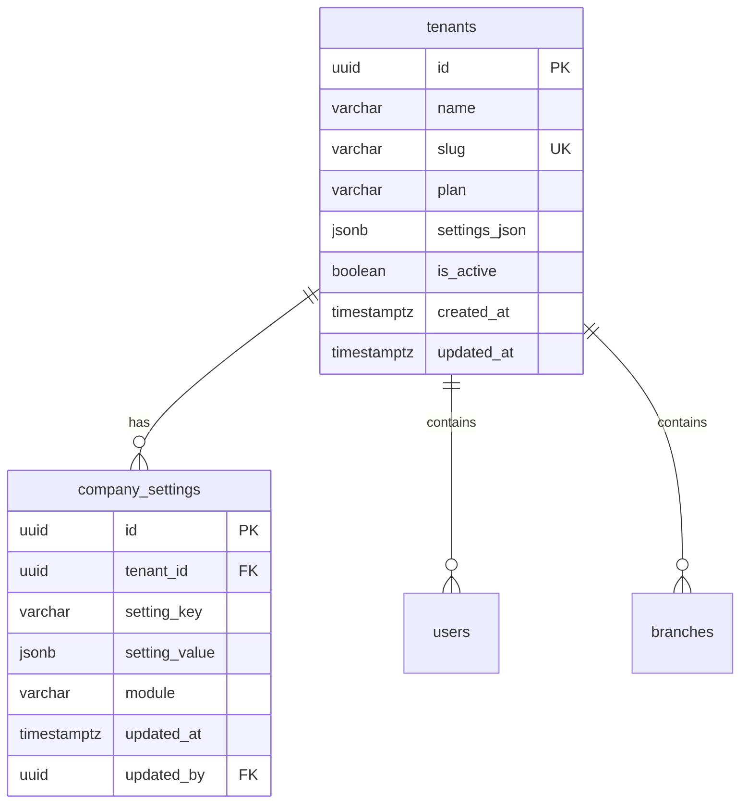

#### Table: `tenants`

| Column | Type | Constraints | Default | Description |
|--------|------|------------|---------|-------------|
| `id` | UUID | PK | `gen_random_uuid()` | Tenant identifier |
| `name` | VARCHAR(255) | NOT NULL | | Company / organization name |
| `slug` | VARCHAR(100) | NOT NULL, UNIQUE | | URL-safe identifier for tenant |
| `plan` | VARCHAR(50) | NOT NULL | `'starter'` | Subscription plan: starter, growth, enterprise |
| `domain` | VARCHAR(255) | | | Custom domain if applicable |
| `logo_url` | VARCHAR(500) | | | Company logo URL |
| `settings_json` | JSONB | NOT NULL | `'{}'::jsonb` | Global tenant settings (currency, locale, timezone) |
| `is_active` | BOOLEAN | NOT NULL | `true` | Tenant active status |
| `max_branches` | INTEGER | NOT NULL | `1` | Maximum branches allowed by plan |
| `max_users` | INTEGER | NOT NULL | `5` | Maximum users allowed by plan |
| `created_at` | TIMESTAMPTZ | NOT NULL | `now()` | |
| `updated_at` | TIMESTAMPTZ | NOT NULL | `now()` | |
| `deleted_at` | TIMESTAMPTZ | | | |

```sql
CREATE INDEX idx_tenants_slug ON tenants(slug) WHERE deleted_at IS NULL;
CREATE INDEX idx_tenants_is_active ON tenants(is_active) WHERE deleted_at IS NULL;
```

#### Table: `company_settings`

| Column | Type | Constraints | Default | Description |
|--------|------|------------|---------|-------------|
| `id` | UUID | PK | `gen_random_uuid()` | |
| `tenant_id` | UUID | NOT NULL, FK → tenants | | |
| `setting_key` | VARCHAR(255) | NOT NULL | | Setting identifier (e.g., `currency`, `fiscal_year_start`) |
| `setting_value` | JSONB | NOT NULL | | Setting value |
| `module` | VARCHAR(100) | | | Module scope: sales, inventory, accounting, global |
| `description` | TEXT | | | Human-readable setting description |
| `updated_at` | TIMESTAMPTZ | NOT NULL | `now()` | |
| `updated_by` | UUID | FK → users | | |

```sql
CREATE UNIQUE INDEX uq_company_settings_tenant_key ON company_settings(tenant_id, setting_key);
```

---

### 3.2 Authentication & RBAC

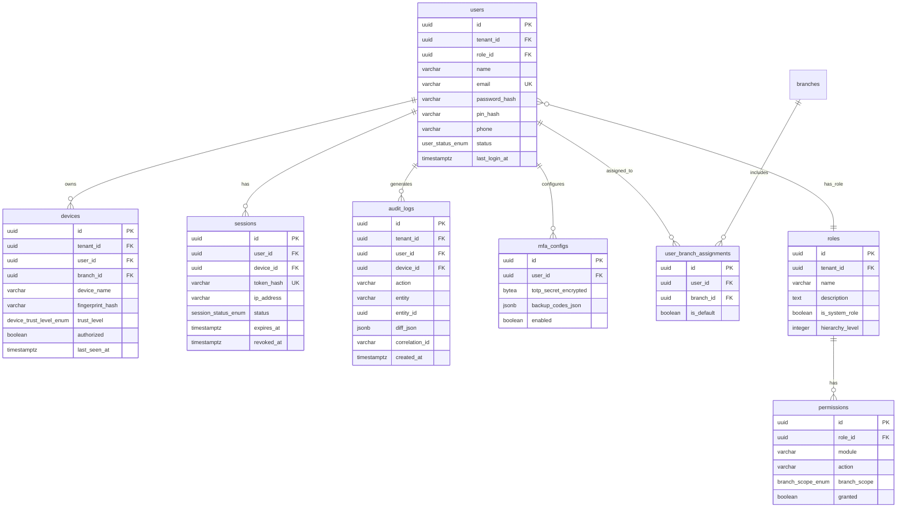

#### Table: `users`

| Column | Type | Constraints | Default | Description |
|--------|------|------------|---------|-------------|
| `id` | UUID | PK | `gen_random_uuid()` | |
| `tenant_id` | UUID | NOT NULL, FK → tenants | | |
| `role_id` | UUID | NOT NULL, FK → roles | | User's assigned role |
| `name` | VARCHAR(255) | NOT NULL | | Full name |
| `email` | VARCHAR(255) | NOT NULL | | Login email |
| `password_hash` | VARCHAR(255) | NOT NULL | | Argon2id hashed password |
| `pin_hash` | VARCHAR(255) | | | Quick-login PIN hash |
| `phone` | VARCHAR(50) | | | Contact phone |
| `avatar_url` | VARCHAR(500) | | | Profile avatar |
| `status` | `user_status_enum` | NOT NULL | `'ACTIVE'` | |
| `last_login_at` | TIMESTAMPTZ | | | |
| `failed_login_count` | INTEGER | NOT NULL | `0` | Consecutive failed logins |
| `locked_until` | TIMESTAMPTZ | | | Account lock expiry (exponential backoff) |
| `created_at` | TIMESTAMPTZ | NOT NULL | `now()` | |
| `updated_at` | TIMESTAMPTZ | NOT NULL | `now()` | |
| `deleted_at` | TIMESTAMPTZ | | | |
| `version` | INTEGER | NOT NULL | `1` | |
| `created_by` | UUID | FK → users | | |
| `updated_by` | UUID | FK → users | | |

```sql
CREATE UNIQUE INDEX uq_users_tenant_email ON users(tenant_id, email) WHERE deleted_at IS NULL;
CREATE INDEX idx_users_tenant_status ON users(tenant_id, status) WHERE deleted_at IS NULL;
CREATE INDEX idx_users_email ON users(email) WHERE deleted_at IS NULL;
CREATE INDEX idx_users_phone ON users(tenant_id, phone) WHERE deleted_at IS NULL AND phone IS NOT NULL;
```

#### Table: `roles`

| Column | Type | Constraints | Default | Description |
|--------|------|------------|---------|-------------|
| `id` | UUID | PK | `gen_random_uuid()` | |
| `tenant_id` | UUID | NOT NULL, FK → tenants | | |
| `name` | VARCHAR(100) | NOT NULL | | Role name (Owner, Admin, Manager, Cashier, etc.) |
| `description` | TEXT | | | Role description |
| `is_system_role` | BOOLEAN | NOT NULL | `false` | System roles cannot be deleted by tenant |
| `hierarchy_level` | INTEGER | NOT NULL | `99` | 1=highest (Owner), higher=lower privilege |
| `max_session_duration_hours` | INTEGER | | `8` | Maximum session duration for this role |
| `requires_mfa` | BOOLEAN | NOT NULL | `false` | Force MFA for this role |
| `created_at` | TIMESTAMPTZ | NOT NULL | `now()` | |
| `updated_at` | TIMESTAMPTZ | NOT NULL | `now()` | |
| `deleted_at` | TIMESTAMPTZ | | | |
| `version` | INTEGER | NOT NULL | `1` | |

```sql
CREATE UNIQUE INDEX uq_roles_tenant_name ON roles(tenant_id, name) WHERE deleted_at IS NULL;
CREATE INDEX idx_roles_tenant ON roles(tenant_id) WHERE deleted_at IS NULL;
```

#### Table: `permissions`

| Column | Type | Constraints | Default | Description |
|--------|------|------------|---------|-------------|
| `id` | UUID | PK | `gen_random_uuid()` | |
| `role_id` | UUID | NOT NULL, FK → roles ON DELETE CASCADE | | |
| `module` | VARCHAR(50) | NOT NULL | | Module name: sales, inventory, accounting, etc. |
| `action` | VARCHAR(100) | NOT NULL | | Action: create, read, update, delete, approve, export, etc. |
| `branch_scope` | `branch_scope_enum` | NOT NULL | `'OWN_BRANCH'` | Scope of permission |
| `granted` | BOOLEAN | NOT NULL | `false` | Whether permission is granted |
| `conditions_json` | JSONB | | | Additional conditions (e.g., threshold amounts) |
| `created_at` | TIMESTAMPTZ | NOT NULL | `now()` | |
| `updated_at` | TIMESTAMPTZ | NOT NULL | `now()` | |

```sql
CREATE UNIQUE INDEX uq_permissions_role_module_action ON permissions(role_id, module, action);
CREATE INDEX idx_permissions_role ON permissions(role_id);
CREATE INDEX idx_permissions_module ON permissions(module);
```

#### Table: `devices`

| Column | Type | Constraints | Default | Description |
|--------|------|------------|---------|-------------|
| `id` | UUID | PK | `gen_random_uuid()` | |
| `tenant_id` | UUID | NOT NULL, FK → tenants | | |
| `user_id` | UUID | FK → users | | Registered user (NULL if unassigned) |
| `branch_id` | UUID | FK → branches | | Assigned branch |
| `device_name` | VARCHAR(255) | NOT NULL | | Human-readable name |
| `device_model` | VARCHAR(255) | | | Hardware model |
| `os_info` | VARCHAR(255) | | | OS name + version |
| `fingerprint_hash` | VARCHAR(255) | NOT NULL | | SHA-256 of device fingerprint |
| `trust_level` | `device_trust_level_enum` | NOT NULL | `'PENDING'` | |
| `authorized` | BOOLEAN | NOT NULL | `false` | Whether device is approved |
| `risk_score` | INTEGER | NOT NULL | `0` | 0-100 risk score from anomaly engine |
| `last_seen_at` | TIMESTAMPTZ | | | |
| `authorized_at` | TIMESTAMPTZ | | | |
| `authorized_by` | UUID | FK → users | | Admin who approved device |
| `created_at` | TIMESTAMPTZ | NOT NULL | `now()` | |
| `updated_at` | TIMESTAMPTZ | NOT NULL | `now()` | |
| `deleted_at` | TIMESTAMPTZ | | | |
| `version` | INTEGER | NOT NULL | `1` | |

```sql
CREATE UNIQUE INDEX uq_devices_fingerprint ON devices(fingerprint_hash) WHERE deleted_at IS NULL;
CREATE INDEX idx_devices_tenant ON devices(tenant_id) WHERE deleted_at IS NULL;
CREATE INDEX idx_devices_user ON devices(user_id) WHERE deleted_at IS NULL;
CREATE INDEX idx_devices_trust ON devices(tenant_id, trust_level) WHERE deleted_at IS NULL;
```

#### Table: `sessions`

| Column | Type | Constraints | Default | Description |
|--------|------|------------|---------|-------------|
| `id` | UUID | PK | `gen_random_uuid()` | |
| `user_id` | UUID | NOT NULL, FK → users | | |
| `device_id` | UUID | NOT NULL, FK → devices | | |
| `branch_id` | UUID | NOT NULL, FK → branches | | Branch context for this session |
| `token_hash` | VARCHAR(255) | NOT NULL, UNIQUE | | SHA-256 of refresh token |
| `ip_address` | INET | | | Client IP |
| `user_agent` | TEXT | | | Client user agent |
| `status` | `session_status_enum` | NOT NULL | `'ACTIVE'` | |
| `expires_at` | TIMESTAMPTZ | NOT NULL | | |
| `revoked_at` | TIMESTAMPTZ | | | |
| `revoked_reason` | VARCHAR(255) | | | Reason for revocation |
| `created_at` | TIMESTAMPTZ | NOT NULL | `now()` | |

```sql
CREATE INDEX idx_sessions_token ON sessions(token_hash);
CREATE INDEX idx_sessions_user ON sessions(user_id, status);
CREATE INDEX idx_sessions_expires ON sessions(expires_at) WHERE status = 'ACTIVE';
CREATE INDEX idx_sessions_device ON sessions(device_id);
```

#### Table: `audit_logs` — **IMMUTABLE**

| Column | Type | Constraints | Default | Description |
|--------|------|------------|---------|-------------|
| `id` | UUID | PK | `gen_random_uuid()` | |
| `tenant_id` | UUID | NOT NULL, FK → tenants | | |
| `user_id` | UUID | FK → users | | Actor (NULL for system actions) |
| `device_id` | UUID | FK → devices | | Source device |
| `action` | VARCHAR(100) | NOT NULL | | Action performed |
| `entity` | VARCHAR(100) | NOT NULL | | Entity type affected |
| `entity_id` | UUID | | | Specific entity ID |
| `old_values` | JSONB | | | Previous state (for updates) |
| `new_values` | JSONB | | | New state (for creates/updates) |
| `diff_json` | JSONB | | | Computed diff between old and new |
| `ip_address` | INET | | | |
| `correlation_id` | UUID | | | Business operation trace ID |
| `metadata` | JSONB | | | Additional context |
| `created_at` | TIMESTAMPTZ | NOT NULL | `now()` | |

```sql
-- Partitioned by created_at (see Section 7)
CREATE INDEX idx_audit_logs_user_created ON audit_logs(user_id, created_at);
CREATE INDEX idx_audit_logs_entity ON audit_logs(entity, entity_id);
CREATE INDEX idx_audit_logs_tenant_created ON audit_logs(tenant_id, created_at);
CREATE INDEX idx_audit_logs_correlation ON audit_logs(correlation_id) WHERE correlation_id IS NOT NULL;
CREATE INDEX idx_audit_logs_action ON audit_logs(tenant_id, action);
```

> **Business Rule:** audit_logs is append-only. No UPDATE or DELETE operations permitted. Enforced by database trigger and ORM configuration.

#### Table: `mfa_configs`

| Column | Type | Constraints | Default | Description |
|--------|------|------------|---------|-------------|
| `id` | UUID | PK | `gen_random_uuid()` | |
| `user_id` | UUID | NOT NULL, FK → users, UNIQUE | | One MFA config per user |
| `totp_secret_encrypted` | BYTEA | | | AES-256-GCM encrypted TOTP secret |
| `backup_codes_json` | JSONB | | | Argon2-hashed backup codes |
| `sms_phone` | VARCHAR(50) | | | SMS fallback number |
| `enabled` | BOOLEAN | NOT NULL | `false` | |
| `last_used_at` | TIMESTAMPTZ | | | |
| `created_at` | TIMESTAMPTZ | NOT NULL | `now()` | |
| `updated_at` | TIMESTAMPTZ | NOT NULL | `now()` | |

```sql
CREATE UNIQUE INDEX uq_mfa_configs_user ON mfa_configs(user_id);
```

#### Table: `user_branch_assignments`

| Column | Type | Constraints | Default | Description |
|--------|------|------------|---------|-------------|
| `id` | UUID | PK | `gen_random_uuid()` | |
| `user_id` | UUID | NOT NULL, FK → users ON DELETE CASCADE | | |
| `branch_id` | UUID | NOT NULL, FK → branches ON DELETE CASCADE | | |
| `is_default` | BOOLEAN | NOT NULL | `false` | Default branch for this user |
| `created_at` | TIMESTAMPTZ | NOT NULL | `now()` | |

```sql
CREATE UNIQUE INDEX uq_user_branch ON user_branch_assignments(user_id, branch_id);
CREATE INDEX idx_user_branch_user ON user_branch_assignments(user_id);
CREATE INDEX idx_user_branch_branch ON user_branch_assignments(branch_id);
```

---

### 3.3 Sync & Infrastructure

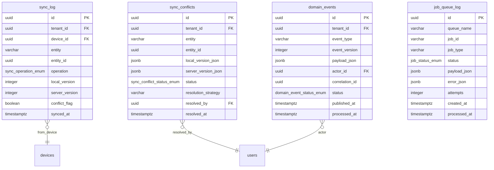

#### Table: `sync_log`

| Column | Type | Constraints | Default | Description |
|--------|------|------------|---------|-------------|
| `id` | UUID | PK | `gen_random_uuid()` | |
| `tenant_id` | UUID | NOT NULL, FK → tenants | | |
| `device_id` | UUID | NOT NULL, FK → devices | | Source device |
| `entity` | VARCHAR(100) | NOT NULL | | Entity type synced |
| `entity_id` | UUID | NOT NULL | | Specific entity |
| `operation` | `sync_operation_enum` | NOT NULL | | CREATE, UPDATE, or DELETE |
| `local_version` | INTEGER | NOT NULL | | Client-side version |
| `server_version` | INTEGER | | | Server-side version after merge |
| `conflict_flag` | BOOLEAN | NOT NULL | `false` | Whether sync caused conflict |
| `sync_batch_id` | UUID | | | Groups operations from same push |
| `synced_at` | TIMESTAMPTZ | NOT NULL | `now()` | |
| `created_at` | TIMESTAMPTZ | NOT NULL | `now()` | |

```sql
CREATE INDEX idx_sync_log_tenant_entity ON sync_log(tenant_id, entity, synced_at);
CREATE INDEX idx_sync_log_device ON sync_log(device_id, synced_at);
CREATE INDEX idx_sync_log_batch ON sync_log(sync_batch_id) WHERE sync_batch_id IS NOT NULL;
CREATE INDEX idx_sync_log_conflicts ON sync_log(tenant_id, conflict_flag) WHERE conflict_flag = true;
```

#### Table: `sync_conflicts`

| Column | Type | Constraints | Default | Description |
|--------|------|------------|---------|-------------|
| `id` | UUID | PK | `gen_random_uuid()` | |
| `tenant_id` | UUID | NOT NULL, FK → tenants | | |
| `entity` | VARCHAR(100) | NOT NULL | | |
| `entity_id` | UUID | NOT NULL | | |
| `device_id` | UUID | FK → devices | | Device that caused conflict |
| `local_version_json` | JSONB | NOT NULL | | Full client record at conflict time |
| `server_version_json` | JSONB | NOT NULL | | Full server record at conflict time |
| `status` | `sync_conflict_status_enum` | NOT NULL | `'DETECTED'` | |
| `resolution_strategy` | VARCHAR(50) | | | LWW, MANUAL, MERGE, SERVER_WINS, CLIENT_WINS |
| `resolved_version_json` | JSONB | | | Final resolved record |
| `resolved_by` | UUID | FK → users | | |
| `resolved_at` | TIMESTAMPTZ | | | |
| `created_at` | TIMESTAMPTZ | NOT NULL | `now()` | |
| `updated_at` | TIMESTAMPTZ | NOT NULL | `now()` | |

```sql
CREATE INDEX idx_sync_conflicts_tenant_status ON sync_conflicts(tenant_id, status);
CREATE INDEX idx_sync_conflicts_entity ON sync_conflicts(entity, entity_id);
CREATE INDEX idx_sync_conflicts_pending ON sync_conflicts(tenant_id) WHERE status IN ('DETECTED', 'PENDING_REVIEW');
```

#### Table: `domain_events` — **IMMUTABLE**

| Column | Type | Constraints | Default | Description |
|--------|------|------------|---------|-------------|
| `id` | UUID | PK | `gen_random_uuid()` | |
| `tenant_id` | UUID | NOT NULL, FK → tenants | | |
| `event_type` | VARCHAR(100) | NOT NULL | | e.g., invoice.created, payment.received |
| `event_version` | INTEGER | NOT NULL | `1` | Schema version of event payload |
| `payload_json` | JSONB | NOT NULL | | Full event payload |
| `actor_id` | UUID | FK → users | | User who triggered the event |
| `correlation_id` | UUID | | | Business operation trace ID |
| `branch_id` | UUID | FK → branches | | Source branch |
| `status` | `domain_event_status_enum` | NOT NULL | `'PUBLISHED'` | |
| `retry_count` | INTEGER | NOT NULL | `0` | |
| `error_message` | TEXT | | | Last processing error |
| `published_at` | TIMESTAMPTZ | NOT NULL | `now()` | |
| `processed_at` | TIMESTAMPTZ | | | |
| `created_at` | TIMESTAMPTZ | NOT NULL | `now()` | |

```sql
-- Partitioned by created_at (see Section 7)
CREATE INDEX idx_domain_events_type ON domain_events(event_type, created_at);
CREATE INDEX idx_domain_events_tenant ON domain_events(tenant_id, created_at);
CREATE INDEX idx_domain_events_status ON domain_events(status) WHERE status IN ('PUBLISHED', 'FAILED');
CREATE INDEX idx_domain_events_correlation ON domain_events(correlation_id) WHERE correlation_id IS NOT NULL;
```

#### Table: `job_queue_log`

| Column | Type | Constraints | Default | Description |
|--------|------|------------|---------|-------------|
| `id` | UUID | PK | `gen_random_uuid()` | |
| `queue_name` | VARCHAR(100) | NOT NULL | | BullMQ queue name |
| `job_id` | VARCHAR(255) | NOT NULL | | BullMQ job ID |
| `job_type` | VARCHAR(100) | NOT NULL | | Job type within queue |
| `status` | `job_status_enum` | NOT NULL | `'PENDING'` | |
| `payload_json` | JSONB | | | Job input payload |
| `result_json` | JSONB | | | Job output result |
| `error_json` | JSONB | | | Error details if failed |
| `attempts` | INTEGER | NOT NULL | `0` | |
| `max_attempts` | INTEGER | NOT NULL | `3` | |
| `created_at` | TIMESTAMPTZ | NOT NULL | `now()` | |
| `started_at` | TIMESTAMPTZ | | | |
| `processed_at` | TIMESTAMPTZ | | | |

```sql
CREATE INDEX idx_job_queue_log_queue ON job_queue_log(queue_name, status);
CREATE INDEX idx_job_queue_log_status ON job_queue_log(status) WHERE status IN ('PENDING', 'FAILED');
CREATE INDEX idx_job_queue_log_created ON job_queue_log(created_at);
```

---

### 3.4 Product Catalog

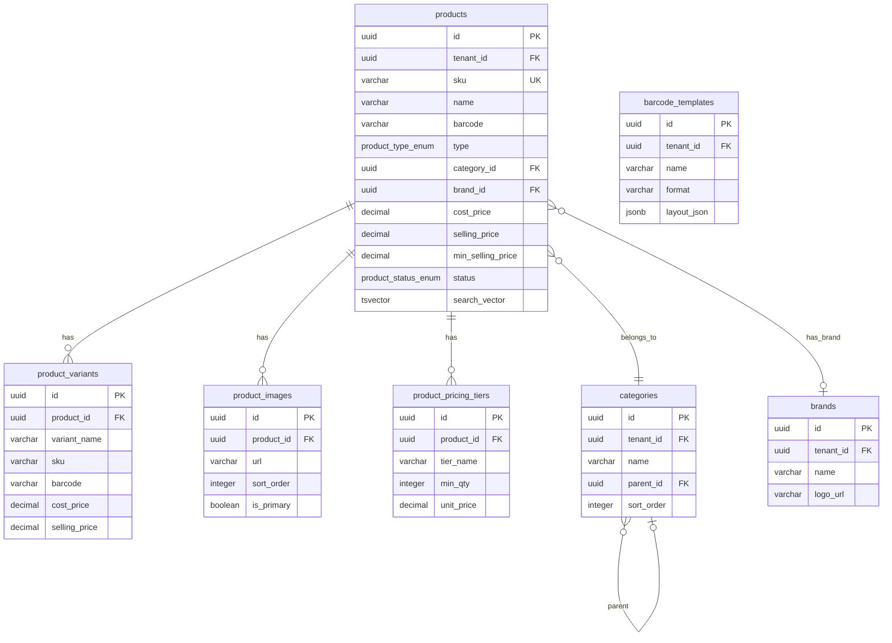

#### Table: `categories`

| Column | Type | Constraints | Default | Description |
|--------|------|------------|---------|-------------|
| `id` | UUID | PK | `gen_random_uuid()` | |
| `tenant_id` | UUID | NOT NULL, FK → tenants | | |
| `name` | VARCHAR(255) | NOT NULL | | Category name |
| `slug` | VARCHAR(255) | NOT NULL | | URL-safe slug |
| `parent_id` | UUID | FK → categories | | Parent category (NULL for root) |
| `description` | TEXT | | | |
| `image_url` | VARCHAR(500) | | | |
| `sort_order` | INTEGER | NOT NULL | `0` | Display ordering |
| `is_active` | BOOLEAN | NOT NULL | `true` | |
| `created_at` | TIMESTAMPTZ | NOT NULL | `now()` | |
| `updated_at` | TIMESTAMPTZ | NOT NULL | `now()` | |
| `deleted_at` | TIMESTAMPTZ | | | |
| `version` | INTEGER | NOT NULL | `1` | |
| `created_by` | UUID | FK → users | | |
| `updated_by` | UUID | FK → users | | |

```sql
CREATE UNIQUE INDEX uq_categories_tenant_slug ON categories(tenant_id, slug) WHERE deleted_at IS NULL;
CREATE INDEX idx_categories_parent ON categories(parent_id) WHERE deleted_at IS NULL;
CREATE INDEX idx_categories_tenant ON categories(tenant_id) WHERE deleted_at IS NULL;
```

#### Table: `brands`

| Column | Type | Constraints | Default | Description |
|--------|------|------------|---------|-------------|
| `id` | UUID | PK | `gen_random_uuid()` | |
| `tenant_id` | UUID | NOT NULL, FK → tenants | | |
| `name` | VARCHAR(255) | NOT NULL | | |
| `slug` | VARCHAR(255) | NOT NULL | | |
| `logo_url` | VARCHAR(500) | | | |
| `description` | TEXT | | | |
| `is_active` | BOOLEAN | NOT NULL | `true` | |
| `created_at` | TIMESTAMPTZ | NOT NULL | `now()` | |
| `updated_at` | TIMESTAMPTZ | NOT NULL | `now()` | |
| `deleted_at` | TIMESTAMPTZ | | | |
| `version` | INTEGER | NOT NULL | `1` | |
| `created_by` | UUID | FK → users | | |
| `updated_by` | UUID | FK → users | | |

```sql
CREATE UNIQUE INDEX uq_brands_tenant_slug ON brands(tenant_id, slug) WHERE deleted_at IS NULL;
CREATE INDEX idx_brands_tenant ON brands(tenant_id) WHERE deleted_at IS NULL;
```

#### Table: `products`

| Column | Type | Constraints | Default | Description |
|--------|------|------------|---------|-------------|
| `id` | UUID | PK | `gen_random_uuid()` | |
| `tenant_id` | UUID | NOT NULL, FK → tenants | | |
| `sku` | VARCHAR(100) | NOT NULL | | Stock keeping unit |
| `name` | VARCHAR(500) | NOT NULL | | Product display name |
| `description` | TEXT | | | |
| `barcode` | VARCHAR(100) | | | Primary barcode (EAN/UPC) |
| `type` | `product_type_enum` | NOT NULL | `'STANDARD'` | STANDARD, SERIALIZED (IMEI), SERVICE, COMPOSITE |
| `category_id` | UUID | FK → categories | | |
| `brand_id` | UUID | FK → brands | | |
| `unit_of_measure` | VARCHAR(50) | NOT NULL | `'PCS'` | PCS, KG, LTR, MTR, BOX, etc. |
| `cost_price` | DECIMAL(15,4) | NOT NULL | `0` | Base cost price |
| `selling_price` | DECIMAL(15,4) | NOT NULL | `0` | Default selling price |
| `min_selling_price` | DECIMAL(15,4) | | | Minimum price (floor for discounts) |
| `wholesale_price` | DECIMAL(15,4) | | | Wholesale/bulk price |
| `tax_rate` | DECIMAL(5,2) | NOT NULL | `0` | Default tax percentage |
| `tax_inclusive` | BOOLEAN | NOT NULL | `false` | Whether selling_price includes tax |
| `reorder_point` | INTEGER | NOT NULL | `0` | Low stock alert threshold |
| `reorder_qty` | INTEGER | NOT NULL | `0` | Default reorder quantity |
| `weight` | DECIMAL(10,3) | | | For landed cost allocation |
| `is_active` | BOOLEAN | NOT NULL | `true` | |
| `status` | `product_status_enum` | NOT NULL | `'ACTIVE'` | |
| `image_url` | VARCHAR(500) | | | Primary product image |
| `tags` | TEXT[] | | | Searchable tags array |
| `custom_fields_json` | JSONB | | `'{}'::jsonb` | Dynamic custom fields |
| `search_vector` | TSVECTOR | | | Full-text search vector |
| `created_at` | TIMESTAMPTZ | NOT NULL | `now()` | |
| `updated_at` | TIMESTAMPTZ | NOT NULL | `now()` | |
| `deleted_at` | TIMESTAMPTZ | | | |
| `version` | INTEGER | NOT NULL | `1` | |
| `created_by` | UUID | FK → users | | |
| `updated_by` | UUID | FK → users | | |

```sql
CREATE UNIQUE INDEX uq_products_tenant_sku ON products(tenant_id, sku) WHERE deleted_at IS NULL;
CREATE UNIQUE INDEX uq_products_tenant_barcode ON products(tenant_id, barcode) WHERE deleted_at IS NULL AND barcode IS NOT NULL;
CREATE INDEX idx_products_tenant_category ON products(tenant_id, category_id) WHERE deleted_at IS NULL;
CREATE INDEX idx_products_tenant_brand ON products(tenant_id, brand_id) WHERE deleted_at IS NULL;
CREATE INDEX idx_products_tenant_status ON products(tenant_id, status) WHERE deleted_at IS NULL;
CREATE INDEX idx_products_search ON products USING GIN(search_vector);
CREATE INDEX idx_products_tags ON products USING GIN(tags) WHERE deleted_at IS NULL;
CREATE INDEX idx_products_barcode ON products(barcode) WHERE deleted_at IS NULL AND barcode IS NOT NULL;
```

> **Trigger:** `search_vector` auto-updated on INSERT/UPDATE via `fn_products_search_vector` — concatenates name, sku, barcode, brand, category, tags.

#### Table: `product_variants`

| Column | Type | Constraints | Default | Description |
|--------|------|------------|---------|-------------|
| `id` | UUID | PK | `gen_random_uuid()` | |
| `product_id` | UUID | NOT NULL, FK → products ON DELETE CASCADE | | |
| `variant_name` | VARCHAR(255) | NOT NULL | | e.g., "128GB Black", "256GB Blue" |
| `sku` | VARCHAR(100) | NOT NULL | | Variant-specific SKU |
| `barcode` | VARCHAR(100) | | | Variant barcode |
| `cost_price` | DECIMAL(15,4) | NOT NULL | `0` | |
| `selling_price` | DECIMAL(15,4) | NOT NULL | `0` | |
| `weight` | DECIMAL(10,3) | | | |
| `attributes_json` | JSONB | NOT NULL | `'{}'::jsonb` | Key-value: { "color": "Black", "storage": "128GB" } |
| `is_active` | BOOLEAN | NOT NULL | `true` | |
| `created_at` | TIMESTAMPTZ | NOT NULL | `now()` | |
| `updated_at` | TIMESTAMPTZ | NOT NULL | `now()` | |
| `deleted_at` | TIMESTAMPTZ | | | |
| `version` | INTEGER | NOT NULL | `1` | |

```sql
CREATE UNIQUE INDEX uq_product_variants_sku ON product_variants(sku) WHERE deleted_at IS NULL;
CREATE INDEX idx_product_variants_product ON product_variants(product_id) WHERE deleted_at IS NULL;
```

#### Table: `product_images`

| Column | Type | Constraints | Default | Description |
|--------|------|------------|---------|-------------|
| `id` | UUID | PK | `gen_random_uuid()` | |
| `product_id` | UUID | NOT NULL, FK → products ON DELETE CASCADE | | |
| `url` | VARCHAR(500) | NOT NULL | | Image URL (S3/Supabase) |
| `alt_text` | VARCHAR(255) | | | Accessibility alt text |
| `sort_order` | INTEGER | NOT NULL | `0` | Display ordering |
| `is_primary` | BOOLEAN | NOT NULL | `false` | Primary display image |
| `created_at` | TIMESTAMPTZ | NOT NULL | `now()` | |

```sql
CREATE INDEX idx_product_images_product ON product_images(product_id);
```

#### Table: `product_pricing_tiers`

| Column | Type | Constraints | Default | Description |
|--------|------|------------|---------|-------------|
| `id` | UUID | PK | `gen_random_uuid()` | |
| `product_id` | UUID | NOT NULL, FK → products ON DELETE CASCADE | | |
| `tier_name` | VARCHAR(100) | NOT NULL | | e.g., "Wholesale", "Distributor", "Qty 10+" |
| `customer_group_id` | UUID | FK → customer_groups | | Apply to specific customer group |
| `min_qty` | INTEGER | NOT NULL | `1` | Minimum quantity for tier |
| `max_qty` | INTEGER | | | Maximum quantity (NULL = unlimited) |
| `unit_price` | DECIMAL(15,4) | NOT NULL | | Price at this tier |
| `discount_pct` | DECIMAL(5,2) | | | Discount percentage (alternative to fixed price) |
| `valid_from` | DATE | | | Start date (NULL = always) |
| `valid_until` | DATE | | | End date (NULL = no expiry) |
| `is_active` | BOOLEAN | NOT NULL | `true` | |
| `created_at` | TIMESTAMPTZ | NOT NULL | `now()` | |
| `updated_at` | TIMESTAMPTZ | NOT NULL | `now()` | |

```sql
CREATE INDEX idx_pricing_tiers_product ON product_pricing_tiers(product_id);
CREATE INDEX idx_pricing_tiers_group ON product_pricing_tiers(customer_group_id) WHERE customer_group_id IS NOT NULL;
```

#### Table: `barcode_templates`

| Column | Type | Constraints | Default | Description |
|--------|------|------------|---------|-------------|
| `id` | UUID | PK | `gen_random_uuid()` | |
| `tenant_id` | UUID | NOT NULL, FK → tenants | | |
| `name` | VARCHAR(255) | NOT NULL | | Template name |
| `format` | VARCHAR(50) | NOT NULL | `'CODE128'` | Barcode format: CODE128, EAN13, QR, etc. |
| `width_mm` | INTEGER | NOT NULL | `50` | Label width in mm |
| `height_mm` | INTEGER | NOT NULL | `25` | Label height in mm |
| `layout_json` | JSONB | NOT NULL | | Layout definition: positions of barcode, name, price, sku |
| `is_default` | BOOLEAN | NOT NULL | `false` | |
| `created_at` | TIMESTAMPTZ | NOT NULL | `now()` | |
| `updated_at` | TIMESTAMPTZ | NOT NULL | `now()` | |
| `deleted_at` | TIMESTAMPTZ | | | |

```sql
CREATE INDEX idx_barcode_templates_tenant ON barcode_templates(tenant_id) WHERE deleted_at IS NULL;
```

---

### 3.5 Sales & POS

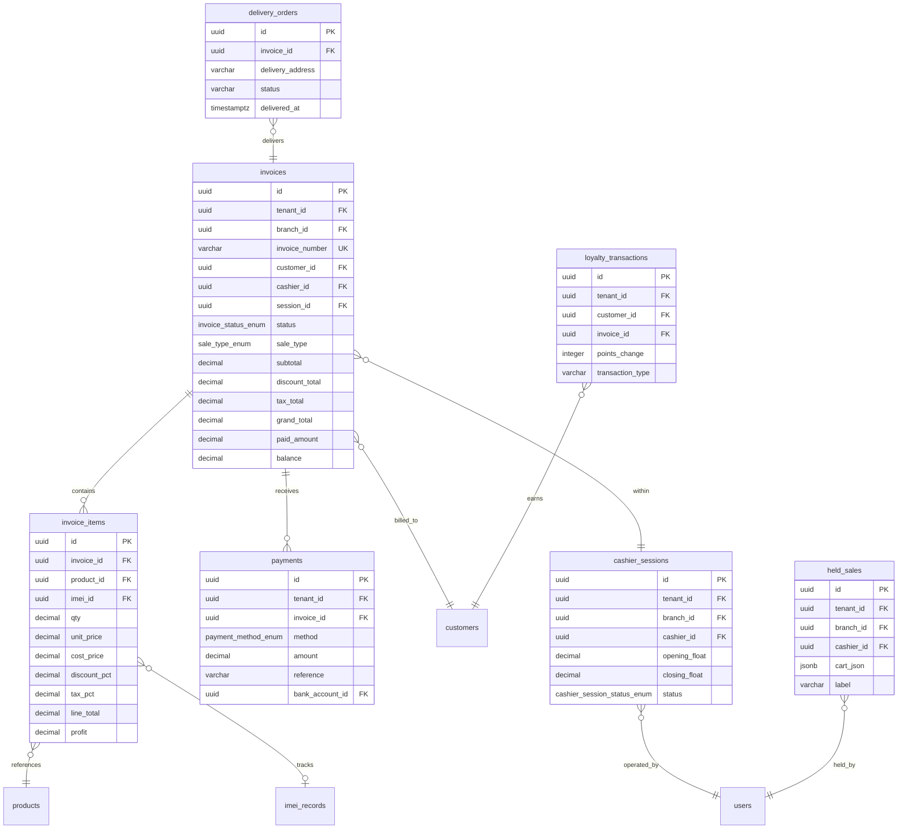

#### Table: `invoices`

| Column | Type | Constraints | Default | Description |
|--------|------|------------|---------|-------------|
| `id` | UUID | PK | `gen_random_uuid()` | |
| `tenant_id` | UUID | NOT NULL, FK → tenants | | |
| `branch_id` | UUID | NOT NULL, FK → branches | | |
| `invoice_number` | VARCHAR(50) | NOT NULL | | Sequential, branch-prefixed (e.g., BR01-INV-000001) |
| `customer_id` | UUID | FK → customers | | NULL for walk-in cash sales |
| `cashier_id` | UUID | NOT NULL, FK → users | | |
| `session_id` | UUID | FK → cashier_sessions | | |
| `status` | `invoice_status_enum` | NOT NULL | `'DRAFT'` | |
| `sale_type` | `sale_type_enum` | NOT NULL | `'CASH'` | |
| `subtotal` | DECIMAL(15,4) | NOT NULL | `0` | Sum of line totals before tax |
| `discount_total` | DECIMAL(15,4) | NOT NULL | `0` | Total discount amount |
| `tax_total` | DECIMAL(15,4) | NOT NULL | `0` | Total tax amount |
| `grand_total` | DECIMAL(15,4) | NOT NULL | `0` | Final amount: subtotal - discount + tax |
| `paid_amount` | DECIMAL(15,4) | NOT NULL | `0` | Amount paid so far |
| `balance` | DECIMAL(15,4) | NOT NULL | `0` | Remaining: grand_total - paid_amount |
| `change_amount` | DECIMAL(15,4) | NOT NULL | `0` | Change given to customer |
| `notes` | TEXT | | | |
| `return_reason` | TEXT | | | Populated on return |
| `original_invoice_id` | UUID | FK → invoices | | For return invoices: links to original |
| `correlation_id` | UUID | | | Business operation trace |
| `is_offline` | BOOLEAN | NOT NULL | `false` | Created in offline mode |
| `synced_at` | TIMESTAMPTZ | | | When offline invoice synced |
| `created_at` | TIMESTAMPTZ | NOT NULL | `now()` | |
| `updated_at` | TIMESTAMPTZ | NOT NULL | `now()` | |
| `deleted_at` | TIMESTAMPTZ | | | |
| `version` | INTEGER | NOT NULL | `1` | |
| `created_by` | UUID | FK → users | | |
| `updated_by` | UUID | FK → users | | |

```sql
CREATE UNIQUE INDEX uq_invoices_tenant_number ON invoices(tenant_id, invoice_number) WHERE deleted_at IS NULL;
CREATE INDEX idx_invoices_branch_created ON invoices(branch_id, created_at) WHERE deleted_at IS NULL;
CREATE INDEX idx_invoices_customer ON invoices(customer_id) WHERE deleted_at IS NULL AND customer_id IS NOT NULL;
CREATE INDEX idx_invoices_status ON invoices(tenant_id, status) WHERE deleted_at IS NULL;
CREATE INDEX idx_invoices_cashier ON invoices(cashier_id, created_at) WHERE deleted_at IS NULL;
CREATE INDEX idx_invoices_session ON invoices(session_id) WHERE deleted_at IS NULL;
CREATE INDEX idx_invoices_offline ON invoices(tenant_id, is_offline) WHERE is_offline = true AND synced_at IS NULL;
CREATE INDEX idx_invoices_tenant_created ON invoices(tenant_id, created_at) WHERE deleted_at IS NULL;
```

> **Business Rule:** Invoice is immutable once status is PAID — only additions (payments, returns) allowed, no direct edits. Enforced by trigger.

#### Table: `invoice_items`

| Column | Type | Constraints | Default | Description |
|--------|------|------------|---------|-------------|
| `id` | UUID | PK | `gen_random_uuid()` | |
| `invoice_id` | UUID | NOT NULL, FK → invoices ON DELETE CASCADE | | |
| `product_id` | UUID | NOT NULL, FK → products | | |
| `variant_id` | UUID | FK → product_variants | | If variant-level sale |
| `imei_id` | UUID | FK → imei_records | | For serialized products |
| `description` | VARCHAR(500) | | | Line item description override |
| `qty` | DECIMAL(15,4) | NOT NULL | `1` | Quantity sold |
| `unit_price` | DECIMAL(15,4) | NOT NULL | | Selling price per unit |
| `cost_price` | DECIMAL(15,4) | NOT NULL | | Cost at time of sale (for margin calc) |
| `discount_pct` | DECIMAL(5,2) | NOT NULL | `0` | Line-item discount percentage |
| `discount_amount` | DECIMAL(15,4) | NOT NULL | `0` | Computed discount amount |
| `tax_pct` | DECIMAL(5,2) | NOT NULL | `0` | Tax rate applied |
| `tax_amount` | DECIMAL(15,4) | NOT NULL | `0` | Computed tax amount |
| `line_total` | DECIMAL(15,4) | NOT NULL | | Final line amount (qty * unit_price - discount + tax) |
| `profit` | DECIMAL(15,4) | NOT NULL | `0` | Line profit: (unit_price - cost_price) * qty - discount |
| `pricing_tier` | VARCHAR(100) | | | Which pricing tier was applied |
| `created_at` | TIMESTAMPTZ | NOT NULL | `now()` | |

```sql
CREATE INDEX idx_invoice_items_invoice ON invoice_items(invoice_id);
CREATE INDEX idx_invoice_items_product ON invoice_items(product_id);
CREATE INDEX idx_invoice_items_imei ON invoice_items(imei_id) WHERE imei_id IS NOT NULL;
```

#### Table: `payments`

| Column | Type | Constraints | Default | Description |
|--------|------|------------|---------|-------------|
| `id` | UUID | PK | `gen_random_uuid()` | |
| `tenant_id` | UUID | NOT NULL, FK → tenants | | |
| `invoice_id` | UUID | NOT NULL, FK → invoices | | |
| `method` | `payment_method_enum` | NOT NULL | | |
| `amount` | DECIMAL(15,4) | NOT NULL | | Payment amount |
| `reference` | VARCHAR(255) | | | Bank reference, cheque number, etc. |
| `bank_account_id` | UUID | FK → bank_accounts | | For bank transfer payments |
| `device_id` | UUID | FK → devices | | Device where payment was processed |
| `correlation_id` | UUID | | | |
| `notes` | TEXT | | | |
| `created_at` | TIMESTAMPTZ | NOT NULL | `now()` | |
| `created_by` | UUID | FK → users | | |

```sql
CREATE INDEX idx_payments_invoice ON payments(invoice_id);
CREATE INDEX idx_payments_tenant_created ON payments(tenant_id, created_at);
CREATE INDEX idx_payments_method ON payments(tenant_id, method);
CREATE INDEX idx_payments_bank ON payments(bank_account_id) WHERE bank_account_id IS NOT NULL;
```

> **Check constraint:** `chk_payments_amount_positive: amount > 0`

#### Table: `cashier_sessions`

| Column | Type | Constraints | Default | Description |
|--------|------|------------|---------|-------------|
| `id` | UUID | PK | `gen_random_uuid()` | |
| `tenant_id` | UUID | NOT NULL, FK → tenants | | |
| `branch_id` | UUID | NOT NULL, FK → branches | | |
| `cashier_id` | UUID | NOT NULL, FK → users | | |
| `device_id` | UUID | FK → devices | | |
| `opening_float` | DECIMAL(15,4) | NOT NULL | `0` | Starting cash amount |
| `closing_float` | DECIMAL(15,4) | | | Actual cash counted at close |
| `expected_float` | DECIMAL(15,4) | | | Calculated: opening + cash sales |
| `cash_variance` | DECIMAL(15,4) | | | closing - expected |
| `total_sales` | DECIMAL(15,4) | NOT NULL | `0` | Running total of sales |
| `total_returns` | DECIMAL(15,4) | NOT NULL | `0` | Running total of returns |
| `total_transactions` | INTEGER | NOT NULL | `0` | Invoice count |
| `status` | `cashier_session_status_enum` | NOT NULL | `'OPEN'` | |
| `opened_at` | TIMESTAMPTZ | NOT NULL | `now()` | |
| `closed_at` | TIMESTAMPTZ | | | |
| `closed_by` | UUID | FK → users | | Manager who approved closing |
| `notes` | TEXT | | | |
| `created_at` | TIMESTAMPTZ | NOT NULL | `now()` | |
| `updated_at` | TIMESTAMPTZ | NOT NULL | `now()` | |
| `version` | INTEGER | NOT NULL | `1` | |

```sql
CREATE INDEX idx_cashier_sessions_branch ON cashier_sessions(branch_id, status);
CREATE INDEX idx_cashier_sessions_cashier ON cashier_sessions(cashier_id, opened_at);
CREATE INDEX idx_cashier_sessions_open ON cashier_sessions(tenant_id) WHERE status = 'OPEN';
```

#### Table: `held_sales`

| Column | Type | Constraints | Default | Description |
|--------|------|------------|---------|-------------|
| `id` | UUID | PK | `gen_random_uuid()` | |
| `tenant_id` | UUID | NOT NULL, FK → tenants | | |
| `branch_id` | UUID | NOT NULL, FK → branches | | |
| `cashier_id` | UUID | NOT NULL, FK → users | | |
| `session_id` | UUID | FK → cashier_sessions | | |
| `customer_id` | UUID | FK → customers | | |
| `cart_json` | JSONB | NOT NULL | | Full cart state: items, quantities, prices, discounts |
| `label` | VARCHAR(255) | | | User-assigned label (e.g., customer name) |
| `expires_at` | TIMESTAMPTZ | | | Auto-cleanup time |
| `created_at` | TIMESTAMPTZ | NOT NULL | `now()` | |
| `updated_at` | TIMESTAMPTZ | NOT NULL | `now()` | |

```sql
CREATE INDEX idx_held_sales_branch ON held_sales(branch_id);
CREATE INDEX idx_held_sales_cashier ON held_sales(cashier_id);
CREATE INDEX idx_held_sales_expires ON held_sales(expires_at) WHERE expires_at IS NOT NULL;
```

#### Table: `delivery_orders`

| Column | Type | Constraints | Default | Description |
|--------|------|------------|---------|-------------|
| `id` | UUID | PK | `gen_random_uuid()` | |
| `tenant_id` | UUID | NOT NULL, FK → tenants | | |
| `invoice_id` | UUID | NOT NULL, FK → invoices | | |
| `delivery_address` | TEXT | NOT NULL | | |
| `contact_phone` | VARCHAR(50) | | | |
| `delivery_person` | VARCHAR(255) | | | |
| `status` | VARCHAR(50) | NOT NULL | `'PENDING'` | PENDING, DISPATCHED, IN_TRANSIT, DELIVERED, FAILED |
| `scheduled_date` | DATE | | | |
| `delivered_at` | TIMESTAMPTZ | | | |
| `delivery_notes` | TEXT | | | |
| `proof_of_delivery_url` | VARCHAR(500) | | | Photo/signature URL |
| `created_at` | TIMESTAMPTZ | NOT NULL | `now()` | |
| `updated_at` | TIMESTAMPTZ | NOT NULL | `now()` | |
| `version` | INTEGER | NOT NULL | `1` | |

```sql
CREATE INDEX idx_delivery_orders_invoice ON delivery_orders(invoice_id);
CREATE INDEX idx_delivery_orders_status ON delivery_orders(tenant_id, status);
CREATE INDEX idx_delivery_orders_date ON delivery_orders(scheduled_date) WHERE status != 'DELIVERED';
```

#### Table: `loyalty_transactions`

| Column | Type | Constraints | Default | Description |
|--------|------|------------|---------|-------------|
| `id` | UUID | PK | `gen_random_uuid()` | |
| `tenant_id` | UUID | NOT NULL, FK → tenants | | |
| `customer_id` | UUID | NOT NULL, FK → customers | | |
| `invoice_id` | UUID | FK → invoices | | Source invoice |
| `points_change` | INTEGER | NOT NULL | | Positive = earn, negative = redeem |
| `balance_after` | INTEGER | NOT NULL | | Points balance after this transaction |
| `transaction_type` | VARCHAR(50) | NOT NULL | | EARN, REDEEM, ADJUST, EXPIRE |
| `description` | VARCHAR(255) | | | |
| `expires_at` | TIMESTAMPTZ | | | Point expiry date |
| `created_at` | TIMESTAMPTZ | NOT NULL | `now()` | |
| `created_by` | UUID | FK → users | | |

```sql
CREATE INDEX idx_loyalty_customer ON loyalty_transactions(customer_id, created_at);
CREATE INDEX idx_loyalty_invoice ON loyalty_transactions(invoice_id) WHERE invoice_id IS NOT NULL;
CREATE INDEX idx_loyalty_expiry ON loyalty_transactions(expires_at) WHERE points_change > 0 AND expires_at IS NOT NULL;
```

---

### 3.6 Purchase Management

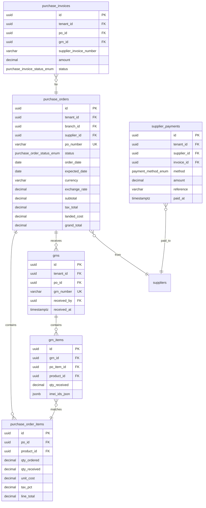

#### Table: `purchase_orders`

| Column | Type | Constraints | Default | Description |
|--------|------|------------|---------|-------------|
| `id` | UUID | PK | `gen_random_uuid()` | |
| `tenant_id` | UUID | NOT NULL, FK → tenants | | |
| `branch_id` | UUID | NOT NULL, FK → branches | | |
| `supplier_id` | UUID | NOT NULL, FK → suppliers | | |
| `po_number` | VARCHAR(50) | NOT NULL | | Sequential, branch-prefixed |
| `status` | `purchase_order_status_enum` | NOT NULL | `'DRAFT'` | |
| `order_date` | DATE | NOT NULL | `CURRENT_DATE` | |
| `expected_date` | DATE | | | Expected delivery date |
| `currency` | VARCHAR(3) | NOT NULL | `'PKR'` | ISO 4217 currency code |
| `exchange_rate` | DECIMAL(10,6) | NOT NULL | `1.0` | Exchange rate to base currency |
| `subtotal` | DECIMAL(15,4) | NOT NULL | `0` | |
| `tax_total` | DECIMAL(15,4) | NOT NULL | `0` | |
| `discount_total` | DECIMAL(15,4) | NOT NULL | `0` | |
| `freight_charges` | DECIMAL(15,4) | NOT NULL | `0` | Shipping/freight cost |
| `insurance_charges` | DECIMAL(15,4) | NOT NULL | `0` | Insurance cost |
| `custom_duty` | DECIMAL(15,4) | NOT NULL | `0` | Import duty |
| `landed_cost` | DECIMAL(15,4) | NOT NULL | `0` | Total additional costs |
| `grand_total` | DECIMAL(15,4) | NOT NULL | `0` | |
| `notes` | TEXT | | | |
| `approved_by` | UUID | FK → users | | |
| `approved_at` | TIMESTAMPTZ | | | |
| `correlation_id` | UUID | | | |
| `created_at` | TIMESTAMPTZ | NOT NULL | `now()` | |
| `updated_at` | TIMESTAMPTZ | NOT NULL | `now()` | |
| `deleted_at` | TIMESTAMPTZ | | | |
| `version` | INTEGER | NOT NULL | `1` | |
| `created_by` | UUID | FK → users | | |
| `updated_by` | UUID | FK → users | | |

```sql
CREATE UNIQUE INDEX uq_po_tenant_number ON purchase_orders(tenant_id, po_number) WHERE deleted_at IS NULL;
CREATE INDEX idx_po_supplier ON purchase_orders(supplier_id, status) WHERE deleted_at IS NULL;
CREATE INDEX idx_po_branch_created ON purchase_orders(branch_id, created_at) WHERE deleted_at IS NULL;
CREATE INDEX idx_po_status ON purchase_orders(tenant_id, status) WHERE deleted_at IS NULL;
```

#### Table: `purchase_order_items`

| Column | Type | Constraints | Default | Description |
|--------|------|------------|---------|-------------|
| `id` | UUID | PK | `gen_random_uuid()` | |
| `po_id` | UUID | NOT NULL, FK → purchase_orders ON DELETE CASCADE | | |
| `product_id` | UUID | NOT NULL, FK → products | | |
| `variant_id` | UUID | FK → product_variants | | |
| `qty_ordered` | DECIMAL(15,4) | NOT NULL | | |
| `qty_received` | DECIMAL(15,4) | NOT NULL | `0` | Updated on GRN |
| `unit_cost` | DECIMAL(15,4) | NOT NULL | | Per-unit cost in PO currency |
| `unit_cost_base` | DECIMAL(15,4) | NOT NULL | | Per-unit cost in base currency |
| `tax_pct` | DECIMAL(5,2) | NOT NULL | `0` | |
| `discount_pct` | DECIMAL(5,2) | NOT NULL | `0` | |
| `line_total` | DECIMAL(15,4) | NOT NULL | | |
| `landed_cost_allocated` | DECIMAL(15,4) | NOT NULL | `0` | Proportional landed cost |
| `created_at` | TIMESTAMPTZ | NOT NULL | `now()` | |

```sql
CREATE INDEX idx_po_items_po ON purchase_order_items(po_id);
CREATE INDEX idx_po_items_product ON purchase_order_items(product_id);

ALTER TABLE purchase_order_items ADD CONSTRAINT chk_po_items_qty CHECK (qty_ordered > 0);
ALTER TABLE purchase_order_items ADD CONSTRAINT chk_po_items_received CHECK (qty_received >= 0 AND qty_received <= qty_ordered);
```

#### Table: `grns`

| Column | Type | Constraints | Default | Description |
|--------|------|------------|---------|-------------|
| `id` | UUID | PK | `gen_random_uuid()` | |
| `tenant_id` | UUID | NOT NULL, FK → tenants | | |
| `po_id` | UUID | NOT NULL, FK → purchase_orders | | |
| `grn_number` | VARCHAR(50) | NOT NULL | | Sequential |
| `warehouse_id` | UUID | FK → warehouses | | Receiving warehouse |
| `received_by` | UUID | NOT NULL, FK → users | | |
| `received_at` | TIMESTAMPTZ | NOT NULL | `now()` | |
| `notes` | TEXT | | | |
| `correlation_id` | UUID | | | |
| `created_at` | TIMESTAMPTZ | NOT NULL | `now()` | |

```sql
CREATE UNIQUE INDEX uq_grns_tenant_number ON grns(tenant_id, grn_number);
CREATE INDEX idx_grns_po ON grns(po_id);
CREATE INDEX idx_grns_tenant_created ON grns(tenant_id, created_at);
```

> **Business Rule:** GRN is immutable once created. Corrections handled via purchase return only.

#### Table: `grn_items`

| Column | Type | Constraints | Default | Description |
|--------|------|------------|---------|-------------|
| `id` | UUID | PK | `gen_random_uuid()` | |
| `grn_id` | UUID | NOT NULL, FK → grns ON DELETE CASCADE | | |
| `po_item_id` | UUID | NOT NULL, FK → purchase_order_items | | Links to PO line |
| `product_id` | UUID | NOT NULL, FK → products | | |
| `qty_received` | DECIMAL(15,4) | NOT NULL | | Quantity received in this GRN |
| `qty_rejected` | DECIMAL(15,4) | NOT NULL | `0` | Quality-rejected quantity |
| `imei_ids_json` | JSONB | | | Array of IMEI strings captured on receipt |
| `batch_number` | VARCHAR(100) | | | Batch/lot number |
| `expiry_date` | DATE | | | Batch expiry date |
| `notes` | TEXT | | | |
| `created_at` | TIMESTAMPTZ | NOT NULL | `now()` | |

```sql
CREATE INDEX idx_grn_items_grn ON grn_items(grn_id);
CREATE INDEX idx_grn_items_po_item ON grn_items(po_item_id);
CREATE INDEX idx_grn_items_product ON grn_items(product_id);

ALTER TABLE grn_items ADD CONSTRAINT chk_grn_items_qty CHECK (qty_received > 0);
```

#### Table: `purchase_invoices`

| Column | Type | Constraints | Default | Description |
|--------|------|------------|---------|-------------|
| `id` | UUID | PK | `gen_random_uuid()` | |
| `tenant_id` | UUID | NOT NULL, FK → tenants | | |
| `po_id` | UUID | NOT NULL, FK → purchase_orders | | |
| `grn_id` | UUID | FK → grns | | Matched GRN |
| `supplier_id` | UUID | NOT NULL, FK → suppliers | | |
| `supplier_invoice_number` | VARCHAR(100) | | | Supplier's invoice reference |
| `amount` | DECIMAL(15,4) | NOT NULL | | Invoice amount |
| `tax_amount` | DECIMAL(15,4) | NOT NULL | `0` | |
| `total_amount` | DECIMAL(15,4) | NOT NULL | | |
| `paid_amount` | DECIMAL(15,4) | NOT NULL | `0` | |
| `balance` | DECIMAL(15,4) | NOT NULL | | |
| `status` | `purchase_invoice_status_enum` | NOT NULL | `'DRAFT'` | |
| `due_date` | DATE | | | |
| `notes` | TEXT | | | |
| `created_at` | TIMESTAMPTZ | NOT NULL | `now()` | |
| `updated_at` | TIMESTAMPTZ | NOT NULL | `now()` | |
| `deleted_at` | TIMESTAMPTZ | | | |
| `version` | INTEGER | NOT NULL | `1` | |
| `created_by` | UUID | FK → users | | |
| `updated_by` | UUID | FK → users | | |

```sql
CREATE INDEX idx_purchase_invoices_po ON purchase_invoices(po_id);
CREATE INDEX idx_purchase_invoices_supplier ON purchase_invoices(supplier_id) WHERE deleted_at IS NULL;
CREATE INDEX idx_purchase_invoices_status ON purchase_invoices(tenant_id, status) WHERE deleted_at IS NULL;
```

#### Table: `supplier_payments`

| Column | Type | Constraints | Default | Description |
|--------|------|------------|---------|-------------|
| `id` | UUID | PK | `gen_random_uuid()` | |
| `tenant_id` | UUID | NOT NULL, FK → tenants | | |
| `supplier_id` | UUID | NOT NULL, FK → suppliers | | |
| `invoice_id` | UUID | FK → purchase_invoices | | |
| `method` | `payment_method_enum` | NOT NULL | | |
| `amount` | DECIMAL(15,4) | NOT NULL | | |
| `reference` | VARCHAR(255) | | | Payment reference |
| `bank_account_id` | UUID | FK → bank_accounts | | |
| `voucher_number` | VARCHAR(50) | | | Payment voucher number |
| `correlation_id` | UUID | | | |
| `notes` | TEXT | | | |
| `paid_at` | TIMESTAMPTZ | NOT NULL | `now()` | |
| `created_at` | TIMESTAMPTZ | NOT NULL | `now()` | |
| `created_by` | UUID | FK → users | | |

```sql
CREATE INDEX idx_supplier_payments_supplier ON supplier_payments(supplier_id, paid_at);
CREATE INDEX idx_supplier_payments_invoice ON supplier_payments(invoice_id) WHERE invoice_id IS NOT NULL;
CREATE INDEX idx_supplier_payments_tenant ON supplier_payments(tenant_id, paid_at);

ALTER TABLE supplier_payments ADD CONSTRAINT chk_supplier_payments_amount CHECK (amount > 0);
```

---

### 3.7 Inventory & Warehouse

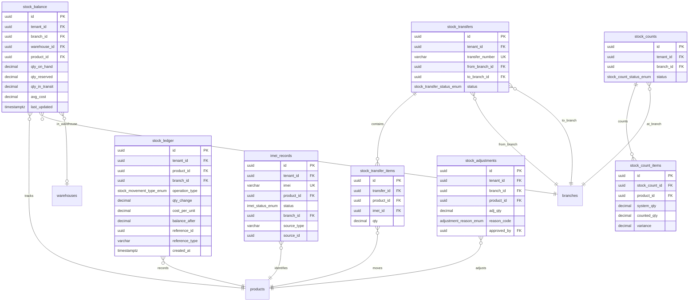

#### Table: `stock_balance`

| Column | Type | Constraints | Default | Description |
|--------|------|------------|---------|-------------|
| `id` | UUID | PK | `gen_random_uuid()` | |
| `tenant_id` | UUID | NOT NULL, FK → tenants | | |
| `branch_id` | UUID | NOT NULL, FK → branches | | |
| `warehouse_id` | UUID | FK → warehouses | | NULL = branch default location |
| `product_id` | UUID | NOT NULL, FK → products | | |
| `qty_on_hand` | DECIMAL(15,4) | NOT NULL | `0` | Current available stock |
| `qty_reserved` | DECIMAL(15,4) | NOT NULL | `0` | Reserved for pending orders |
| `qty_in_transit` | DECIMAL(15,4) | NOT NULL | `0` | Stock in transfer |
| `avg_cost` | DECIMAL(15,4) | NOT NULL | `0` | Weighted average cost |
| `last_stock_take` | TIMESTAMPTZ | | | Last physical count date |
| `reorder_point` | INTEGER | | | Product-branch specific override |
| `last_updated` | TIMESTAMPTZ | NOT NULL | `now()` | |
| `version` | INTEGER | NOT NULL | `1` | |

```sql
CREATE UNIQUE INDEX uq_stock_balance_tenant_branch_product ON stock_balance(tenant_id, branch_id, product_id) WHERE warehouse_id IS NULL;
CREATE UNIQUE INDEX uq_stock_balance_tenant_branch_warehouse_product ON stock_balance(tenant_id, branch_id, warehouse_id, product_id) WHERE warehouse_id IS NOT NULL;
CREATE INDEX idx_stock_balance_product ON stock_balance(product_id);
CREATE INDEX idx_stock_balance_branch ON stock_balance(branch_id);
CREATE INDEX idx_stock_balance_low_stock ON stock_balance(tenant_id, branch_id) WHERE qty_on_hand <= 0;

ALTER TABLE stock_balance ADD CONSTRAINT chk_stock_balance_reserved CHECK (qty_reserved >= 0);
ALTER TABLE stock_balance ADD CONSTRAINT chk_stock_balance_transit CHECK (qty_in_transit >= 0);
```

> **Business Rule:** Stock balance is a materialized aggregate updated by triggers on stock_ledger INSERT. Never update directly — always write to stock_ledger.

#### Table: `stock_ledger` — **IMMUTABLE**

| Column | Type | Constraints | Default | Description |
|--------|------|------------|---------|-------------|
| `id` | UUID | PK | `gen_random_uuid()` | |
| `tenant_id` | UUID | NOT NULL, FK → tenants | | |
| `product_id` | UUID | NOT NULL, FK → products | | |
| `variant_id` | UUID | FK → product_variants | | |
| `branch_id` | UUID | NOT NULL, FK → branches | | |
| `warehouse_id` | UUID | FK → warehouses | | |
| `operation_type` | `stock_movement_type_enum` | NOT NULL | | SALE, PURCHASE_RECEIPT, RETURN_IN, etc. |
| `qty_change` | DECIMAL(15,4) | NOT NULL | | Positive = increase, negative = decrease |
| `cost_per_unit` | DECIMAL(15,4) | NOT NULL | `0` | Cost at time of movement |
| `total_cost` | DECIMAL(15,4) | NOT NULL | `0` | qty_change * cost_per_unit |
| `balance_after` | DECIMAL(15,4) | NOT NULL | | Running balance after this movement |
| `avg_cost_after` | DECIMAL(15,4) | NOT NULL | `0` | Weighted avg cost after this movement |
| `reference_id` | UUID | NOT NULL | | Source document ID (invoice, GRN, transfer, etc.) |
| `reference_type` | VARCHAR(50) | NOT NULL | | INVOICE, GRN, TRANSFER, ADJUSTMENT, COUNT |
| `imei_id` | UUID | FK → imei_records | | For serialized items |
| `batch_number` | VARCHAR(100) | | | Batch/lot reference |
| `correlation_id` | UUID | | | |
| `notes` | TEXT | | | |
| `created_at` | TIMESTAMPTZ | NOT NULL | `now()` | |
| `created_by` | UUID | FK → users | | |

```sql
-- Partitioned by created_at (see Section 7)
CREATE INDEX idx_stock_ledger_product_branch ON stock_ledger(product_id, branch_id, created_at);
CREATE INDEX idx_stock_ledger_tenant_created ON stock_ledger(tenant_id, created_at);
CREATE INDEX idx_stock_ledger_reference ON stock_ledger(reference_type, reference_id);
CREATE INDEX idx_stock_ledger_operation ON stock_ledger(tenant_id, operation_type, created_at);
CREATE INDEX idx_stock_ledger_imei ON stock_ledger(imei_id) WHERE imei_id IS NOT NULL;
```

> **Business Rule:** stock_ledger is append-only — no UPDATE or DELETE. Every stock movement writes a new row. Enforced by trigger `trg_stock_ledger_immutable`.

#### Table: `imei_records`

| Column | Type | Constraints | Default | Description |
|--------|------|------------|---------|-------------|
| `id` | UUID | PK | `gen_random_uuid()` | |
| `tenant_id` | UUID | NOT NULL, FK → tenants | | |
| `imei` | VARCHAR(50) | NOT NULL | | IMEI/serial number |
| `product_id` | UUID | NOT NULL, FK → products | | |
| `variant_id` | UUID | FK → product_variants | | |
| `status` | `imei_status_enum` | NOT NULL | `'AVAILABLE'` | |
| `branch_id` | UUID | NOT NULL, FK → branches | | Current location |
| `warehouse_id` | UUID | FK → warehouses | | |
| `source_type` | VARCHAR(50) | NOT NULL | | How it entered system: PURCHASE, OPENING_BALANCE, TRANSFER |
| `source_id` | UUID | | | Source document (GRN, transfer, etc.) |
| `sold_invoice_id` | UUID | FK → invoices | | Invoice that sold this IMEI |
| `cost_price` | DECIMAL(15,4) | NOT NULL | `0` | Acquisition cost |
| `selling_price` | DECIMAL(15,4) | | | Actual selling price if sold |
| `warranty_expires_at` | DATE | | | Warranty expiry |
| `notes` | TEXT | | | |
| `created_at` | TIMESTAMPTZ | NOT NULL | `now()` | |
| `updated_at` | TIMESTAMPTZ | NOT NULL | `now()` | |
| `version` | INTEGER | NOT NULL | `1` | |
| `created_by` | UUID | FK → users | | |
| `updated_by` | UUID | FK → users | | |

```sql
CREATE UNIQUE INDEX uq_imei_records_imei ON imei_records(imei);
CREATE INDEX idx_imei_records_product ON imei_records(product_id, status);
CREATE INDEX idx_imei_records_branch ON imei_records(branch_id, status);
CREATE INDEX idx_imei_records_tenant_status ON imei_records(tenant_id, status);
CREATE INDEX idx_imei_records_sold ON imei_records(sold_invoice_id) WHERE sold_invoice_id IS NOT NULL;
```

> **Business Rule:** IMEI uniqueness is global (not per-tenant) — enforced at database level. Duplicate IMEI detection triggers ERR_INVENTORY_IMEI_DUPLICATE.

#### Table: `stock_transfers`

| Column | Type | Constraints | Default | Description |
|--------|------|------------|---------|-------------|
| `id` | UUID | PK | `gen_random_uuid()` | |
| `tenant_id` | UUID | NOT NULL, FK → tenants | | |
| `transfer_number` | VARCHAR(50) | NOT NULL | | Sequential |
| `from_branch_id` | UUID | NOT NULL, FK → branches | | Source branch |
| `to_branch_id` | UUID | NOT NULL, FK → branches | | Destination branch |
| `from_warehouse_id` | UUID | FK → warehouses | | |
| `to_warehouse_id` | UUID | FK → warehouses | | |
| `status` | `stock_transfer_status_enum` | NOT NULL | `'DRAFT'` | |
| `dispatched_at` | TIMESTAMPTZ | | | |
| `dispatched_by` | UUID | FK → users | | |
| `received_at` | TIMESTAMPTZ | | | |
| `received_by` | UUID | FK → users | | Confirms receipt at destination |
| `notes` | TEXT | | | |
| `correlation_id` | UUID | | | |
| `created_at` | TIMESTAMPTZ | NOT NULL | `now()` | |
| `updated_at` | TIMESTAMPTZ | NOT NULL | `now()` | |
| `deleted_at` | TIMESTAMPTZ | | | |
| `version` | INTEGER | NOT NULL | `1` | |
| `created_by` | UUID | FK → users | | |
| `updated_by` | UUID | FK → users | | |

```sql
CREATE UNIQUE INDEX uq_transfer_tenant_number ON stock_transfers(tenant_id, transfer_number) WHERE deleted_at IS NULL;
CREATE INDEX idx_transfers_from ON stock_transfers(from_branch_id, status) WHERE deleted_at IS NULL;
CREATE INDEX idx_transfers_to ON stock_transfers(to_branch_id, status) WHERE deleted_at IS NULL;
CREATE INDEX idx_transfers_status ON stock_transfers(tenant_id, status) WHERE deleted_at IS NULL;

ALTER TABLE stock_transfers ADD CONSTRAINT chk_transfers_different_branches CHECK (from_branch_id != to_branch_id);
```

#### Table: `stock_transfer_items`

| Column | Type | Constraints | Default | Description |
|--------|------|------------|---------|-------------|
| `id` | UUID | PK | `gen_random_uuid()` | |
| `transfer_id` | UUID | NOT NULL, FK → stock_transfers ON DELETE CASCADE | | |
| `product_id` | UUID | NOT NULL, FK → products | | |
| `variant_id` | UUID | FK → product_variants | | |
| `imei_id` | UUID | FK → imei_records | | For serialized items |
| `qty` | DECIMAL(15,4) | NOT NULL | | Transfer quantity |
| `qty_received` | DECIMAL(15,4) | NOT NULL | `0` | Actually received (can differ) |
| `cost_price` | DECIMAL(15,4) | NOT NULL | `0` | Cost at time of transfer |
| `notes` | TEXT | | | |
| `created_at` | TIMESTAMPTZ | NOT NULL | `now()` | |

```sql
CREATE INDEX idx_transfer_items_transfer ON stock_transfer_items(transfer_id);
CREATE INDEX idx_transfer_items_product ON stock_transfer_items(product_id);
CREATE INDEX idx_transfer_items_imei ON stock_transfer_items(imei_id) WHERE imei_id IS NOT NULL;

ALTER TABLE stock_transfer_items ADD CONSTRAINT chk_transfer_items_qty CHECK (qty > 0);
```

#### Table: `stock_adjustments`

| Column | Type | Constraints | Default | Description |
|--------|------|------------|---------|-------------|
| `id` | UUID | PK | `gen_random_uuid()` | |
| `tenant_id` | UUID | NOT NULL, FK → tenants | | |
| `branch_id` | UUID | NOT NULL, FK → branches | | |
| `warehouse_id` | UUID | FK → warehouses | | |
| `product_id` | UUID | NOT NULL, FK → products | | |
| `variant_id` | UUID | FK → product_variants | | |
| `adj_qty` | DECIMAL(15,4) | NOT NULL | | Positive = increase, negative = decrease |
| `cost_per_unit` | DECIMAL(15,4) | NOT NULL | `0` | |
| `reason_code` | `adjustment_reason_enum` | NOT NULL | | |
| `reason_notes` | TEXT | | | |
| `reference_number` | VARCHAR(50) | | | |
| `requires_approval` | BOOLEAN | NOT NULL | `false` | |
| `approved_by` | UUID | FK → users | | |
| `approved_at` | TIMESTAMPTZ | | | |
| `correlation_id` | UUID | | | |
| `created_at` | TIMESTAMPTZ | NOT NULL | `now()` | |
| `created_by` | UUID | FK → users | | |

```sql
CREATE INDEX idx_adjustments_branch ON stock_adjustments(branch_id, created_at);
CREATE INDEX idx_adjustments_product ON stock_adjustments(product_id);
CREATE INDEX idx_adjustments_tenant ON stock_adjustments(tenant_id, created_at);
CREATE INDEX idx_adjustments_pending ON stock_adjustments(tenant_id) WHERE requires_approval = true AND approved_by IS NULL;
```

#### Table: `stock_counts`

| Column | Type | Constraints | Default | Description |
|--------|------|------------|---------|-------------|
| `id` | UUID | PK | `gen_random_uuid()` | |
| `tenant_id` | UUID | NOT NULL, FK → tenants | | |
| `branch_id` | UUID | NOT NULL, FK → branches | | |
| `warehouse_id` | UUID | FK → warehouses | | |
| `count_number` | VARCHAR(50) | NOT NULL | | |
| `status` | `stock_count_status_enum` | NOT NULL | `'DRAFT'` | |
| `category_id` | UUID | FK → categories | | If counting specific category only |
| `started_at` | TIMESTAMPTZ | | | |
| `completed_at` | TIMESTAMPTZ | | | |
| `total_items` | INTEGER | NOT NULL | `0` | |
| `items_counted` | INTEGER | NOT NULL | `0` | |
| `variance_count` | INTEGER | NOT NULL | `0` | Items with variance |
| `notes` | TEXT | | | |
| `created_at` | TIMESTAMPTZ | NOT NULL | `now()` | |
| `updated_at` | TIMESTAMPTZ | NOT NULL | `now()` | |
| `version` | INTEGER | NOT NULL | `1` | |
| `created_by` | UUID | FK → users | | |
| `updated_by` | UUID | FK → users | | |

```sql
CREATE UNIQUE INDEX uq_stock_counts_number ON stock_counts(tenant_id, count_number);
CREATE INDEX idx_stock_counts_branch ON stock_counts(branch_id, status);
```

#### Table: `stock_count_items`

| Column | Type | Constraints | Default | Description |
|--------|------|------------|---------|-------------|
| `id` | UUID | PK | `gen_random_uuid()` | |
| `stock_count_id` | UUID | NOT NULL, FK → stock_counts ON DELETE CASCADE | | |
| `product_id` | UUID | NOT NULL, FK → products | | |
| `variant_id` | UUID | FK → product_variants | | |
| `system_qty` | DECIMAL(15,4) | NOT NULL | | System quantity at count start |
| `counted_qty` | DECIMAL(15,4) | | | Actual counted quantity |
| `variance` | DECIMAL(15,4) | | | counted - system |
| `variance_cost` | DECIMAL(15,4) | | | variance * avg_cost |
| `notes` | TEXT | | | |
| `counted_at` | TIMESTAMPTZ | | | |
| `counted_by` | UUID | FK → users | | |
| `created_at` | TIMESTAMPTZ | NOT NULL | `now()` | |

```sql
CREATE INDEX idx_stock_count_items_count ON stock_count_items(stock_count_id);
CREATE INDEX idx_stock_count_items_product ON stock_count_items(product_id);
CREATE UNIQUE INDEX uq_stock_count_items ON stock_count_items(stock_count_id, product_id);
```

---

### 3.8 CRM — Customers & Suppliers

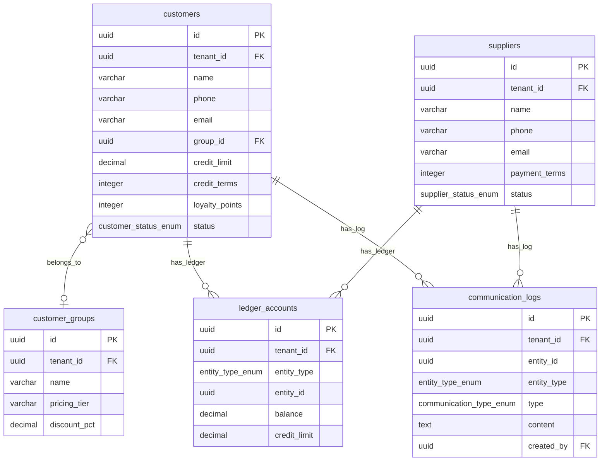

#### Table: `customers`

| Column | Type | Constraints | Default | Description |
|--------|------|------------|---------|-------------|
| `id` | UUID | PK | `gen_random_uuid()` | |
| `tenant_id` | UUID | NOT NULL, FK → tenants | | |
| `name` | VARCHAR(255) | NOT NULL | | |
| `phone` | VARCHAR(50) | | | Primary contact |
| `phone_secondary` | VARCHAR(50) | | | |
| `email` | VARCHAR(255) | | | |
| `address_line1` | VARCHAR(255) | | | |
| `address_line2` | VARCHAR(255) | | | |
| `city` | VARCHAR(100) | | | |
| `state` | VARCHAR(100) | | | |
| `postal_code` | VARCHAR(20) | | | |
| `country` | VARCHAR(100) | | `'Pakistan'` | |
| `tax_number` | VARCHAR(50) | | | Tax registration / NTN |
| `group_id` | UUID | FK → customer_groups | | Pricing group |
| `credit_limit` | DECIMAL(15,4) | NOT NULL | `0` | Maximum credit allowed |
| `credit_terms` | INTEGER | NOT NULL | `0` | Payment terms in days |
| `loyalty_points` | INTEGER | NOT NULL | `0` | Current loyalty balance |
| `opening_balance` | DECIMAL(15,4) | NOT NULL | `0` | Opening receivable balance |
| `status` | `customer_status_enum` | NOT NULL | `'ACTIVE'` | |
| `tags` | TEXT[] | | | |
| `custom_fields_json` | JSONB | | `'{}'::jsonb` | |
| `notes` | TEXT | | | |
| `created_at` | TIMESTAMPTZ | NOT NULL | `now()` | |
| `updated_at` | TIMESTAMPTZ | NOT NULL | `now()` | |
| `deleted_at` | TIMESTAMPTZ | | | |
| `version` | INTEGER | NOT NULL | `1` | |
| `created_by` | UUID | FK → users | | |
| `updated_by` | UUID | FK → users | | |

```sql
CREATE INDEX idx_customers_tenant_phone ON customers(tenant_id, phone) WHERE deleted_at IS NULL;
CREATE INDEX idx_customers_tenant_name ON customers(tenant_id, name) WHERE deleted_at IS NULL;
CREATE INDEX idx_customers_tenant_email ON customers(tenant_id, email) WHERE deleted_at IS NULL AND email IS NOT NULL;
CREATE INDEX idx_customers_group ON customers(group_id) WHERE deleted_at IS NULL AND group_id IS NOT NULL;
CREATE INDEX idx_customers_status ON customers(tenant_id, status) WHERE deleted_at IS NULL;
```

#### Table: `suppliers`

| Column | Type | Constraints | Default | Description |
|--------|------|------------|---------|-------------|
| `id` | UUID | PK | `gen_random_uuid()` | |
| `tenant_id` | UUID | NOT NULL, FK → tenants | | |
| `name` | VARCHAR(255) | NOT NULL | | |
| `contact_person` | VARCHAR(255) | | | |
| `phone` | VARCHAR(50) | | | |
| `email` | VARCHAR(255) | | | |
| `address_line1` | VARCHAR(255) | | | |
| `address_line2` | VARCHAR(255) | | | |
| `city` | VARCHAR(100) | | | |
| `state` | VARCHAR(100) | | | |
| `postal_code` | VARCHAR(20) | | | |
| `country` | VARCHAR(100) | | `'Pakistan'` | |
| `tax_number` | VARCHAR(50) | | | |
| `payment_terms` | INTEGER | NOT NULL | `30` | Days |
| `currency` | VARCHAR(3) | NOT NULL | `'PKR'` | |
| `bank_name` | VARCHAR(255) | | | |
| `bank_account_number` | VARCHAR(100) | | | |
| `opening_balance` | DECIMAL(15,4) | NOT NULL | `0` | Opening payable balance |
| `status` | `supplier_status_enum` | NOT NULL | `'ACTIVE'` | |
| `tags` | TEXT[] | | | |
| `custom_fields_json` | JSONB | | `'{}'::jsonb` | |
| `notes` | TEXT | | | |
| `created_at` | TIMESTAMPTZ | NOT NULL | `now()` | |
| `updated_at` | TIMESTAMPTZ | NOT NULL | `now()` | |
| `deleted_at` | TIMESTAMPTZ | | | |
| `version` | INTEGER | NOT NULL | `1` | |
| `created_by` | UUID | FK → users | | |
| `updated_by` | UUID | FK → users | | |

```sql
CREATE INDEX idx_suppliers_tenant_name ON suppliers(tenant_id, name) WHERE deleted_at IS NULL;
CREATE INDEX idx_suppliers_tenant_phone ON suppliers(tenant_id, phone) WHERE deleted_at IS NULL;
CREATE INDEX idx_suppliers_status ON suppliers(tenant_id, status) WHERE deleted_at IS NULL;
```

#### Table: `customer_groups`

| Column | Type | Constraints | Default | Description |
|--------|------|------------|---------|-------------|
| `id` | UUID | PK | `gen_random_uuid()` | |
| `tenant_id` | UUID | NOT NULL, FK → tenants | | |
| `name` | VARCHAR(255) | NOT NULL | | e.g., "Retail", "Wholesale", "Distributor" |
| `pricing_tier` | VARCHAR(100) | | | Linked pricing tier name |
| `discount_pct` | DECIMAL(5,2) | NOT NULL | `0` | Default group discount |
| `description` | TEXT | | | |
| `is_active` | BOOLEAN | NOT NULL | `true` | |
| `created_at` | TIMESTAMPTZ | NOT NULL | `now()` | |
| `updated_at` | TIMESTAMPTZ | NOT NULL | `now()` | |
| `deleted_at` | TIMESTAMPTZ | | | |
| `version` | INTEGER | NOT NULL | `1` | |

```sql
CREATE UNIQUE INDEX uq_customer_groups_tenant_name ON customer_groups(tenant_id, name) WHERE deleted_at IS NULL;
```

#### Table: `ledger_accounts`

| Column | Type | Constraints | Default | Description |
|--------|------|------------|---------|-------------|
| `id` | UUID | PK | `gen_random_uuid()` | |
| `tenant_id` | UUID | NOT NULL, FK → tenants | | |
| `entity_type` | `entity_type_enum` | NOT NULL | | CUSTOMER or SUPPLIER |
| `entity_id` | UUID | NOT NULL | | References customers.id or suppliers.id |
| `balance` | DECIMAL(15,4) | NOT NULL | `0` | Current balance (positive = receivable/payable) |
| `credit_limit` | DECIMAL(15,4) | NOT NULL | `0` | Credit limit (for customers) |
| `last_transaction_at` | TIMESTAMPTZ | | | |
| `created_at` | TIMESTAMPTZ | NOT NULL | `now()` | |
| `updated_at` | TIMESTAMPTZ | NOT NULL | `now()` | |

```sql
CREATE UNIQUE INDEX uq_ledger_accounts_entity ON ledger_accounts(tenant_id, entity_type, entity_id);
CREATE INDEX idx_ledger_accounts_entity ON ledger_accounts(entity_id);
CREATE INDEX idx_ledger_accounts_balance ON ledger_accounts(tenant_id, entity_type) WHERE balance != 0;
```

#### Table: `communication_logs`

| Column | Type | Constraints | Default | Description |
|--------|------|------------|---------|-------------|
| `id` | UUID | PK | `gen_random_uuid()` | |
| `tenant_id` | UUID | NOT NULL, FK → tenants | | |
| `entity_type` | `entity_type_enum` | NOT NULL | | |
| `entity_id` | UUID | NOT NULL | | |
| `type` | `communication_type_enum` | NOT NULL | | CALL, SMS, EMAIL, etc. |
| `subject` | VARCHAR(255) | | | |
| `content` | TEXT | NOT NULL | | |
| `follow_up_date` | DATE | | | |
| `follow_up_completed` | BOOLEAN | NOT NULL | `false` | |
| `created_at` | TIMESTAMPTZ | NOT NULL | `now()` | |
| `created_by` | UUID | NOT NULL, FK → users | | |

```sql
CREATE INDEX idx_communication_logs_entity ON communication_logs(entity_type, entity_id, created_at);
CREATE INDEX idx_communication_logs_follow_up ON communication_logs(follow_up_date) WHERE follow_up_completed = false AND follow_up_date IS NOT NULL;
```

---

### 3.9 Accounting & Finance

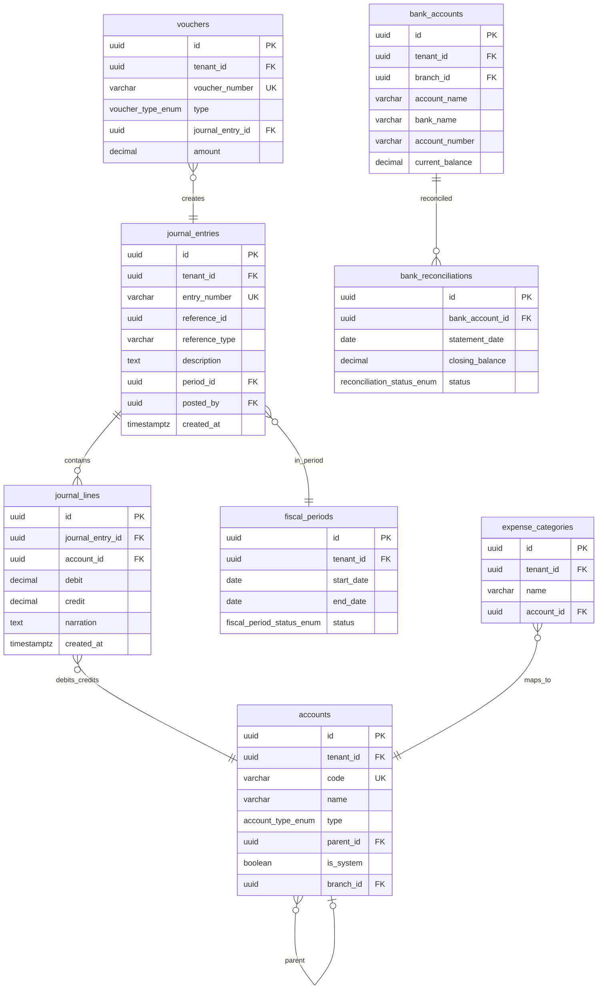

#### Table: `accounts`

| Column | Type | Constraints | Default | Description |
|--------|------|------------|---------|-------------|
| `id` | UUID | PK | `gen_random_uuid()` | |
| `tenant_id` | UUID | NOT NULL, FK → tenants | | |
| `code` | VARCHAR(20) | NOT NULL | | Account code (e.g., 1000, 2000, 3000) |
| `name` | VARCHAR(255) | NOT NULL | | Account name |
| `type` | `account_type_enum` | NOT NULL | | ASSET, LIABILITY, EQUITY, REVENUE, EXPENSE |
| `parent_id` | UUID | FK → accounts | | Parent account for hierarchy |
| `description` | TEXT | | | |
| `is_system` | BOOLEAN | NOT NULL | `false` | System accounts cannot be deleted |
| `is_active` | BOOLEAN | NOT NULL | `true` | |
| `branch_id` | UUID | FK → branches | | NULL = tenant-level account |
| `opening_balance` | DECIMAL(15,4) | NOT NULL | `0` | |
| `current_balance` | DECIMAL(15,4) | NOT NULL | `0` | Computed running balance |
| `created_at` | TIMESTAMPTZ | NOT NULL | `now()` | |
| `updated_at` | TIMESTAMPTZ | NOT NULL | `now()` | |
| `deleted_at` | TIMESTAMPTZ | | | |
| `version` | INTEGER | NOT NULL | `1` | |
| `created_by` | UUID | FK → users | | |
| `updated_by` | UUID | FK → users | | |

```sql
CREATE UNIQUE INDEX uq_accounts_tenant_code ON accounts(tenant_id, code) WHERE deleted_at IS NULL;
CREATE INDEX idx_accounts_parent ON accounts(parent_id) WHERE deleted_at IS NULL;
CREATE INDEX idx_accounts_type ON accounts(tenant_id, type) WHERE deleted_at IS NULL;
CREATE INDEX idx_accounts_branch ON accounts(tenant_id, branch_id) WHERE deleted_at IS NULL;
```

#### Table: `journal_entries` — **IMMUTABLE**

| Column | Type | Constraints | Default | Description |
|--------|------|------------|---------|-------------|
| `id` | UUID | PK | `gen_random_uuid()` | |
| `tenant_id` | UUID | NOT NULL, FK → tenants | | |
| `entry_number` | VARCHAR(50) | NOT NULL | | Sequential journal number |
| `reference_id` | UUID | | | Source document (invoice, payment, etc.) |
| `reference_type` | VARCHAR(50) | | | SALE_INVOICE, PURCHASE_INVOICE, PAYMENT, RECEIPT, MANUAL, etc. |
| `description` | TEXT | NOT NULL | | Transaction description / narration |
| `period_id` | UUID | NOT NULL, FK → fiscal_periods | | |
| `branch_id` | UUID | FK → branches | | |
| `is_reversing` | BOOLEAN | NOT NULL | `false` | Whether this reverses another entry |
| `reversed_entry_id` | UUID | FK → journal_entries | | Original entry being reversed |
| `posted_by` | UUID | NOT NULL, FK → users | | |
| `correlation_id` | UUID | | | |
| `created_at` | TIMESTAMPTZ | NOT NULL | `now()` | |

```sql
CREATE UNIQUE INDEX uq_journal_entries_tenant_number ON journal_entries(tenant_id, entry_number);
CREATE INDEX idx_journal_entries_tenant_created ON journal_entries(tenant_id, created_at);
CREATE INDEX idx_journal_entries_reference ON journal_entries(reference_type, reference_id);
CREATE INDEX idx_journal_entries_period ON journal_entries(period_id);
CREATE INDEX idx_journal_entries_correlation ON journal_entries(correlation_id) WHERE correlation_id IS NOT NULL;
```

> **Business Rule:** journal_entries are IMMUTABLE. No UPDATE or DELETE. Corrections only via reversing journal entries (is_reversing = true). Enforced by trigger.

#### Table: `journal_lines` — **IMMUTABLE**

| Column | Type | Constraints | Default | Description |
|--------|------|------------|---------|-------------|
| `id` | UUID | PK | `gen_random_uuid()` | |
| `journal_entry_id` | UUID | NOT NULL, FK → journal_entries ON DELETE RESTRICT | | |
| `account_id` | UUID | NOT NULL, FK → accounts | | |
| `debit` | DECIMAL(15,4) | NOT NULL | `0` | Debit amount (0 if credit) |
| `credit` | DECIMAL(15,4) | NOT NULL | `0` | Credit amount (0 if debit) |
| `narration` | TEXT | | | Line-level description |
| `branch_id` | UUID | FK → branches | | |
| `created_at` | TIMESTAMPTZ | NOT NULL | `now()` | |

```sql
CREATE INDEX idx_journal_lines_entry ON journal_lines(journal_entry_id);
CREATE INDEX idx_journal_lines_account ON journal_lines(account_id, journal_entry_id);
CREATE INDEX idx_journal_lines_account_created ON journal_lines(account_id, created_at);

ALTER TABLE journal_lines ADD CONSTRAINT chk_journal_lines_debit_positive CHECK (debit >= 0);
ALTER TABLE journal_lines ADD CONSTRAINT chk_journal_lines_credit_positive CHECK (credit >= 0);
ALTER TABLE journal_lines ADD CONSTRAINT chk_journal_lines_one_side CHECK (
    (debit > 0 AND credit = 0) OR (debit = 0 AND credit > 0)
);
```

> **Business Rule:** For every journal_entry, `SUM(debit) = SUM(credit)` across all journal_lines. Enforced by trigger `trg_journal_entry_balance_check`.

#### Table: `fiscal_periods`

| Column | Type | Constraints | Default | Description |
|--------|------|------------|---------|-------------|
| `id` | UUID | PK | `gen_random_uuid()` | |
| `tenant_id` | UUID | NOT NULL, FK → tenants | | |
| `name` | VARCHAR(100) | NOT NULL | | e.g., "FY2025-Q1", "Jul 2025" |
| `start_date` | DATE | NOT NULL | | |
| `end_date` | DATE | NOT NULL | | |
| `status` | `fiscal_period_status_enum` | NOT NULL | `'OPEN'` | |
| `closed_by` | UUID | FK → users | | |
| `closed_at` | TIMESTAMPTZ | | | |
| `created_at` | TIMESTAMPTZ | NOT NULL | `now()` | |
| `updated_at` | TIMESTAMPTZ | NOT NULL | `now()` | |

```sql
CREATE INDEX idx_fiscal_periods_tenant ON fiscal_periods(tenant_id, start_date);
CREATE INDEX idx_fiscal_periods_status ON fiscal_periods(tenant_id, status);

ALTER TABLE fiscal_periods ADD CONSTRAINT chk_fiscal_periods_dates CHECK (end_date > start_date);
```

> **Business Rule:** When a fiscal period is CLOSED, no journal entries can be created in that period. Enforced at API level and validated by trigger.

#### Table: `bank_accounts`

| Column | Type | Constraints | Default | Description |
|--------|------|------------|---------|-------------|
| `id` | UUID | PK | `gen_random_uuid()` | |
| `tenant_id` | UUID | NOT NULL, FK → tenants | | |
| `branch_id` | UUID | FK → branches | | |
| `account_name` | VARCHAR(255) | NOT NULL | | Internal name |
| `bank_name` | VARCHAR(255) | NOT NULL | | |
| `account_number` | VARCHAR(100) | NOT NULL | | |
| `iban` | VARCHAR(50) | | | |
| `swift_code` | VARCHAR(20) | | | |
| `currency` | VARCHAR(3) | NOT NULL | `'PKR'` | |
| `opening_balance` | DECIMAL(15,4) | NOT NULL | `0` | |
| `current_balance` | DECIMAL(15,4) | NOT NULL | `0` | |
| `chart_account_id` | UUID | FK → accounts | | Linked chart of accounts entry |
| `is_active` | BOOLEAN | NOT NULL | `true` | |
| `created_at` | TIMESTAMPTZ | NOT NULL | `now()` | |
| `updated_at` | TIMESTAMPTZ | NOT NULL | `now()` | |
| `deleted_at` | TIMESTAMPTZ | | | |
| `version` | INTEGER | NOT NULL | `1` | |

```sql
CREATE INDEX idx_bank_accounts_tenant ON bank_accounts(tenant_id) WHERE deleted_at IS NULL;
CREATE INDEX idx_bank_accounts_branch ON bank_accounts(branch_id) WHERE deleted_at IS NULL;
```

#### Table: `bank_reconciliations`

| Column | Type | Constraints | Default | Description |
|--------|------|------------|---------|-------------|
| `id` | UUID | PK | `gen_random_uuid()` | |
| `tenant_id` | UUID | NOT NULL, FK → tenants | | |
| `bank_account_id` | UUID | NOT NULL, FK → bank_accounts | | |
| `statement_date` | DATE | NOT NULL | | Bank statement date |
| `statement_balance` | DECIMAL(15,4) | NOT NULL | | Balance per bank statement |
| `ledger_balance` | DECIMAL(15,4) | NOT NULL | | Balance per books |
| `reconciled_balance` | DECIMAL(15,4) | | | After reconciliation |
| `unreconciled_items_json` | JSONB | | | Outstanding items |
| `status` | `reconciliation_status_enum` | NOT NULL | `'DRAFT'` | |
| `reconciled_by` | UUID | FK → users | | |
| `reconciled_at` | TIMESTAMPTZ | | | |
| `notes` | TEXT | | | |
| `created_at` | TIMESTAMPTZ | NOT NULL | `now()` | |
| `updated_at` | TIMESTAMPTZ | NOT NULL | `now()` | |
| `version` | INTEGER | NOT NULL | `1` | |

```sql
CREATE INDEX idx_bank_recon_account ON bank_reconciliations(bank_account_id, statement_date);
CREATE INDEX idx_bank_recon_status ON bank_reconciliations(tenant_id, status);
```

#### Table: `expense_categories`

| Column | Type | Constraints | Default | Description |
|--------|------|------------|---------|-------------|
| `id` | UUID | PK | `gen_random_uuid()` | |
| `tenant_id` | UUID | NOT NULL, FK → tenants | | |
| `name` | VARCHAR(255) | NOT NULL | | e.g., "Rent", "Utilities", "Office Supplies" |
| `account_id` | UUID | NOT NULL, FK → accounts | | Linked expense account |
| `parent_id` | UUID | FK → expense_categories | | Subcategory support |
| `description` | TEXT | | | |
| `is_active` | BOOLEAN | NOT NULL | `true` | |
| `created_at` | TIMESTAMPTZ | NOT NULL | `now()` | |
| `updated_at` | TIMESTAMPTZ | NOT NULL | `now()` | |
| `deleted_at` | TIMESTAMPTZ | | | |

```sql
CREATE UNIQUE INDEX uq_expense_categories_tenant_name ON expense_categories(tenant_id, name) WHERE deleted_at IS NULL;
CREATE INDEX idx_expense_categories_account ON expense_categories(account_id);
```

#### Table: `vouchers`

| Column | Type | Constraints | Default | Description |
|--------|------|------------|---------|-------------|
| `id` | UUID | PK | `gen_random_uuid()` | |
| `tenant_id` | UUID | NOT NULL, FK → tenants | | |
| `voucher_number` | VARCHAR(50) | NOT NULL | | Sequential by type |
| `type` | `voucher_type_enum` | NOT NULL | | PAYMENT, RECEIPT, CONTRA, JOURNAL |
| `journal_entry_id` | UUID | FK → journal_entries | | Created journal entry |
| `amount` | DECIMAL(15,4) | NOT NULL | | Total voucher amount |
| `party_type` | `entity_type_enum` | | | CUSTOMER or SUPPLIER |
| `party_id` | UUID | | | Customer/supplier ID |
| `bank_account_id` | UUID | FK → bank_accounts | | |
| `payment_method` | `payment_method_enum` | | | |
| `reference` | VARCHAR(255) | | | Cheque number, transfer ref |
| `description` | TEXT | | | |
| `approved_by` | UUID | FK → users | | |
| `approved_at` | TIMESTAMPTZ | | | |
| `correlation_id` | UUID | | | |
| `created_at` | TIMESTAMPTZ | NOT NULL | `now()` | |
| `updated_at` | TIMESTAMPTZ | NOT NULL | `now()` | |
| `deleted_at` | TIMESTAMPTZ | | | |
| `version` | INTEGER | NOT NULL | `1` | |
| `created_by` | UUID | FK → users | | |
| `updated_by` | UUID | FK → users | | |

```sql
CREATE UNIQUE INDEX uq_vouchers_tenant_number ON vouchers(tenant_id, voucher_number) WHERE deleted_at IS NULL;
CREATE INDEX idx_vouchers_type ON vouchers(tenant_id, type) WHERE deleted_at IS NULL;
CREATE INDEX idx_vouchers_party ON vouchers(party_type, party_id) WHERE party_id IS NOT NULL;
CREATE INDEX idx_vouchers_journal ON vouchers(journal_entry_id) WHERE journal_entry_id IS NOT NULL;

ALTER TABLE vouchers ADD CONSTRAINT chk_vouchers_amount CHECK (amount > 0);
```

---

### 3.10 HR & Payroll

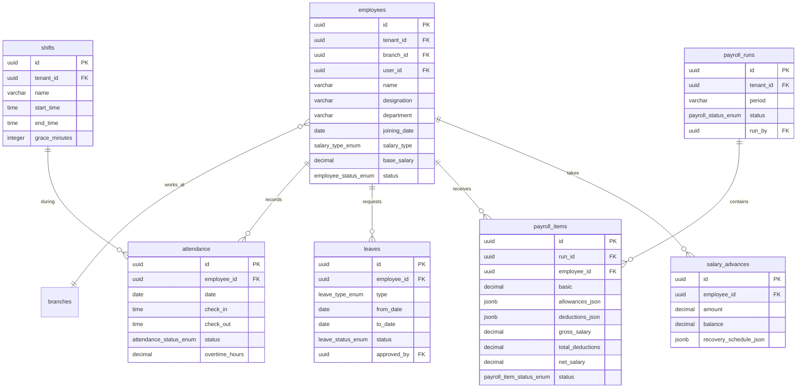

#### Table: `employees`

| Column | Type | Constraints | Default | Description |
|--------|------|------------|---------|-------------|
| `id` | UUID | PK | `gen_random_uuid()` | |
| `tenant_id` | UUID | NOT NULL, FK → tenants | | |
| `branch_id` | UUID | NOT NULL, FK → branches | | Primary branch |
| `user_id` | UUID | FK → users | | Linked user account (NULL if no system access) |
| `employee_code` | VARCHAR(50) | NOT NULL | | Employee ID / badge number |
| `name` | VARCHAR(255) | NOT NULL | | |
| `cnic` | VARCHAR(20) | | | National ID |
| `phone` | VARCHAR(50) | | | |
| `email` | VARCHAR(255) | | | |
| `address` | TEXT | | | |
| `designation` | VARCHAR(100) | | | Job title |
| `department` | VARCHAR(100) | | | Department name |
| `joining_date` | DATE | NOT NULL | | |
| `termination_date` | DATE | | | |
| `salary_type` | `salary_type_enum` | NOT NULL | `'MONTHLY'` | |
| `base_salary` | DECIMAL(15,4) | NOT NULL | `0` | |
| `bank_name` | VARCHAR(255) | | | |
| `bank_account_number` | VARCHAR(100) | | | |
| `emergency_contact` | VARCHAR(255) | | | |
| `emergency_phone` | VARCHAR(50) | | | |
| `documents_json` | JSONB | | `'[]'::jsonb` | List of document URLs |
| `status` | `employee_status_enum` | NOT NULL | `'ACTIVE'` | |
| `notes` | TEXT | | | |
| `created_at` | TIMESTAMPTZ | NOT NULL | `now()` | |
| `updated_at` | TIMESTAMPTZ | NOT NULL | `now()` | |
| `deleted_at` | TIMESTAMPTZ | | | |
| `version` | INTEGER | NOT NULL | `1` | |
| `created_by` | UUID | FK → users | | |
| `updated_by` | UUID | FK → users | | |

```sql
CREATE UNIQUE INDEX uq_employees_tenant_code ON employees(tenant_id, employee_code) WHERE deleted_at IS NULL;
CREATE INDEX idx_employees_branch ON employees(branch_id) WHERE deleted_at IS NULL;
CREATE INDEX idx_employees_user ON employees(user_id) WHERE user_id IS NOT NULL AND deleted_at IS NULL;
CREATE INDEX idx_employees_status ON employees(tenant_id, status) WHERE deleted_at IS NULL;
CREATE INDEX idx_employees_department ON employees(tenant_id, department) WHERE deleted_at IS NULL;
```

#### Table: `shifts`

| Column | Type | Constraints | Default | Description |
|--------|------|------------|---------|-------------|
| `id` | UUID | PK | `gen_random_uuid()` | |
| `tenant_id` | UUID | NOT NULL, FK → tenants | | |
| `name` | VARCHAR(100) | NOT NULL | | e.g., "Morning", "Evening", "Night" |
| `start_time` | TIME | NOT NULL | | |
| `end_time` | TIME | NOT NULL | | |
| `grace_minutes` | INTEGER | NOT NULL | `15` | Late arrival grace period |
| `break_minutes` | INTEGER | NOT NULL | `60` | Break duration |
| `is_active` | BOOLEAN | NOT NULL | `true` | |
| `created_at` | TIMESTAMPTZ | NOT NULL | `now()` | |
| `updated_at` | TIMESTAMPTZ | NOT NULL | `now()` | |
| `deleted_at` | TIMESTAMPTZ | | | |

```sql
CREATE UNIQUE INDEX uq_shifts_tenant_name ON shifts(tenant_id, name) WHERE deleted_at IS NULL;
```

#### Table: `attendance`

| Column | Type | Constraints | Default | Description |
|--------|------|------------|---------|-------------|
| `id` | UUID | PK | `gen_random_uuid()` | |
| `tenant_id` | UUID | NOT NULL, FK → tenants | | |
| `employee_id` | UUID | NOT NULL, FK → employees | | |
| `shift_id` | UUID | FK → shifts | | |
| `date` | DATE | NOT NULL | | |
| `check_in` | TIMESTAMPTZ | | | |
| `check_out` | TIMESTAMPTZ | | | |
| `status` | `attendance_status_enum` | NOT NULL | `'PRESENT'` | |
| `overtime_hours` | DECIMAL(5,2) | NOT NULL | `0` | |
| `late_minutes` | INTEGER | NOT NULL | `0` | |
| `early_leave_minutes` | INTEGER | NOT NULL | `0` | |
| `source` | VARCHAR(50) | NOT NULL | `'MANUAL'` | MANUAL, BIOMETRIC, GPS |
| `gps_location` | POINT | | | GPS coordinates if mobile check-in |
| `device_id` | UUID | FK → devices | | |
| `notes` | TEXT | | | |
| `created_at` | TIMESTAMPTZ | NOT NULL | `now()` | |
| `updated_at` | TIMESTAMPTZ | NOT NULL | `now()` | |
| `version` | INTEGER | NOT NULL | `1` | |
| `created_by` | UUID | FK → users | | |
| `updated_by` | UUID | FK → users | | |

```sql
CREATE UNIQUE INDEX uq_attendance_employee_date ON attendance(employee_id, date);
CREATE INDEX idx_attendance_tenant_date ON attendance(tenant_id, date);
CREATE INDEX idx_attendance_status ON attendance(tenant_id, status, date);
```

#### Table: `leaves`

| Column | Type | Constraints | Default | Description |
|--------|------|------------|---------|-------------|
| `id` | UUID | PK | `gen_random_uuid()` | |
| `tenant_id` | UUID | NOT NULL, FK → tenants | | |
| `employee_id` | UUID | NOT NULL, FK → employees | | |
| `type` | `leave_type_enum` | NOT NULL | | |
| `from_date` | DATE | NOT NULL | | |
| `to_date` | DATE | NOT NULL | | |
| `days` | DECIMAL(5,1) | NOT NULL | | Total leave days (can be 0.5 for half-day) |
| `reason` | TEXT | | | |
| `status` | `leave_status_enum` | NOT NULL | `'PENDING'` | |
| `approved_by` | UUID | FK → users | | |
| `approved_at` | TIMESTAMPTZ | | | |
| `rejection_reason` | TEXT | | | |
| `created_at` | TIMESTAMPTZ | NOT NULL | `now()` | |
| `updated_at` | TIMESTAMPTZ | NOT NULL | `now()` | |
| `version` | INTEGER | NOT NULL | `1` | |
| `created_by` | UUID | FK → users | | |

```sql
CREATE INDEX idx_leaves_employee ON leaves(employee_id, from_date);
CREATE INDEX idx_leaves_status ON leaves(tenant_id, status);
CREATE INDEX idx_leaves_pending ON leaves(tenant_id) WHERE status = 'PENDING';

ALTER TABLE leaves ADD CONSTRAINT chk_leaves_dates CHECK (to_date >= from_date);
ALTER TABLE leaves ADD CONSTRAINT chk_leaves_days CHECK (days > 0);
```

#### Table: `payroll_runs`

| Column | Type | Constraints | Default | Description |
|--------|------|------------|---------|-------------|
| `id` | UUID | PK | `gen_random_uuid()` | |
| `tenant_id` | UUID | NOT NULL, FK → tenants | | |
| `branch_id` | UUID | FK → branches | | NULL = all branches |
| `period` | VARCHAR(20) | NOT NULL | | e.g., "2026-05" |
| `period_start` | DATE | NOT NULL | | |
| `period_end` | DATE | NOT NULL | | |
| `status` | `payroll_status_enum` | NOT NULL | `'DRAFT'` | |
| `total_gross` | DECIMAL(15,4) | NOT NULL | `0` | |
| `total_deductions` | DECIMAL(15,4) | NOT NULL | `0` | |
| `total_net` | DECIMAL(15,4) | NOT NULL | `0` | |
| `employee_count` | INTEGER | NOT NULL | `0` | |
| `run_by` | UUID | NOT NULL, FK → users | | |
| `approved_by` | UUID | FK → users | | |
| `approved_at` | TIMESTAMPTZ | | | |
| `disbursed_at` | TIMESTAMPTZ | | | |
| `journal_entry_id` | UUID | FK → journal_entries | | Accounting posting |
| `correlation_id` | UUID | | | |
| `notes` | TEXT | | | |
| `created_at` | TIMESTAMPTZ | NOT NULL | `now()` | |
| `updated_at` | TIMESTAMPTZ | NOT NULL | `now()` | |
| `version` | INTEGER | NOT NULL | `1` | |

```sql
CREATE UNIQUE INDEX uq_payroll_runs_period ON payroll_runs(tenant_id, branch_id, period);
CREATE INDEX idx_payroll_runs_status ON payroll_runs(tenant_id, status);
```

#### Table: `payroll_items`

| Column | Type | Constraints | Default | Description |
|--------|------|------------|---------|-------------|
| `id` | UUID | PK | `gen_random_uuid()` | |
| `run_id` | UUID | NOT NULL, FK → payroll_runs ON DELETE CASCADE | | |
| `employee_id` | UUID | NOT NULL, FK → employees | | |
| `basic` | DECIMAL(15,4) | NOT NULL | | Base salary for period |
| `allowances_json` | JSONB | NOT NULL | `'{}'::jsonb` | { "housing": 5000, "transport": 3000 } |
| `deductions_json` | JSONB | NOT NULL | `'{}'::jsonb` | { "tax": 2000, "advance": 5000, "loan": 3000 } |
| `overtime_hours` | DECIMAL(5,2) | NOT NULL | `0` | |
| `overtime_amount` | DECIMAL(15,4) | NOT NULL | `0` | |
| `gross_salary` | DECIMAL(15,4) | NOT NULL | | basic + allowances + overtime |
| `total_deductions` | DECIMAL(15,4) | NOT NULL | | Sum of all deductions |
| `net_salary` | DECIMAL(15,4) | NOT NULL | | gross - deductions |
| `status` | `payroll_item_status_enum` | NOT NULL | `'PENDING'` | |
| `payment_reference` | VARCHAR(255) | | | Bank transfer reference |
| `created_at` | TIMESTAMPTZ | NOT NULL | `now()` | |
| `updated_at` | TIMESTAMPTZ | NOT NULL | `now()` | |

```sql
CREATE UNIQUE INDEX uq_payroll_items_run_employee ON payroll_items(run_id, employee_id);
CREATE INDEX idx_payroll_items_employee ON payroll_items(employee_id);

ALTER TABLE payroll_items ADD CONSTRAINT chk_payroll_items_net CHECK (net_salary >= 0);
```

#### Table: `salary_advances`

| Column | Type | Constraints | Default | Description |
|--------|------|------------|---------|-------------|
| `id` | UUID | PK | `gen_random_uuid()` | |
| `tenant_id` | UUID | NOT NULL, FK → tenants | | |
| `employee_id` | UUID | NOT NULL, FK → employees | | |
| `amount` | DECIMAL(15,4) | NOT NULL | | Total advance amount |
| `balance` | DECIMAL(15,4) | NOT NULL | | Remaining unrecovered amount |
| `recovery_amount` | DECIMAL(15,4) | NOT NULL | | Per-period recovery amount |
| `recovery_schedule_json` | JSONB | | | Schedule: [{ period, amount, recovered }] |
| `disbursed_at` | TIMESTAMPTZ | NOT NULL | | |
| `disbursed_by` | UUID | NOT NULL, FK → users | | |
| `fully_recovered_at` | TIMESTAMPTZ | | | |
| `journal_entry_id` | UUID | FK → journal_entries | | |
| `notes` | TEXT | | | |
| `created_at` | TIMESTAMPTZ | NOT NULL | `now()` | |
| `updated_at` | TIMESTAMPTZ | NOT NULL | `now()` | |
| `version` | INTEGER | NOT NULL | `1` | |

```sql
CREATE INDEX idx_salary_advances_employee ON salary_advances(employee_id);
CREATE INDEX idx_salary_advances_active ON salary_advances(tenant_id) WHERE balance > 0;

ALTER TABLE salary_advances ADD CONSTRAINT chk_salary_advances_amount CHECK (amount > 0);
ALTER TABLE salary_advances ADD CONSTRAINT chk_salary_advances_balance CHECK (balance >= 0 AND balance <= amount);
```

---

### 3.11 Repair Management

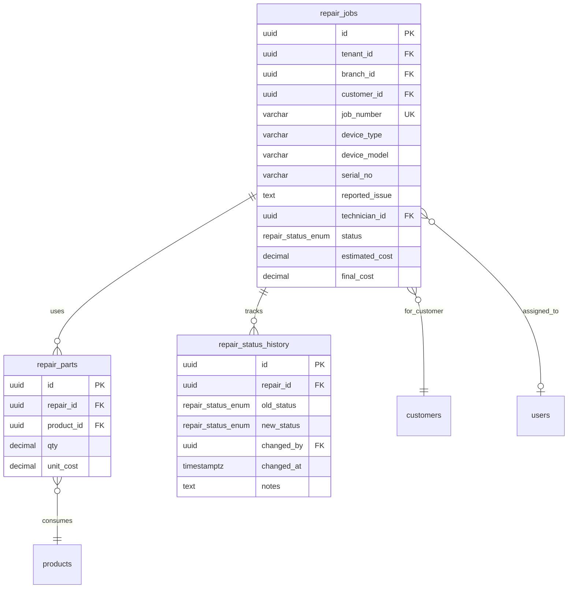

#### Table: `repair_jobs`

| Column | Type | Constraints | Default | Description |
|--------|------|------------|---------|-------------|
| `id` | UUID | PK | `gen_random_uuid()` | |
| `tenant_id` | UUID | NOT NULL, FK → tenants | | |
| `branch_id` | UUID | NOT NULL, FK → branches | | |
| `customer_id` | UUID | NOT NULL, FK → customers | | |
| `job_number` | VARCHAR(50) | NOT NULL | | Sequential |
| `device_type` | VARCHAR(100) | NOT NULL | | e.g., "Smartphone", "Laptop", "Tablet" |
| `device_brand` | VARCHAR(100) | | | |
| `device_model` | VARCHAR(100) | | | |
| `serial_no` | VARCHAR(100) | | | |
| `imei` | VARCHAR(50) | | | |
| `reported_issue` | TEXT | NOT NULL | | Customer description |
| `diagnosis` | TEXT | | | Technician diagnosis |
| `technician_id` | UUID | FK → users | | Assigned technician |
| `status` | `repair_status_enum` | NOT NULL | `'RECEIVED'` | |
| `priority` | VARCHAR(20) | NOT NULL | `'NORMAL'` | LOW, NORMAL, HIGH, URGENT |
| `estimated_cost` | DECIMAL(15,4) | | | Customer estimate |
| `final_cost` | DECIMAL(15,4) | | | Actual repair cost |
| `customer_approved` | BOOLEAN | | | Customer approved estimate |
| `invoice_id` | UUID | FK → invoices | | Generated invoice on completion |
| `warranty_expires_at` | DATE | | | Repair warranty |
| `received_at` | TIMESTAMPTZ | NOT NULL | `now()` | |
| `delivered_at` | TIMESTAMPTZ | | | |
| `customer_signature_url` | VARCHAR(500) | | | Encrypted signature image |
| `notes` | TEXT | | | |
| `correlation_id` | UUID | | | |
| `created_at` | TIMESTAMPTZ | NOT NULL | `now()` | |
| `updated_at` | TIMESTAMPTZ | NOT NULL | `now()` | |
| `deleted_at` | TIMESTAMPTZ | | | |
| `version` | INTEGER | NOT NULL | `1` | |
| `created_by` | UUID | FK → users | | |
| `updated_by` | UUID | FK → users | | |

```sql
CREATE UNIQUE INDEX uq_repair_jobs_tenant_number ON repair_jobs(tenant_id, job_number) WHERE deleted_at IS NULL;
CREATE INDEX idx_repair_jobs_branch_status ON repair_jobs(branch_id, status) WHERE deleted_at IS NULL;
CREATE INDEX idx_repair_jobs_customer ON repair_jobs(customer_id) WHERE deleted_at IS NULL;
CREATE INDEX idx_repair_jobs_technician ON repair_jobs(technician_id) WHERE deleted_at IS NULL AND technician_id IS NOT NULL;
CREATE INDEX idx_repair_jobs_status ON repair_jobs(tenant_id, status) WHERE deleted_at IS NULL;
```

#### Table: `repair_parts`

| Column | Type | Constraints | Default | Description |
|--------|------|------------|---------|-------------|
| `id` | UUID | PK | `gen_random_uuid()` | |
| `repair_id` | UUID | NOT NULL, FK → repair_jobs ON DELETE CASCADE | | |
| `product_id` | UUID | NOT NULL, FK → products | | Part from inventory |
| `qty` | DECIMAL(15,4) | NOT NULL | | |
| `unit_cost` | DECIMAL(15,4) | NOT NULL | | Cost at time of usage |
| `total_cost` | DECIMAL(15,4) | NOT NULL | | qty * unit_cost |
| `stock_ledger_id` | UUID | FK → stock_ledger | | Stock deduction reference |
| `notes` | TEXT | | | |
| `created_at` | TIMESTAMPTZ | NOT NULL | `now()` | |
| `created_by` | UUID | FK → users | | |

```sql
CREATE INDEX idx_repair_parts_repair ON repair_parts(repair_id);
CREATE INDEX idx_repair_parts_product ON repair_parts(product_id);

ALTER TABLE repair_parts ADD CONSTRAINT chk_repair_parts_qty CHECK (qty > 0);
```

#### Table: `repair_status_history`

| Column | Type | Constraints | Default | Description |
|--------|------|------------|---------|-------------|
| `id` | UUID | PK | `gen_random_uuid()` | |
| `repair_id` | UUID | NOT NULL, FK → repair_jobs ON DELETE CASCADE | | |
| `old_status` | `repair_status_enum` | | | NULL for initial entry |
| `new_status` | `repair_status_enum` | NOT NULL | | |
| `changed_by` | UUID | NOT NULL, FK → users | | |
| `changed_at` | TIMESTAMPTZ | NOT NULL | `now()` | |
| `notes` | TEXT | | | |

```sql
CREATE INDEX idx_repair_status_history_repair ON repair_status_history(repair_id, changed_at);
```

---

### 3.12 Reporting & Analytics

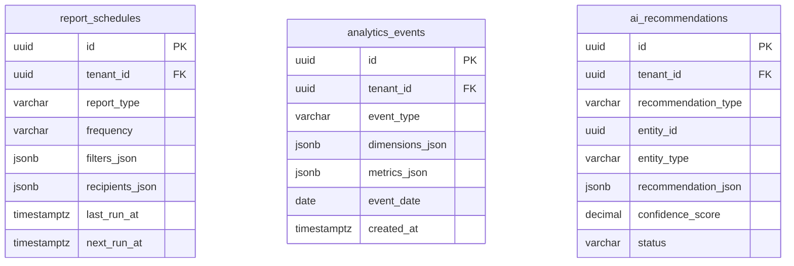

#### Table: `report_schedules`

| Column | Type | Constraints | Default | Description |
|--------|------|------------|---------|-------------|
| `id` | UUID | PK | `gen_random_uuid()` | |
| `tenant_id` | UUID | NOT NULL, FK → tenants | | |
| `report_type` | VARCHAR(100) | NOT NULL | | e.g., "daily_sales", "inventory_valuation", "aging" |
| `name` | VARCHAR(255) | NOT NULL | | User-defined name |
| `frequency` | VARCHAR(20) | NOT NULL | | DAILY, WEEKLY, MONTHLY |
| `cron_expression` | VARCHAR(50) | | | For custom schedules |
| `filters_json` | JSONB | NOT NULL | `'{}'::jsonb` | Report filter parameters |
| `recipients_json` | JSONB | NOT NULL | `'[]'::jsonb` | Email addresses |
| `output_format` | VARCHAR(20) | NOT NULL | `'PDF'` | PDF, EXCEL |
| `is_active` | BOOLEAN | NOT NULL | `true` | |
| `last_run_at` | TIMESTAMPTZ | | | |
| `next_run_at` | TIMESTAMPTZ | | | |
| `created_at` | TIMESTAMPTZ | NOT NULL | `now()` | |
| `updated_at` | TIMESTAMPTZ | NOT NULL | `now()` | |
| `created_by` | UUID | FK → users | | |

```sql
CREATE INDEX idx_report_schedules_tenant ON report_schedules(tenant_id) WHERE is_active = true;
CREATE INDEX idx_report_schedules_next ON report_schedules(next_run_at) WHERE is_active = true;
```

#### Table: `analytics_events` — **IMMUTABLE**

| Column | Type | Constraints | Default | Description |
|--------|------|------------|---------|-------------|
| `id` | UUID | PK | `gen_random_uuid()` | |
| `tenant_id` | UUID | NOT NULL, FK → tenants | | |
| `event_type` | VARCHAR(100) | NOT NULL | | e.g., "sale", "page_view", "search" |
| `dimensions_json` | JSONB | NOT NULL | | { branch_id, product_id, category_id, cashier_id } |
| `metrics_json` | JSONB | NOT NULL | | { amount, qty, profit, duration_ms } |
| `event_date` | DATE | NOT NULL | | Partition key |
| `created_at` | TIMESTAMPTZ | NOT NULL | `now()` | |

```sql
-- Partitioned by event_date (see Section 7)
CREATE INDEX idx_analytics_events_type ON analytics_events(event_type, event_date);
CREATE INDEX idx_analytics_events_tenant ON analytics_events(tenant_id, event_date);
CREATE INDEX idx_analytics_events_dimensions ON analytics_events USING GIN(dimensions_json jsonb_path_ops);
```

#### Table: `ai_recommendations`

| Column | Type | Constraints | Default | Description |
|--------|------|------------|---------|-------------|
| `id` | UUID | PK | `gen_random_uuid()` | |
| `tenant_id` | UUID | NOT NULL, FK → tenants | | |
| `recommendation_type` | VARCHAR(100) | NOT NULL | | REORDER, PRICING, STAFFING, PRODUCT_BUNDLE |
| `entity_type` | VARCHAR(50) | NOT NULL | | Product, customer, etc. |
| `entity_id` | UUID | NOT NULL | | |
| `recommendation_json` | JSONB | NOT NULL | | Full recommendation payload |
| `confidence_score` | DECIMAL(3,2) | NOT NULL | | 0.00 - 1.00 |
| `reasoning` | TEXT | | | |
| `status` | VARCHAR(20) | NOT NULL | `'PENDING'` | PENDING, ACCEPTED, DISMISSED |
| `accepted_by` | UUID | FK → users | | |
| `accepted_at` | TIMESTAMPTZ | | | |
| `expires_at` | TIMESTAMPTZ | | | |
| `created_at` | TIMESTAMPTZ | NOT NULL | `now()` | |
| `updated_at` | TIMESTAMPTZ | NOT NULL | `now()` | |

```sql
CREATE INDEX idx_ai_recommendations_tenant ON ai_recommendations(tenant_id, status);
CREATE INDEX idx_ai_recommendations_entity ON ai_recommendations(entity_type, entity_id);
CREATE INDEX idx_ai_recommendations_type ON ai_recommendations(recommendation_type, status);
CREATE INDEX idx_ai_recommendations_expires ON ai_recommendations(expires_at) WHERE status = 'PENDING';
```

---

### 3.13 Notifications

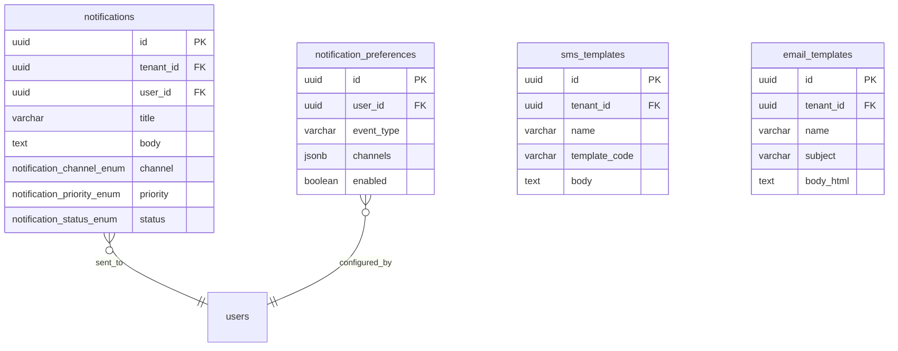

#### Table: `notifications`

| Column | Type | Constraints | Default | Description |
|--------|------|------------|---------|-------------|
| `id` | UUID | PK | `gen_random_uuid()` | |
| `tenant_id` | UUID | NOT NULL, FK → tenants | | |
| `user_id` | UUID | NOT NULL, FK → users | | Recipient |
| `title` | VARCHAR(255) | NOT NULL | | |
| `body` | TEXT | NOT NULL | | |
| `channel` | `notification_channel_enum` | NOT NULL | `'IN_APP'` | |
| `priority` | `notification_priority_enum` | NOT NULL | `'NORMAL'` | |
| `status` | `notification_status_enum` | NOT NULL | `'PENDING'` | |
| `action_url` | VARCHAR(500) | | | Deep link to relevant screen |
| `action_type` | VARCHAR(50) | | | Entity type for navigation |
| `action_id` | UUID | | | Entity ID for navigation |
| `read_at` | TIMESTAMPTZ | | | |
| `sent_at` | TIMESTAMPTZ | | | |
| `delivered_at` | TIMESTAMPTZ | | | |
| `failed_reason` | TEXT | | | |
| `metadata` | JSONB | | | |
| `created_at` | TIMESTAMPTZ | NOT NULL | `now()` | |

```sql
CREATE INDEX idx_notifications_user ON notifications(user_id, created_at);
CREATE INDEX idx_notifications_unread ON notifications(user_id) WHERE read_at IS NULL;
CREATE INDEX idx_notifications_status ON notifications(status) WHERE status IN ('PENDING', 'SENT');
CREATE INDEX idx_notifications_tenant ON notifications(tenant_id, created_at);
```

#### Table: `notification_preferences`

| Column | Type | Constraints | Default | Description |
|--------|------|------------|---------|-------------|
| `id` | UUID | PK | `gen_random_uuid()` | |
| `user_id` | UUID | NOT NULL, FK → users | | |
| `event_type` | VARCHAR(100) | NOT NULL | | e.g., "low_stock", "approval_required", "payment_received" |
| `channels` | JSONB | NOT NULL | `'["IN_APP"]'::jsonb` | Enabled channels for this event |
| `enabled` | BOOLEAN | NOT NULL | `true` | |
| `created_at` | TIMESTAMPTZ | NOT NULL | `now()` | |
| `updated_at` | TIMESTAMPTZ | NOT NULL | `now()` | |

```sql
CREATE UNIQUE INDEX uq_notification_prefs ON notification_preferences(user_id, event_type);
```

#### Table: `sms_templates`

| Column | Type | Constraints | Default | Description |
|--------|------|------------|---------|-------------|
| `id` | UUID | PK | `gen_random_uuid()` | |
| `tenant_id` | UUID | NOT NULL, FK → tenants | | |
| `name` | VARCHAR(255) | NOT NULL | | |
| `template_code` | VARCHAR(100) | NOT NULL | | e.g., "repair_status_update", "payment_reminder" |
| `body` | TEXT | NOT NULL | | Template with placeholders: {{customer_name}}, {{amount}} |
| `language` | VARCHAR(10) | NOT NULL | `'en'` | |
| `is_active` | BOOLEAN | NOT NULL | `true` | |
| `created_at` | TIMESTAMPTZ | NOT NULL | `now()` | |
| `updated_at` | TIMESTAMPTZ | NOT NULL | `now()` | |

```sql
CREATE UNIQUE INDEX uq_sms_templates ON sms_templates(tenant_id, template_code, language);
```

#### Table: `email_templates`

| Column | Type | Constraints | Default | Description |
|--------|------|------------|---------|-------------|
| `id` | UUID | PK | `gen_random_uuid()` | |
| `tenant_id` | UUID | NOT NULL, FK → tenants | | |
| `name` | VARCHAR(255) | NOT NULL | | |
| `template_code` | VARCHAR(100) | NOT NULL | | |
| `subject` | VARCHAR(500) | NOT NULL | | Email subject with placeholders |
| `body_html` | TEXT | NOT NULL | | HTML body with placeholders |
| `body_text` | TEXT | | | Plain text fallback |
| `language` | VARCHAR(10) | NOT NULL | `'en'` | |
| `is_active` | BOOLEAN | NOT NULL | `true` | |
| `created_at` | TIMESTAMPTZ | NOT NULL | `now()` | |
| `updated_at` | TIMESTAMPTZ | NOT NULL | `now()` | |

```sql
CREATE UNIQUE INDEX uq_email_templates ON email_templates(tenant_id, template_code, language);
```

---

### 3.14 Settings & Configuration

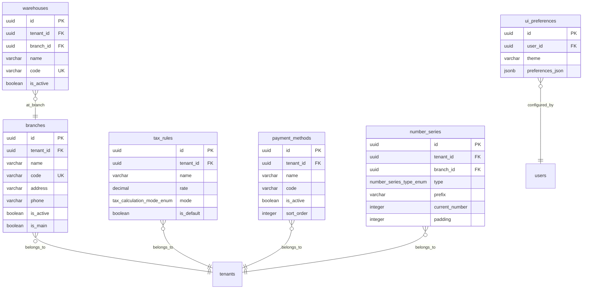

#### Table: `branches`

| Column | Type | Constraints | Default | Description |
|--------|------|------------|---------|-------------|
| `id` | UUID | PK | `gen_random_uuid()` | |
| `tenant_id` | UUID | NOT NULL, FK → tenants | | |
| `name` | VARCHAR(255) | NOT NULL | | |
| `code` | VARCHAR(20) | NOT NULL | | Short branch code (e.g., "BR01") |
| `address_line1` | VARCHAR(255) | | | |
| `address_line2` | VARCHAR(255) | | | |
| `city` | VARCHAR(100) | | | |
| `state` | VARCHAR(100) | | | |
| `postal_code` | VARCHAR(20) | | | |
| `country` | VARCHAR(100) | | `'Pakistan'` | |
| `phone` | VARCHAR(50) | | | |
| `email` | VARCHAR(255) | | | |
| `currency` | VARCHAR(3) | NOT NULL | `'PKR'` | |
| `timezone` | VARCHAR(50) | NOT NULL | `'Asia/Karachi'` | |
| `is_active` | BOOLEAN | NOT NULL | `true` | |
| `is_main` | BOOLEAN | NOT NULL | `false` | Main/HQ branch |
| `opening_date` | DATE | | | |
| `created_at` | TIMESTAMPTZ | NOT NULL | `now()` | |
| `updated_at` | TIMESTAMPTZ | NOT NULL | `now()` | |
| `deleted_at` | TIMESTAMPTZ | | | |
| `version` | INTEGER | NOT NULL | `1` | |

```sql
CREATE UNIQUE INDEX uq_branches_tenant_code ON branches(tenant_id, code) WHERE deleted_at IS NULL;
CREATE INDEX idx_branches_tenant ON branches(tenant_id) WHERE deleted_at IS NULL;
CREATE INDEX idx_branches_active ON branches(tenant_id) WHERE is_active = true AND deleted_at IS NULL;
```

#### Table: `warehouses`

| Column | Type | Constraints | Default | Description |
|--------|------|------------|---------|-------------|
| `id` | UUID | PK | `gen_random_uuid()` | |
| `tenant_id` | UUID | NOT NULL, FK → tenants | | |
| `branch_id` | UUID | NOT NULL, FK → branches | | |
| `name` | VARCHAR(255) | NOT NULL | | |
| `code` | VARCHAR(20) | NOT NULL | | |
| `address` | TEXT | | | |
| `capacity_notes` | TEXT | | | |
| `is_active` | BOOLEAN | NOT NULL | `true` | |
| `is_default` | BOOLEAN | NOT NULL | `false` | Default warehouse for branch |
| `created_at` | TIMESTAMPTZ | NOT NULL | `now()` | |
| `updated_at` | TIMESTAMPTZ | NOT NULL | `now()` | |
| `deleted_at` | TIMESTAMPTZ | | | |
| `version` | INTEGER | NOT NULL | `1` | |

```sql
CREATE UNIQUE INDEX uq_warehouses_tenant_code ON warehouses(tenant_id, code) WHERE deleted_at IS NULL;
CREATE INDEX idx_warehouses_branch ON warehouses(branch_id) WHERE deleted_at IS NULL;
```

#### Table: `tax_rules`

| Column | Type | Constraints | Default | Description |
|--------|------|------------|---------|-------------|
| `id` | UUID | PK | `gen_random_uuid()` | |
| `tenant_id` | UUID | NOT NULL, FK → tenants | | |
| `name` | VARCHAR(100) | NOT NULL | | e.g., "GST 17%", "GST 5%", "Exempt" |
| `code` | VARCHAR(20) | NOT NULL | | Tax code |
| `rate` | DECIMAL(5,2) | NOT NULL | | Tax percentage |
| `mode` | `tax_calculation_mode_enum` | NOT NULL | `'EXCLUSIVE'` | |
| `is_default` | BOOLEAN | NOT NULL | `false` | |
| `applies_to` | VARCHAR(50) | NOT NULL | `'ALL'` | ALL, PRODUCT, SERVICE |
| `description` | TEXT | | | |
| `is_active` | BOOLEAN | NOT NULL | `true` | |
| `effective_from` | DATE | | | |
| `effective_until` | DATE | | | |
| `created_at` | TIMESTAMPTZ | NOT NULL | `now()` | |
| `updated_at` | TIMESTAMPTZ | NOT NULL | `now()` | |
| `deleted_at` | TIMESTAMPTZ | | | |

```sql
CREATE UNIQUE INDEX uq_tax_rules_tenant_code ON tax_rules(tenant_id, code) WHERE deleted_at IS NULL;
CREATE INDEX idx_tax_rules_active ON tax_rules(tenant_id) WHERE is_active = true AND deleted_at IS NULL;
```

#### Table: `payment_methods`

| Column | Type | Constraints | Default | Description |
|--------|------|------------|---------|-------------|
| `id` | UUID | PK | `gen_random_uuid()` | |
| `tenant_id` | UUID | NOT NULL, FK → tenants | | |
| `name` | VARCHAR(100) | NOT NULL | | Display name |
| `code` | VARCHAR(50) | NOT NULL | | CASH, BANK_TRANSFER, CARD, etc. |
| `bank_account_id` | UUID | FK → bank_accounts | | Linked bank account for non-cash |
| `is_active` | BOOLEAN | NOT NULL | `true` | |
| `is_system` | BOOLEAN | NOT NULL | `false` | System methods cannot be deleted |
| `requires_reference` | BOOLEAN | NOT NULL | `false` | Requires reference number on payment |
| `icon` | VARCHAR(100) | | | Icon name for UI |
| `sort_order` | INTEGER | NOT NULL | `0` | |
| `created_at` | TIMESTAMPTZ | NOT NULL | `now()` | |
| `updated_at` | TIMESTAMPTZ | NOT NULL | `now()` | |
| `deleted_at` | TIMESTAMPTZ | | | |

```sql
CREATE UNIQUE INDEX uq_payment_methods_tenant_code ON payment_methods(tenant_id, code) WHERE deleted_at IS NULL;
```

#### Table: `number_series`

| Column | Type | Constraints | Default | Description |
|--------|------|------------|---------|-------------|
| `id` | UUID | PK | `gen_random_uuid()` | |
| `tenant_id` | UUID | NOT NULL, FK → tenants | | |
| `branch_id` | UUID | FK → branches | | Branch-specific series (NULL = tenant-wide) |
| `type` | `number_series_type_enum` | NOT NULL | | Document type |
| `prefix` | VARCHAR(20) | NOT NULL | `''` | e.g., "INV-", "PO-", "GRN-" |
| `suffix` | VARCHAR(20) | NOT NULL | `''` | |
| `current_number` | INTEGER | NOT NULL | `0` | Last used number |
| `padding` | INTEGER | NOT NULL | `6` | Zero-padding width |
| `fiscal_year_reset` | BOOLEAN | NOT NULL | `false` | Reset counter each fiscal year |
| `include_branch_code` | BOOLEAN | NOT NULL | `true` | Include branch code in number |
| `created_at` | TIMESTAMPTZ | NOT NULL | `now()` | |
| `updated_at` | TIMESTAMPTZ | NOT NULL | `now()` | |

```sql
CREATE UNIQUE INDEX uq_number_series ON number_series(tenant_id, branch_id, type);
```

> **Business Rule:** Number generation is gap-safe. Uses `SELECT ... FOR UPDATE` to prevent concurrent gaps. Increment is atomic within a transaction.

#### Table: `ui_preferences`

| Column | Type | Constraints | Default | Description |
|--------|------|------------|---------|-------------|
| `id` | UUID | PK | `gen_random_uuid()` | |
| `user_id` | UUID | NOT NULL, FK → users, UNIQUE | | One preferences record per user |
| `theme` | VARCHAR(20) | NOT NULL | `'light'` | light, dark, system |
| `language` | VARCHAR(10) | NOT NULL | `'en'` | |
| `sidebar_collapsed` | BOOLEAN | NOT NULL | `false` | |
| `default_branch_id` | UUID | FK → branches | | |
| `dashboard_layout_json` | JSONB | | | Custom dashboard widget arrangement |
| `table_preferences_json` | JSONB | | | Per-table: column visibility, sort, page size |
| `keyboard_shortcuts_json` | JSONB | | | Custom keyboard shortcut overrides |
| `pos_layout_json` | JSONB | | | POS screen customization |
| `preferences_json` | JSONB | NOT NULL | `'{}'::jsonb` | Catch-all for misc preferences |
| `created_at` | TIMESTAMPTZ | NOT NULL | `now()` | |
| `updated_at` | TIMESTAMPTZ | NOT NULL | `now()` | |

```sql
CREATE UNIQUE INDEX uq_ui_preferences_user ON ui_preferences(user_id);
```

---

### 3.15 Device Management

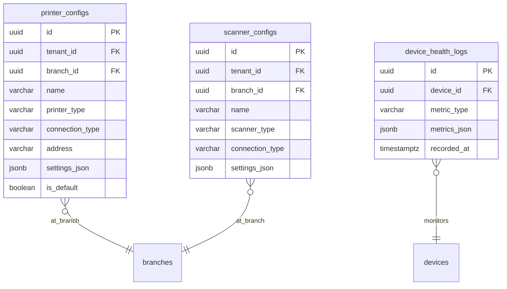

#### Table: `printer_configs`

| Column | Type | Constraints | Default | Description |
|--------|------|------------|---------|-------------|
| `id` | UUID | PK | `gen_random_uuid()` | |
| `tenant_id` | UUID | NOT NULL, FK → tenants | | |
| `branch_id` | UUID | NOT NULL, FK → branches | | |
| `name` | VARCHAR(255) | NOT NULL | | e.g., "POS Receipt Printer", "Label Printer" |
| `printer_type` | VARCHAR(50) | NOT NULL | | THERMAL, LABEL, A4, PDF |
| `model` | VARCHAR(100) | | | Hardware model |
| `connection_type` | VARCHAR(50) | NOT NULL | | USB, BLUETOOTH, NETWORK, PDF_ONLY |
| `address` | VARCHAR(255) | | | IP address, Bluetooth MAC, USB port |
| `paper_width_mm` | INTEGER | NOT NULL | `80` | Paper width in mm |
| `dpi` | INTEGER | NOT NULL | `203` | Dots per inch |
| `settings_json` | JSONB | NOT NULL | `'{}'::jsonb` | Printer-specific settings (charset, cut mode, etc.) |
| `is_default` | BOOLEAN | NOT NULL | `false` | |
| `is_active` | BOOLEAN | NOT NULL | `true` | |
| `created_at` | TIMESTAMPTZ | NOT NULL | `now()` | |
| `updated_at` | TIMESTAMPTZ | NOT NULL | `now()` | |
| `deleted_at` | TIMESTAMPTZ | | | |

```sql
CREATE INDEX idx_printer_configs_branch ON printer_configs(branch_id) WHERE deleted_at IS NULL;
CREATE INDEX idx_printer_configs_default ON printer_configs(branch_id) WHERE is_default = true AND deleted_at IS NULL;
```

#### Table: `device_health_logs`

| Column | Type | Constraints | Default | Description |
|--------|------|------------|---------|-------------|
| `id` | UUID | PK | `gen_random_uuid()` | |
| `device_id` | UUID | NOT NULL, FK → devices | | |
| `metric_type` | VARCHAR(50) | NOT NULL | | BATTERY, STORAGE, MEMORY, NETWORK, UPTIME |
| `metrics_json` | JSONB | NOT NULL | | { "battery_pct": 85, "storage_free_mb": 2048 } |
| `app_version` | VARCHAR(20) | | | |
| `os_version` | VARCHAR(50) | | | |
| `recorded_at` | TIMESTAMPTZ | NOT NULL | `now()` | |

```sql
CREATE INDEX idx_device_health_device ON device_health_logs(device_id, recorded_at);
CREATE INDEX idx_device_health_metric ON device_health_logs(metric_type, recorded_at);
```

#### Table: `scanner_configs`

| Column | Type | Constraints | Default | Description |
|--------|------|------------|---------|-------------|
| `id` | UUID | PK | `gen_random_uuid()` | |
| `tenant_id` | UUID | NOT NULL, FK → tenants | | |
| `branch_id` | UUID | NOT NULL, FK → branches | | |
| `name` | VARCHAR(255) | NOT NULL | | |
| `scanner_type` | VARCHAR(50) | NOT NULL | | BARCODE_1D, BARCODE_2D, QR, RFID |
| `model` | VARCHAR(100) | | | |
| `connection_type` | VARCHAR(50) | NOT NULL | | USB_HID, BLUETOOTH_HID, CAMERA |
| `settings_json` | JSONB | NOT NULL | `'{}'::jsonb` | { "suffix": "\n", "prefix": "", "continuous_mode": true } |
| `is_active` | BOOLEAN | NOT NULL | `true` | |
| `created_at` | TIMESTAMPTZ | NOT NULL | `now()` | |
| `updated_at` | TIMESTAMPTZ | NOT NULL | `now()` | |
| `deleted_at` | TIMESTAMPTZ | | | |

```sql
CREATE INDEX idx_scanner_configs_branch ON scanner_configs(branch_id) WHERE deleted_at IS NULL;
```

---

### 3.16 File Management

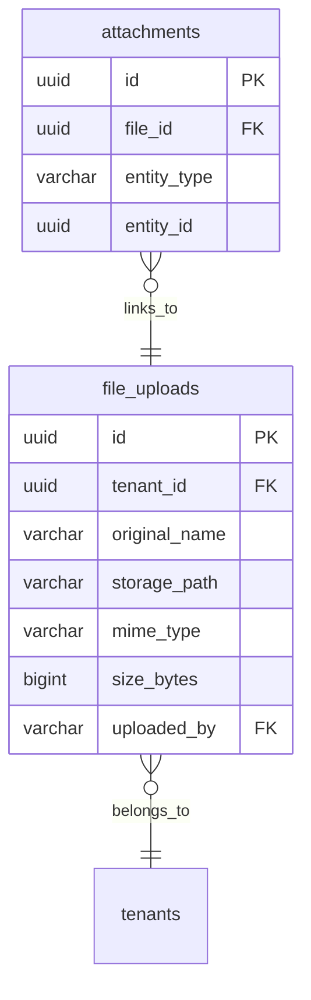

#### Table: `file_uploads`

| Column | Type | Constraints | Default | Description |
|--------|------|------------|---------|-------------|
| `id` | UUID | PK | `gen_random_uuid()` | |
| `tenant_id` | UUID | NOT NULL, FK → tenants | | |
| `original_name` | VARCHAR(500) | NOT NULL | | Original filename |
| `storage_path` | VARCHAR(1000) | NOT NULL | | S3/Supabase storage path |
| `storage_bucket` | VARCHAR(100) | NOT NULL | | Storage bucket name |
| `mime_type` | VARCHAR(100) | NOT NULL | | |
| `size_bytes` | BIGINT | NOT NULL | | |
| `category` | `file_category_enum` | NOT NULL | `'DOCUMENT'` | |
| `checksum` | VARCHAR(64) | | | SHA-256 of file content |
| `is_public` | BOOLEAN | NOT NULL | `false` | |
| `uploaded_by` | UUID | NOT NULL, FK → users | | |
| `created_at` | TIMESTAMPTZ | NOT NULL | `now()` | |
| `deleted_at` | TIMESTAMPTZ | | | |

```sql
CREATE INDEX idx_file_uploads_tenant ON file_uploads(tenant_id, created_at) WHERE deleted_at IS NULL;
CREATE INDEX idx_file_uploads_category ON file_uploads(tenant_id, category) WHERE deleted_at IS NULL;
```

#### Table: `attachments`

| Column | Type | Constraints | Default | Description |
|--------|------|------------|---------|-------------|
| `id` | UUID | PK | `gen_random_uuid()` | |
| `file_id` | UUID | NOT NULL, FK → file_uploads ON DELETE CASCADE | | |
| `entity_type` | VARCHAR(50) | NOT NULL | | Table name: invoices, repair_jobs, employees, etc. |
| `entity_id` | UUID | NOT NULL | | Record ID in that table |
| `description` | VARCHAR(255) | | | |
| `created_at` | TIMESTAMPTZ | NOT NULL | `now()` | |

```sql
CREATE INDEX idx_attachments_entity ON attachments(entity_type, entity_id);
CREATE INDEX idx_attachments_file ON attachments(file_id);
```

---

### 3.17 Approvals & Workflow

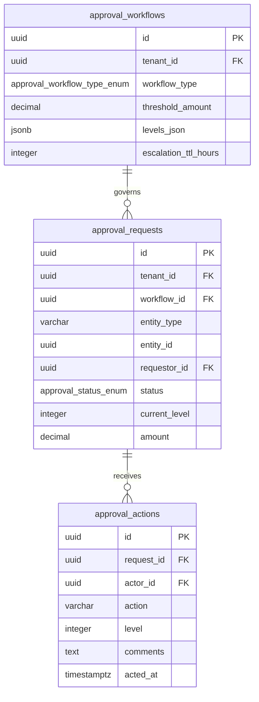

#### Table: `approval_workflows`

| Column | Type | Constraints | Default | Description |
|--------|------|------------|---------|-------------|
| `id` | UUID | PK | `gen_random_uuid()` | |
| `tenant_id` | UUID | NOT NULL, FK → tenants | | |
| `workflow_type` | `approval_workflow_type_enum` | NOT NULL | | |
| `name` | VARCHAR(255) | NOT NULL | | |
| `description` | TEXT | | | |
| `threshold_amount` | DECIMAL(15,4) | | | Trigger above this amount (NULL = always) |
| `levels_json` | JSONB | NOT NULL | | [{ level: 1, required_role: "MANAGER", min_approvers: 1 }] |
| `escalation_ttl_hours` | INTEGER | NOT NULL | `24` | Hours before auto-escalation |
| `is_active` | BOOLEAN | NOT NULL | `true` | |
| `created_at` | TIMESTAMPTZ | NOT NULL | `now()` | |
| `updated_at` | TIMESTAMPTZ | NOT NULL | `now()` | |
| `deleted_at` | TIMESTAMPTZ | | | |
| `version` | INTEGER | NOT NULL | `1` | |

```sql
CREATE INDEX idx_approval_workflows_tenant ON approval_workflows(tenant_id, workflow_type) WHERE deleted_at IS NULL;
CREATE INDEX idx_approval_workflows_active ON approval_workflows(tenant_id) WHERE is_active = true AND deleted_at IS NULL;
```

#### Table: `approval_requests`

| Column | Type | Constraints | Default | Description |
|--------|------|------------|---------|-------------|
| `id` | UUID | PK | `gen_random_uuid()` | |
| `tenant_id` | UUID | NOT NULL, FK → tenants | | |
| `workflow_id` | UUID | NOT NULL, FK → approval_workflows | | |
| `entity_type` | VARCHAR(50) | NOT NULL | | purchase_orders, stock_adjustments, etc. |
| `entity_id` | UUID | NOT NULL | | |
| `requestor_id` | UUID | NOT NULL, FK → users | | Who initiated |
| `status` | `approval_status_enum` | NOT NULL | `'PENDING'` | |
| `current_level` | INTEGER | NOT NULL | `1` | Current approval level |
| `amount` | DECIMAL(15,4) | | | Amount that triggered approval |
| `reason` | TEXT | | | Why approval is needed |
| `expires_at` | TIMESTAMPTZ | | | Auto-expiry |
| `escalated_at` | TIMESTAMPTZ | | | |
| `completed_at` | TIMESTAMPTZ | | | |
| `correlation_id` | UUID | | | |
| `created_at` | TIMESTAMPTZ | NOT NULL | `now()` | |
| `updated_at` | TIMESTAMPTZ | NOT NULL | `now()` | |
| `version` | INTEGER | NOT NULL | `1` | |

```sql
CREATE INDEX idx_approval_requests_tenant_status ON approval_requests(tenant_id, status);
CREATE INDEX idx_approval_requests_entity ON approval_requests(entity_type, entity_id);
CREATE INDEX idx_approval_requests_requestor ON approval_requests(requestor_id);
CREATE INDEX idx_approval_requests_pending ON approval_requests(tenant_id) WHERE status IN ('PENDING', 'ESCALATED');
CREATE INDEX idx_approval_requests_expires ON approval_requests(expires_at) WHERE status = 'PENDING' AND expires_at IS NOT NULL;
```

#### Table: `approval_actions`

| Column | Type | Constraints | Default | Description |
|--------|------|------------|---------|-------------|
| `id` | UUID | PK | `gen_random_uuid()` | |
| `request_id` | UUID | NOT NULL, FK → approval_requests ON DELETE CASCADE | | |
| `actor_id` | UUID | NOT NULL, FK → users | | Who acted |
| `action` | VARCHAR(20) | NOT NULL | | APPROVED, REJECTED, ESCALATED, DELEGATED |
| `level` | INTEGER | NOT NULL | | Which approval level |
| `comments` | TEXT | | | |
| `acted_at` | TIMESTAMPTZ | NOT NULL | `now()` | |

```sql
CREATE INDEX idx_approval_actions_request ON approval_actions(request_id, acted_at);
CREATE INDEX idx_approval_actions_actor ON approval_actions(actor_id);
```

---

### 3.18 Extensibility

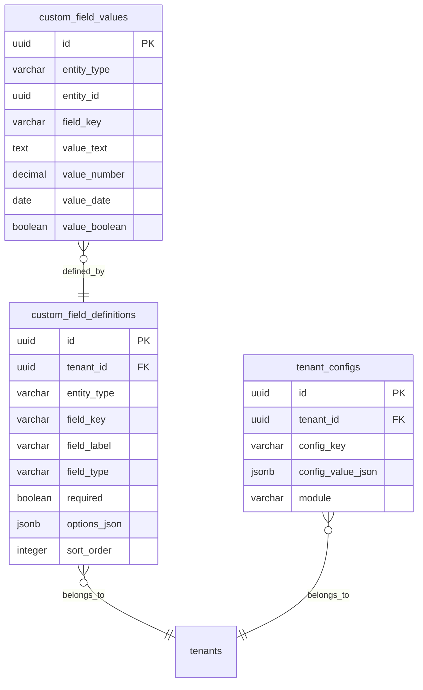

#### Table: `custom_field_definitions`

| Column | Type | Constraints | Default | Description |
|--------|------|------------|---------|-------------|
| `id` | UUID | PK | `gen_random_uuid()` | |
| `tenant_id` | UUID | NOT NULL, FK → tenants | | |
| `entity_type` | VARCHAR(50) | NOT NULL | | products, customers, invoices, etc. |
| `field_key` | VARCHAR(100) | NOT NULL | | Machine-readable field name |
| `field_label` | VARCHAR(255) | NOT NULL | | Human-readable label |
| `field_type` | VARCHAR(20) | NOT NULL | | TEXT, NUMBER, DATE, SELECT, BOOLEAN, TEXTAREA |
| `required` | BOOLEAN | NOT NULL | `false` | |
| `default_value` | TEXT | | | |
| `options_json` | JSONB | | | For SELECT type: [{ value, label }] |
| `validation_json` | JSONB | | | { min, max, pattern, minLength, maxLength } |
| `sort_order` | INTEGER | NOT NULL | `0` | |
| `is_active` | BOOLEAN | NOT NULL | `true` | |
| `created_at` | TIMESTAMPTZ | NOT NULL | `now()` | |
| `updated_at` | TIMESTAMPTZ | NOT NULL | `now()` | |

```sql
CREATE UNIQUE INDEX uq_custom_fields_def ON custom_field_definitions(tenant_id, entity_type, field_key);
CREATE INDEX idx_custom_fields_entity ON custom_field_definitions(tenant_id, entity_type) WHERE is_active = true;
```

#### Table: `custom_field_values`

| Column | Type | Constraints | Default | Description |
|--------|------|------------|---------|-------------|
| `id` | UUID | PK | `gen_random_uuid()` | |
| `tenant_id` | UUID | NOT NULL, FK → tenants | | |
| `definition_id` | UUID | NOT NULL, FK → custom_field_definitions | | |
| `entity_type` | VARCHAR(50) | NOT NULL | | Denormalized for query performance |
| `entity_id` | UUID | NOT NULL | | |
| `field_key` | VARCHAR(100) | NOT NULL | | Denormalized for query performance |
| `value_text` | TEXT | | | For TEXT, TEXTAREA, SELECT |
| `value_number` | DECIMAL(15,4) | | | For NUMBER |
| `value_date` | DATE | | | For DATE |
| `value_boolean` | BOOLEAN | | | For BOOLEAN |
| `created_at` | TIMESTAMPTZ | NOT NULL | `now()` | |
| `updated_at` | TIMESTAMPTZ | NOT NULL | `now()` | |

```sql
CREATE UNIQUE INDEX uq_custom_field_values ON custom_field_values(entity_type, entity_id, field_key);
CREATE INDEX idx_custom_field_values_entity ON custom_field_values(entity_type, entity_id);
CREATE INDEX idx_custom_field_values_tenant ON custom_field_values(tenant_id, entity_type);
```

#### Table: `tenant_configs`

| Column | Type | Constraints | Default | Description |
|--------|------|------------|---------|-------------|
| `id` | UUID | PK | `gen_random_uuid()` | |
| `tenant_id` | UUID | NOT NULL, FK → tenants | | |
| `config_key` | VARCHAR(255) | NOT NULL | | e.g., "approval.po.threshold", "sales.credit.max_days" |
| `config_value_json` | JSONB | NOT NULL | | Configuration value |
| `module` | VARCHAR(50) | | | Module scope |
| `description` | TEXT | | | |
| `updated_by` | UUID | FK → users | | |
| `created_at` | TIMESTAMPTZ | NOT NULL | `now()` | |
| `updated_at` | TIMESTAMPTZ | NOT NULL | `now()` | |

```sql
CREATE UNIQUE INDEX uq_tenant_configs ON tenant_configs(tenant_id, config_key);
CREATE INDEX idx_tenant_configs_module ON tenant_configs(tenant_id, module) WHERE module IS NOT NULL;
```

---

## 4. Master ERD Overview

This diagram shows cross-domain relationships between the 18 bounded contexts.

```mermaid
erDiagram
    %% === Core Infrastructure ===
    tenants ||--o{ branches : has
    tenants ||--o{ users : contains
    tenants ||--o{ roles : defines
    
    %% === Auth ===
    users }o--|| roles : has_role
    users ||--o{ devices : registers
    users ||--o{ sessions : authenticates
    users ||--o{ audit_logs : generates
    users ||--o{ user_branch_assignments : assigned_to
    branches ||--o{ user_branch_assignments : includes
    
    %% === Products ===
    products }o--o| categories : categorized_by
    products }o--o| brands : branded_by
    products ||--o{ product_variants : has_variants
    products ||--o{ product_pricing_tiers : has_pricing
    
    %% === Sales ===
    invoices }o--o| customers : billed_to
    invoices }o--|| users : cashier
    invoices ||--o{ invoice_items : line_items
    invoices ||--o{ payments : receives
    invoice_items }o--|| products : sells
    
    %% === Purchase ===
    purchase_orders }o--|| suppliers : from_supplier
    purchase_orders ||--o{ purchase_order_items : line_items
    purchase_orders ||--o{ grns : received_via
    grns ||--o{ grn_items : received_items
    
    %% === Inventory ===
    stock_balance }o--|| products : tracks_product
    stock_balance }o--|| branches : at_branch
    stock_ledger }o--|| products : records_movement
    imei_records }o--|| products : serialized
    stock_transfers }o--|| branches : from_to
    
    %% === CRM ===
    customers }o--o| customer_groups : grouped
    customers ||--o{ ledger_accounts : receivable
    suppliers ||--o{ ledger_accounts : payable
    
    %% === Accounting ===
    journal_entries ||--o{ journal_lines : entries
    journal_lines }o--|| accounts : debits_credits
    journal_entries }o--|| fiscal_periods : in_period
    
    %% === HR ===
    employees }o--|| branches : works_at
    employees ||--o{ attendance : records
    employees ||--o{ payroll_items : compensated
    payroll_runs ||--o{ payroll_items : contains
    
    %% === Repair ===
    repair_jobs }o--|| customers : for_customer
    repair_jobs ||--o{ repair_parts : uses_parts
    repair_parts }o--|| products : consumes
    
    %% === Approvals ===
    approval_workflows ||--o{ approval_requests : governs
    approval_requests ||--o{ approval_actions : acted_on
    
    %% === Notifications ===
    notifications }o--|| users : notifies
```

---

## 5. Foreign Key Relationship Map

### Master FK Reference Table

| Source Table | Source Column | References | Target Table | ON DELETE | Notes |
|-------------|-------------|-----------|-------------|----------|-------|
| **Multi-Tenancy** | | | | | |
| company_settings | tenant_id | → | tenants(id) | RESTRICT | |
| company_settings | updated_by | → | users(id) | SET NULL | |
| **Auth & RBAC** | | | | | |
| users | tenant_id | → | tenants(id) | RESTRICT | |
| users | role_id | → | roles(id) | RESTRICT | |
| users | created_by | → | users(id) | SET NULL | Self-referencing |
| users | updated_by | → | users(id) | SET NULL | Self-referencing |
| roles | tenant_id | → | tenants(id) | RESTRICT | |
| permissions | role_id | → | roles(id) | CASCADE | Delete role → delete permissions |
| devices | tenant_id | → | tenants(id) | RESTRICT | |
| devices | user_id | → | users(id) | SET NULL | |
| devices | branch_id | → | branches(id) | SET NULL | |
| devices | authorized_by | → | users(id) | SET NULL | |
| sessions | user_id | → | users(id) | CASCADE | Delete user → delete sessions |
| sessions | device_id | → | devices(id) | CASCADE | |
| sessions | branch_id | → | branches(id) | RESTRICT | |
| audit_logs | tenant_id | → | tenants(id) | RESTRICT | |
| audit_logs | user_id | → | users(id) | SET NULL | |
| audit_logs | device_id | → | devices(id) | SET NULL | |
| mfa_configs | user_id | → | users(id) | CASCADE | |
| user_branch_assignments | user_id | → | users(id) | CASCADE | |
| user_branch_assignments | branch_id | → | branches(id) | CASCADE | |
| **Sync & Infrastructure** | | | | | |
| sync_log | tenant_id | → | tenants(id) | RESTRICT | |
| sync_log | device_id | → | devices(id) | RESTRICT | |
| sync_conflicts | tenant_id | → | tenants(id) | RESTRICT | |
| sync_conflicts | device_id | → | devices(id) | SET NULL | |
| sync_conflicts | resolved_by | → | users(id) | SET NULL | |
| domain_events | tenant_id | → | tenants(id) | RESTRICT | |
| domain_events | actor_id | → | users(id) | SET NULL | |
| domain_events | branch_id | → | branches(id) | SET NULL | |
| **Product Catalog** | | | | | |
| categories | tenant_id | → | tenants(id) | RESTRICT | |
| categories | parent_id | → | categories(id) | SET NULL | Self-referencing hierarchy |
| brands | tenant_id | → | tenants(id) | RESTRICT | |
| products | tenant_id | → | tenants(id) | RESTRICT | |
| products | category_id | → | categories(id) | SET NULL | |
| products | brand_id | → | brands(id) | SET NULL | |
| product_variants | product_id | → | products(id) | CASCADE | Delete product → delete variants |
| product_images | product_id | → | products(id) | CASCADE | |
| product_pricing_tiers | product_id | → | products(id) | CASCADE | |
| product_pricing_tiers | customer_group_id | → | customer_groups(id) | SET NULL | |
| **Sales & POS** | | | | | |
| invoices | tenant_id | → | tenants(id) | RESTRICT | |
| invoices | branch_id | → | branches(id) | RESTRICT | |
| invoices | customer_id | → | customers(id) | SET NULL | Walk-in sales have NULL |
| invoices | cashier_id | → | users(id) | RESTRICT | |
| invoices | session_id | → | cashier_sessions(id) | SET NULL | |
| invoices | original_invoice_id | → | invoices(id) | SET NULL | Return → original |
| invoice_items | invoice_id | → | invoices(id) | CASCADE | |
| invoice_items | product_id | → | products(id) | RESTRICT | |
| invoice_items | variant_id | → | product_variants(id) | SET NULL | |
| invoice_items | imei_id | → | imei_records(id) | SET NULL | |
| payments | tenant_id | → | tenants(id) | RESTRICT | |
| payments | invoice_id | → | invoices(id) | RESTRICT | |
| payments | bank_account_id | → | bank_accounts(id) | SET NULL | |
| cashier_sessions | tenant_id | → | tenants(id) | RESTRICT | |
| cashier_sessions | branch_id | → | branches(id) | RESTRICT | |
| cashier_sessions | cashier_id | → | users(id) | RESTRICT | |
| held_sales | tenant_id | → | tenants(id) | RESTRICT | |
| held_sales | branch_id | → | branches(id) | RESTRICT | |
| held_sales | cashier_id | → | users(id) | RESTRICT | |
| held_sales | customer_id | → | customers(id) | SET NULL | |
| delivery_orders | tenant_id | → | tenants(id) | RESTRICT | |
| delivery_orders | invoice_id | → | invoices(id) | RESTRICT | |
| loyalty_transactions | tenant_id | → | tenants(id) | RESTRICT | |
| loyalty_transactions | customer_id | → | customers(id) | RESTRICT | |
| loyalty_transactions | invoice_id | → | invoices(id) | SET NULL | |
| **Purchase Management** | | | | | |
| purchase_orders | tenant_id | → | tenants(id) | RESTRICT | |
| purchase_orders | branch_id | → | branches(id) | RESTRICT | |
| purchase_orders | supplier_id | → | suppliers(id) | RESTRICT | |
| purchase_order_items | po_id | → | purchase_orders(id) | CASCADE | |
| purchase_order_items | product_id | → | products(id) | RESTRICT | |
| grns | tenant_id | → | tenants(id) | RESTRICT | |
| grns | po_id | → | purchase_orders(id) | RESTRICT | |
| grns | warehouse_id | → | warehouses(id) | SET NULL | |
| grns | received_by | → | users(id) | RESTRICT | |
| grn_items | grn_id | → | grns(id) | CASCADE | |
| grn_items | po_item_id | → | purchase_order_items(id) | RESTRICT | |
| grn_items | product_id | → | products(id) | RESTRICT | |
| purchase_invoices | tenant_id | → | tenants(id) | RESTRICT | |
| purchase_invoices | po_id | → | purchase_orders(id) | RESTRICT | |
| purchase_invoices | grn_id | → | grns(id) | SET NULL | |
| purchase_invoices | supplier_id | → | suppliers(id) | RESTRICT | |
| supplier_payments | tenant_id | → | tenants(id) | RESTRICT | |
| supplier_payments | supplier_id | → | suppliers(id) | RESTRICT | |
| supplier_payments | invoice_id | → | purchase_invoices(id) | SET NULL | |
| supplier_payments | bank_account_id | → | bank_accounts(id) | SET NULL | |
| **Inventory & Warehouse** | | | | | |
| stock_balance | tenant_id | → | tenants(id) | RESTRICT | |
| stock_balance | branch_id | → | branches(id) | RESTRICT | |
| stock_balance | warehouse_id | → | warehouses(id) | SET NULL | |
| stock_balance | product_id | → | products(id) | RESTRICT | |
| stock_ledger | tenant_id | → | tenants(id) | RESTRICT | |
| stock_ledger | product_id | → | products(id) | RESTRICT | |
| stock_ledger | branch_id | → | branches(id) | RESTRICT | |
| stock_ledger | imei_id | → | imei_records(id) | SET NULL | |
| imei_records | tenant_id | → | tenants(id) | RESTRICT | |
| imei_records | product_id | → | products(id) | RESTRICT | |
| imei_records | branch_id | → | branches(id) | RESTRICT | |
| imei_records | sold_invoice_id | → | invoices(id) | SET NULL | |
| stock_transfers | tenant_id | → | tenants(id) | RESTRICT | |
| stock_transfers | from_branch_id | → | branches(id) | RESTRICT | |
| stock_transfers | to_branch_id | → | branches(id) | RESTRICT | |
| stock_transfer_items | transfer_id | → | stock_transfers(id) | CASCADE | |
| stock_transfer_items | product_id | → | products(id) | RESTRICT | |
| stock_transfer_items | imei_id | → | imei_records(id) | SET NULL | |
| stock_adjustments | tenant_id | → | tenants(id) | RESTRICT | |
| stock_adjustments | branch_id | → | branches(id) | RESTRICT | |
| stock_adjustments | product_id | → | products(id) | RESTRICT | |
| stock_counts | tenant_id | → | tenants(id) | RESTRICT | |
| stock_counts | branch_id | → | branches(id) | RESTRICT | |
| stock_count_items | stock_count_id | → | stock_counts(id) | CASCADE | |
| stock_count_items | product_id | → | products(id) | RESTRICT | |
| **CRM** | | | | | |
| customers | tenant_id | → | tenants(id) | RESTRICT | |
| customers | group_id | → | customer_groups(id) | SET NULL | |
| suppliers | tenant_id | → | tenants(id) | RESTRICT | |
| customer_groups | tenant_id | → | tenants(id) | RESTRICT | |
| ledger_accounts | tenant_id | → | tenants(id) | RESTRICT | |
| communication_logs | tenant_id | → | tenants(id) | RESTRICT | |
| communication_logs | created_by | → | users(id) | RESTRICT | |
| **Accounting** | | | | | |
| accounts | tenant_id | → | tenants(id) | RESTRICT | |
| accounts | parent_id | → | accounts(id) | SET NULL | Self-referencing hierarchy |
| accounts | branch_id | → | branches(id) | SET NULL | |
| journal_entries | tenant_id | → | tenants(id) | RESTRICT | |
| journal_entries | period_id | → | fiscal_periods(id) | RESTRICT | |
| journal_entries | posted_by | → | users(id) | RESTRICT | |
| journal_entries | reversed_entry_id | → | journal_entries(id) | SET NULL | |
| journal_lines | journal_entry_id | → | journal_entries(id) | RESTRICT | Never cascade delete |
| journal_lines | account_id | → | accounts(id) | RESTRICT | |
| fiscal_periods | tenant_id | → | tenants(id) | RESTRICT | |
| bank_accounts | tenant_id | → | tenants(id) | RESTRICT | |
| bank_accounts | branch_id | → | branches(id) | SET NULL | |
| bank_accounts | chart_account_id | → | accounts(id) | SET NULL | |
| bank_reconciliations | tenant_id | → | tenants(id) | RESTRICT | |
| bank_reconciliations | bank_account_id | → | bank_accounts(id) | RESTRICT | |
| expense_categories | tenant_id | → | tenants(id) | RESTRICT | |
| expense_categories | account_id | → | accounts(id) | RESTRICT | |
| vouchers | tenant_id | → | tenants(id) | RESTRICT | |
| vouchers | journal_entry_id | → | journal_entries(id) | SET NULL | |
| vouchers | bank_account_id | → | bank_accounts(id) | SET NULL | |
| **HR & Payroll** | | | | | |
| employees | tenant_id | → | tenants(id) | RESTRICT | |
| employees | branch_id | → | branches(id) | RESTRICT | |
| employees | user_id | → | users(id) | SET NULL | |
| shifts | tenant_id | → | tenants(id) | RESTRICT | |
| attendance | tenant_id | → | tenants(id) | RESTRICT | |
| attendance | employee_id | → | employees(id) | RESTRICT | |
| attendance | shift_id | → | shifts(id) | SET NULL | |
| leaves | tenant_id | → | tenants(id) | RESTRICT | |
| leaves | employee_id | → | employees(id) | RESTRICT | |
| leaves | approved_by | → | users(id) | SET NULL | |
| payroll_runs | tenant_id | → | tenants(id) | RESTRICT | |
| payroll_runs | journal_entry_id | → | journal_entries(id) | SET NULL | |
| payroll_items | run_id | → | payroll_runs(id) | CASCADE | |
| payroll_items | employee_id | → | employees(id) | RESTRICT | |
| salary_advances | tenant_id | → | tenants(id) | RESTRICT | |
| salary_advances | employee_id | → | employees(id) | RESTRICT | |
| salary_advances | journal_entry_id | → | journal_entries(id) | SET NULL | |
| **Repair** | | | | | |
| repair_jobs | tenant_id | → | tenants(id) | RESTRICT | |
| repair_jobs | branch_id | → | branches(id) | RESTRICT | |
| repair_jobs | customer_id | → | customers(id) | RESTRICT | |
| repair_jobs | technician_id | → | users(id) | SET NULL | |
| repair_jobs | invoice_id | → | invoices(id) | SET NULL | |
| repair_parts | repair_id | → | repair_jobs(id) | CASCADE | |
| repair_parts | product_id | → | products(id) | RESTRICT | |
| repair_status_history | repair_id | → | repair_jobs(id) | CASCADE | |
| repair_status_history | changed_by | → | users(id) | RESTRICT | |
| **Reporting & Analytics** | | | | | |
| report_schedules | tenant_id | → | tenants(id) | RESTRICT | |
| analytics_events | tenant_id | → | tenants(id) | RESTRICT | |
| ai_recommendations | tenant_id | → | tenants(id) | RESTRICT | |
| **Notifications** | | | | | |
| notifications | tenant_id | → | tenants(id) | RESTRICT | |
| notifications | user_id | → | users(id) | CASCADE | |
| notification_preferences | user_id | → | users(id) | CASCADE | |
| sms_templates | tenant_id | → | tenants(id) | RESTRICT | |
| email_templates | tenant_id | → | tenants(id) | RESTRICT | |
| **Settings & Config** | | | | | |
| branches | tenant_id | → | tenants(id) | RESTRICT | |
| warehouses | tenant_id | → | tenants(id) | RESTRICT | |
| warehouses | branch_id | → | branches(id) | RESTRICT | |
| tax_rules | tenant_id | → | tenants(id) | RESTRICT | |
| payment_methods | tenant_id | → | tenants(id) | RESTRICT | |
| payment_methods | bank_account_id | → | bank_accounts(id) | SET NULL | |
| number_series | tenant_id | → | tenants(id) | RESTRICT | |
| number_series | branch_id | → | branches(id) | SET NULL | |
| ui_preferences | user_id | → | users(id) | CASCADE | |
| **Device Management** | | | | | |
| printer_configs | tenant_id | → | tenants(id) | RESTRICT | |
| printer_configs | branch_id | → | branches(id) | RESTRICT | |
| device_health_logs | device_id | → | devices(id) | CASCADE | |
| scanner_configs | tenant_id | → | tenants(id) | RESTRICT | |
| scanner_configs | branch_id | → | branches(id) | RESTRICT | |
| **File Management** | | | | | |
| file_uploads | tenant_id | → | tenants(id) | RESTRICT | |
| file_uploads | uploaded_by | → | users(id) | RESTRICT | |
| attachments | file_id | → | file_uploads(id) | CASCADE | |
| **Approvals** | | | | | |
| approval_workflows | tenant_id | → | tenants(id) | RESTRICT | |
| approval_requests | tenant_id | → | tenants(id) | RESTRICT | |
| approval_requests | workflow_id | → | approval_workflows(id) | RESTRICT | |
| approval_requests | requestor_id | → | users(id) | RESTRICT | |
| approval_actions | request_id | → | approval_requests(id) | CASCADE | |
| approval_actions | actor_id | → | users(id) | RESTRICT | |
| **Extensibility** | | | | | |
| custom_field_definitions | tenant_id | → | tenants(id) | RESTRICT | |
| custom_field_values | tenant_id | → | tenants(id) | RESTRICT | |
| custom_field_values | definition_id | → | custom_field_definitions(id) | CASCADE | |
| tenant_configs | tenant_id | → | tenants(id) | RESTRICT | |

---

## 6. Row-Level Security Policies

### 6.1 RLS Setup

```sql
-- Enable RLS on ALL tenant-scoped tables
DO $$
DECLARE
    tbl TEXT;
BEGIN
    FOR tbl IN
        SELECT table_name FROM information_schema.columns
        WHERE column_name = 'tenant_id'
          AND table_schema = 'public'
        GROUP BY table_name
    LOOP
        EXECUTE format('ALTER TABLE %I ENABLE ROW LEVEL SECURITY', tbl);
        EXECUTE format('ALTER TABLE %I FORCE ROW LEVEL SECURITY', tbl);
    END LOOP;
END $$;

-- Create application roles
CREATE ROLE app_user;
CREATE ROLE app_readonly;
```

### 6.2 Tenant Isolation Policy (applied to every tenant-scoped table)

```sql
-- Template: Apply to each table with tenant_id
-- Example for products table:

CREATE POLICY tenant_isolation_select ON products
    FOR SELECT TO app_user
    USING (tenant_id = current_setting('app.current_tenant_id')::uuid);

CREATE POLICY tenant_isolation_insert ON products
    FOR INSERT TO app_user
    WITH CHECK (tenant_id = current_setting('app.current_tenant_id')::uuid);

CREATE POLICY tenant_isolation_update ON products
    FOR UPDATE TO app_user
    USING (tenant_id = current_setting('app.current_tenant_id')::uuid)
    WITH CHECK (tenant_id = current_setting('app.current_tenant_id')::uuid);

CREATE POLICY tenant_isolation_delete ON products
    FOR DELETE TO app_user
    USING (tenant_id = current_setting('app.current_tenant_id')::uuid);
```

### 6.3 Branch Isolation Policy (for branch-scoped operations)

```sql
-- Users can only access records in their assigned branches
CREATE POLICY branch_isolation ON invoices
    FOR ALL TO app_user
    USING (
        branch_id IN (
            SELECT uba.branch_id
            FROM user_branch_assignments uba
            WHERE uba.user_id = current_setting('app.current_user_id')::uuid
        )
        OR EXISTS (
            SELECT 1 FROM permissions p
            JOIN users u ON u.role_id = p.role_id
            WHERE u.id = current_setting('app.current_user_id')::uuid
              AND p.module = 'sales' AND p.granted = true
              AND p.branch_scope = 'ALL'
        )
    );
```

### 6.4 Soft Delete Policy (hide deleted records from normal queries)

```sql
-- Applied to all soft-deletable tables
CREATE POLICY soft_delete_filter ON products
    FOR SELECT TO app_user
    USING (deleted_at IS NULL);

-- Admin override: can see deleted records
CREATE POLICY soft_delete_admin_override ON products
    FOR SELECT TO app_user
    USING (
        deleted_at IS NOT NULL
        AND EXISTS (
            SELECT 1 FROM users u
            JOIN roles r ON u.role_id = r.id
            WHERE u.id = current_setting('app.current_user_id')::uuid
              AND r.hierarchy_level <= 2
        )
    );
```

### 6.5 Immutable Table Policies

```sql
-- audit_logs: no UPDATE or DELETE allowed
CREATE POLICY audit_logs_insert_only ON audit_logs
    FOR INSERT TO app_user
    WITH CHECK (true);

CREATE POLICY audit_logs_select ON audit_logs
    FOR SELECT TO app_user
    USING (tenant_id = current_setting('app.current_tenant_id')::uuid);

-- No UPDATE or DELETE policies = effectively blocked

-- Same pattern for: stock_ledger, journal_entries, journal_lines, domain_events, analytics_events
```

### 6.6 Setting Tenant Context

```sql
-- Called at the start of every request by the API middleware
CREATE OR REPLACE FUNCTION fn_set_app_context(
    p_tenant_id UUID,
    p_user_id UUID,
    p_branch_id UUID DEFAULT NULL
) RETURNS VOID AS $$
BEGIN
    PERFORM set_config('app.current_tenant_id', p_tenant_id::text, true);
    PERFORM set_config('app.current_user_id', p_user_id::text, true);
    IF p_branch_id IS NOT NULL THEN
        PERFORM set_config('app.current_branch_id', p_branch_id::text, true);
    END IF;
END;
$$ LANGUAGE plpgsql SECURITY DEFINER;
```

---

## 7. Partitioning Strategy

### 7.1 Partitioned Tables

The following high-volume, append-only tables use **range partitioning by month** on their timestamp column:

| Table | Partition Key | Estimated Growth | Retention |
|-------|-------------|-----------------|-----------|
| `audit_logs` | `created_at` | ~50K rows/month/tenant | 24 months online, archive after |
| `domain_events` | `created_at` | ~100K rows/month/tenant | 12 months online, archive after |
| `stock_ledger` | `created_at` | ~200K rows/month/tenant | 36 months online (financial) |
| `analytics_events` | `event_date` | ~500K rows/month/tenant | 12 months online |

### 7.2 Partition DDL

```sql
-- audit_logs: partitioned by month
CREATE TABLE audit_logs (
    id UUID NOT NULL DEFAULT gen_random_uuid(),
    tenant_id UUID NOT NULL REFERENCES tenants(id),
    user_id UUID,
    device_id UUID,
    action VARCHAR(100) NOT NULL,
    entity VARCHAR(100) NOT NULL,
    entity_id UUID,
    old_values JSONB,
    new_values JSONB,
    diff_json JSONB,
    ip_address INET,
    correlation_id UUID,
    metadata JSONB,
    created_at TIMESTAMPTZ NOT NULL DEFAULT now(),
    PRIMARY KEY (id, created_at)
) PARTITION BY RANGE (created_at);

-- Create partitions (automated monthly via pg_partman or cron)
CREATE TABLE audit_logs_2026_01 PARTITION OF audit_logs
    FOR VALUES FROM ('2026-01-01') TO ('2026-02-01');
CREATE TABLE audit_logs_2026_02 PARTITION OF audit_logs
    FOR VALUES FROM ('2026-02-01') TO ('2026-03-01');
-- ... continued monthly

-- domain_events: partitioned by month
CREATE TABLE domain_events (
    id UUID NOT NULL DEFAULT gen_random_uuid(),
    tenant_id UUID NOT NULL,
    event_type VARCHAR(100) NOT NULL,
    event_version INTEGER NOT NULL DEFAULT 1,
    payload_json JSONB NOT NULL,
    actor_id UUID,
    correlation_id UUID,
    branch_id UUID,
    status domain_event_status_enum NOT NULL DEFAULT 'PUBLISHED',
    retry_count INTEGER NOT NULL DEFAULT 0,
    error_message TEXT,
    published_at TIMESTAMPTZ NOT NULL DEFAULT now(),
    processed_at TIMESTAMPTZ,
    created_at TIMESTAMPTZ NOT NULL DEFAULT now(),
    PRIMARY KEY (id, created_at)
) PARTITION BY RANGE (created_at);

-- stock_ledger: partitioned by month
CREATE TABLE stock_ledger (
    id UUID NOT NULL DEFAULT gen_random_uuid(),
    tenant_id UUID NOT NULL,
    product_id UUID NOT NULL,
    variant_id UUID,
    branch_id UUID NOT NULL,
    warehouse_id UUID,
    operation_type stock_movement_type_enum NOT NULL,
    qty_change DECIMAL(15,4) NOT NULL,
    cost_per_unit DECIMAL(15,4) NOT NULL DEFAULT 0,
    total_cost DECIMAL(15,4) NOT NULL DEFAULT 0,
    balance_after DECIMAL(15,4) NOT NULL,
    avg_cost_after DECIMAL(15,4) NOT NULL DEFAULT 0,
    reference_id UUID NOT NULL,
    reference_type VARCHAR(50) NOT NULL,
    imei_id UUID,
    batch_number VARCHAR(100),
    correlation_id UUID,
    notes TEXT,
    created_at TIMESTAMPTZ NOT NULL DEFAULT now(),
    created_by UUID,
    PRIMARY KEY (id, created_at)
) PARTITION BY RANGE (created_at);

-- analytics_events: partitioned by event_date
CREATE TABLE analytics_events (
    id UUID NOT NULL DEFAULT gen_random_uuid(),
    tenant_id UUID NOT NULL,
    event_type VARCHAR(100) NOT NULL,
    dimensions_json JSONB NOT NULL,
    metrics_json JSONB NOT NULL,
    event_date DATE NOT NULL,
    created_at TIMESTAMPTZ NOT NULL DEFAULT now(),
    PRIMARY KEY (id, event_date)
) PARTITION BY RANGE (event_date);
```

### 7.3 Automated Partition Management

```sql
-- Using pg_partman for automated partition creation
SELECT partman.create_parent(
    p_parent_table := 'public.audit_logs',
    p_control := 'created_at',
    p_type := 'native',
    p_interval := '1 month',
    p_premake := 3  -- Create 3 months ahead
);

-- Schedule maintenance (runs via pg_cron)
SELECT cron.schedule('partition-maintenance', '0 3 * * *',
    $$SELECT partman.run_maintenance()$$
);
```

---

## 8. Materialized Views

### 8.1 Daily Sales Summary

```sql
CREATE MATERIALIZED VIEW mv_daily_sales_summary AS
SELECT
    i.tenant_id,
    i.branch_id,
    DATE(i.created_at) AS sale_date,
    COUNT(DISTINCT i.id) AS invoice_count,
    COUNT(DISTINCT i.customer_id) AS customer_count,
    SUM(i.grand_total) AS total_revenue,
    SUM(i.discount_total) AS total_discounts,
    SUM(i.tax_total) AS total_tax,
    SUM(ii.profit) AS total_profit,
    SUM(CASE WHEN i.sale_type = 'CASH' THEN i.grand_total ELSE 0 END) AS cash_sales,
    SUM(CASE WHEN i.sale_type = 'CREDIT' THEN i.grand_total ELSE 0 END) AS credit_sales,
    COUNT(DISTINCT CASE WHEN i.status = 'RETURNED' THEN i.id END) AS return_count,
    SUM(CASE WHEN i.status = 'RETURNED' THEN i.grand_total ELSE 0 END) AS return_amount
FROM invoices i
LEFT JOIN invoice_items ii ON ii.invoice_id = i.id
WHERE i.deleted_at IS NULL
  AND i.status NOT IN ('DRAFT', 'VOID')
GROUP BY i.tenant_id, i.branch_id, DATE(i.created_at);

CREATE UNIQUE INDEX uq_mv_daily_sales ON mv_daily_sales_summary(tenant_id, branch_id, sale_date);
```

### 8.2 Inventory Valuation

```sql
CREATE MATERIALIZED VIEW mv_inventory_valuation AS
SELECT
    sb.tenant_id,
    sb.branch_id,
    sb.product_id,
    p.name AS product_name,
    p.sku,
    c.name AS category_name,
    sb.qty_on_hand,
    sb.qty_reserved,
    sb.qty_in_transit,
    sb.avg_cost,
    (sb.qty_on_hand * sb.avg_cost) AS total_value,
    p.selling_price,
    (sb.qty_on_hand * p.selling_price) AS retail_value,
    p.reorder_point,
    CASE WHEN sb.qty_on_hand <= p.reorder_point THEN true ELSE false END AS below_reorder
FROM stock_balance sb
JOIN products p ON p.id = sb.product_id AND p.deleted_at IS NULL
LEFT JOIN categories c ON c.id = p.category_id
WHERE sb.qty_on_hand != 0 OR sb.qty_reserved != 0 OR sb.qty_in_transit != 0;

CREATE UNIQUE INDEX uq_mv_inventory ON mv_inventory_valuation(tenant_id, branch_id, product_id);
```

### 8.3 Account Balances

```sql
CREATE MATERIALIZED VIEW mv_account_balances AS
SELECT
    a.tenant_id,
    a.id AS account_id,
    a.code AS account_code,
    a.name AS account_name,
    a.type AS account_type,
    a.branch_id,
    COALESCE(SUM(jl.debit), 0) AS total_debit,
    COALESCE(SUM(jl.credit), 0) AS total_credit,
    COALESCE(SUM(jl.debit), 0) - COALESCE(SUM(jl.credit), 0) AS balance
FROM accounts a
LEFT JOIN journal_lines jl ON jl.account_id = a.id
LEFT JOIN journal_entries je ON je.id = jl.journal_entry_id
WHERE a.deleted_at IS NULL
GROUP BY a.tenant_id, a.id, a.code, a.name, a.type, a.branch_id;

CREATE UNIQUE INDEX uq_mv_account_balances ON mv_account_balances(tenant_id, account_id);
```

### 8.4 Customer Aging

```sql
CREATE MATERIALIZED VIEW mv_customer_aging AS
SELECT
    c.tenant_id,
    c.id AS customer_id,
    c.name AS customer_name,
    la.balance AS total_outstanding,
    SUM(CASE WHEN i.created_at >= NOW() - INTERVAL '30 days' THEN i.balance ELSE 0 END) AS current_0_30,
    SUM(CASE WHEN i.created_at >= NOW() - INTERVAL '60 days'
              AND i.created_at < NOW() - INTERVAL '30 days' THEN i.balance ELSE 0 END) AS days_31_60,
    SUM(CASE WHEN i.created_at >= NOW() - INTERVAL '90 days'
              AND i.created_at < NOW() - INTERVAL '60 days' THEN i.balance ELSE 0 END) AS days_61_90,
    SUM(CASE WHEN i.created_at < NOW() - INTERVAL '90 days' THEN i.balance ELSE 0 END) AS over_90
FROM customers c
JOIN ledger_accounts la ON la.entity_type = 'CUSTOMER' AND la.entity_id = c.id
LEFT JOIN invoices i ON i.customer_id = c.id
    AND i.deleted_at IS NULL
    AND i.status IN ('CONFIRMED', 'PARTIALLY_PAID')
    AND i.balance > 0
WHERE c.deleted_at IS NULL
GROUP BY c.tenant_id, c.id, c.name, la.balance
HAVING la.balance > 0;

CREATE UNIQUE INDEX uq_mv_customer_aging ON mv_customer_aging(tenant_id, customer_id);
```

### 8.5 Supplier Aging

```sql
CREATE MATERIALIZED VIEW mv_supplier_aging AS
SELECT
    s.tenant_id,
    s.id AS supplier_id,
    s.name AS supplier_name,
    la.balance AS total_outstanding,
    SUM(CASE WHEN pi.created_at >= NOW() - INTERVAL '30 days' THEN pi.balance ELSE 0 END) AS current_0_30,
    SUM(CASE WHEN pi.created_at >= NOW() - INTERVAL '60 days'
              AND pi.created_at < NOW() - INTERVAL '30 days' THEN pi.balance ELSE 0 END) AS days_31_60,
    SUM(CASE WHEN pi.created_at >= NOW() - INTERVAL '90 days'
              AND pi.created_at < NOW() - INTERVAL '60 days' THEN pi.balance ELSE 0 END) AS days_61_90,
    SUM(CASE WHEN pi.created_at < NOW() - INTERVAL '90 days' THEN pi.balance ELSE 0 END) AS over_90
FROM suppliers s
JOIN ledger_accounts la ON la.entity_type = 'SUPPLIER' AND la.entity_id = s.id
LEFT JOIN purchase_invoices pi ON pi.supplier_id = s.id
    AND pi.deleted_at IS NULL
    AND pi.status IN ('PENDING', 'APPROVED')
    AND pi.balance > 0
WHERE s.deleted_at IS NULL
GROUP BY s.tenant_id, s.id, s.name, la.balance
HAVING la.balance > 0;

CREATE UNIQUE INDEX uq_mv_supplier_aging ON mv_supplier_aging(tenant_id, supplier_id);
```

### 8.6 Product Performance

```sql
CREATE MATERIALIZED VIEW mv_product_performance AS
SELECT
    ii.product_id,
    p.tenant_id,
    p.name AS product_name,
    p.sku,
    COUNT(DISTINCT ii.invoice_id) AS times_sold,
    SUM(ii.qty) AS total_qty_sold,
    SUM(ii.line_total) AS total_revenue,
    SUM(ii.profit) AS total_profit,
    AVG(ii.unit_price) AS avg_selling_price,
    AVG(ii.discount_pct) AS avg_discount_pct,
    MIN(i.created_at) AS first_sale_date,
    MAX(i.created_at) AS last_sale_date
FROM invoice_items ii
JOIN invoices i ON i.id = ii.invoice_id AND i.deleted_at IS NULL AND i.status NOT IN ('DRAFT', 'VOID')
JOIN products p ON p.id = ii.product_id
GROUP BY ii.product_id, p.tenant_id, p.name, p.sku;

CREATE UNIQUE INDEX uq_mv_product_performance ON mv_product_performance(tenant_id, product_id);
```

### 8.7 Refresh Strategy

```sql
-- Concurrent refresh (non-blocking) via BullMQ scheduled job every 5 minutes
-- Called by: npm run refresh:materialized-views

CREATE OR REPLACE FUNCTION fn_refresh_materialized_views()
RETURNS VOID AS $$
BEGIN
    REFRESH MATERIALIZED VIEW CONCURRENTLY mv_daily_sales_summary;
    REFRESH MATERIALIZED VIEW CONCURRENTLY mv_inventory_valuation;
    REFRESH MATERIALIZED VIEW CONCURRENTLY mv_account_balances;
    REFRESH MATERIALIZED VIEW CONCURRENTLY mv_customer_aging;
    REFRESH MATERIALIZED VIEW CONCURRENTLY mv_supplier_aging;
    REFRESH MATERIALIZED VIEW CONCURRENTLY mv_product_performance;
END;
$$ LANGUAGE plpgsql;
```

---

## 9. Database Functions & Triggers

### 9.1 Auto-Update Timestamp

```sql
CREATE OR REPLACE FUNCTION fn_update_timestamp()
RETURNS TRIGGER AS $$
BEGIN
    NEW.updated_at = now();
    RETURN NEW;
END;
$$ LANGUAGE plpgsql;

-- Apply to all tables with updated_at column
-- Example:
CREATE TRIGGER trg_users_update_timestamp
    BEFORE UPDATE ON users
    FOR EACH ROW
    EXECUTE FUNCTION fn_update_timestamp();

-- Repeat for: roles, products, categories, brands, invoices, purchase_orders,
-- customers, suppliers, accounts, employees, repair_jobs, stock_transfers,
-- stock_balance, bank_accounts, vouchers, approval_requests, etc.
```

### 9.2 Version Increment (Optimistic Locking)

```sql
CREATE OR REPLACE FUNCTION fn_increment_version()
RETURNS TRIGGER AS $$
BEGIN
    IF NEW.version != OLD.version THEN
        RAISE EXCEPTION 'Optimistic lock violation: expected version %, got %',
            OLD.version, NEW.version
        USING ERRCODE = 'serialization_failure';
    END IF;
    NEW.version = OLD.version + 1;
    RETURN NEW;
END;
$$ LANGUAGE plpgsql;

-- Apply to all versioned tables
CREATE TRIGGER trg_users_version
    BEFORE UPDATE ON users
    FOR EACH ROW
    EXECUTE FUNCTION fn_increment_version();
```

### 9.3 Immutability Enforcement

```sql
CREATE OR REPLACE FUNCTION fn_prevent_update()
RETURNS TRIGGER AS $$
BEGIN
    RAISE EXCEPTION 'UPDATE not permitted on immutable table %', TG_TABLE_NAME
    USING ERRCODE = 'restrict_violation';
END;
$$ LANGUAGE plpgsql;

CREATE OR REPLACE FUNCTION fn_prevent_delete()
RETURNS TRIGGER AS $$
BEGIN
    RAISE EXCEPTION 'DELETE not permitted on immutable table %', TG_TABLE_NAME
    USING ERRCODE = 'restrict_violation';
END;
$$ LANGUAGE plpgsql;

-- Apply to immutable tables
CREATE TRIGGER trg_audit_logs_no_update BEFORE UPDATE ON audit_logs
    FOR EACH ROW EXECUTE FUNCTION fn_prevent_update();
CREATE TRIGGER trg_audit_logs_no_delete BEFORE DELETE ON audit_logs
    FOR EACH ROW EXECUTE FUNCTION fn_prevent_delete();

CREATE TRIGGER trg_stock_ledger_no_update BEFORE UPDATE ON stock_ledger
    FOR EACH ROW EXECUTE FUNCTION fn_prevent_update();
CREATE TRIGGER trg_stock_ledger_no_delete BEFORE DELETE ON stock_ledger
    FOR EACH ROW EXECUTE FUNCTION fn_prevent_delete();

CREATE TRIGGER trg_journal_entries_no_update BEFORE UPDATE ON journal_entries
    FOR EACH ROW EXECUTE FUNCTION fn_prevent_update();
CREATE TRIGGER trg_journal_entries_no_delete BEFORE DELETE ON journal_entries
    FOR EACH ROW EXECUTE FUNCTION fn_prevent_delete();

CREATE TRIGGER trg_journal_lines_no_update BEFORE UPDATE ON journal_lines
    FOR EACH ROW EXECUTE FUNCTION fn_prevent_update();
CREATE TRIGGER trg_journal_lines_no_delete BEFORE DELETE ON journal_lines
    FOR EACH ROW EXECUTE FUNCTION fn_prevent_delete();

CREATE TRIGGER trg_domain_events_no_update BEFORE UPDATE ON domain_events
    FOR EACH ROW EXECUTE FUNCTION fn_prevent_update();
CREATE TRIGGER trg_domain_events_no_delete BEFORE DELETE ON domain_events
    FOR EACH ROW EXECUTE FUNCTION fn_prevent_delete();
```

### 9.4 Journal Balance Validation

```sql
CREATE OR REPLACE FUNCTION fn_validate_journal_balance()
RETURNS TRIGGER AS $$
DECLARE
    v_total_debit DECIMAL(15,4);
    v_total_credit DECIMAL(15,4);
BEGIN
    SELECT COALESCE(SUM(debit), 0), COALESCE(SUM(credit), 0)
    INTO v_total_debit, v_total_credit
    FROM journal_lines
    WHERE journal_entry_id = NEW.journal_entry_id;

    IF v_total_debit != v_total_credit THEN
        RAISE EXCEPTION 'ERR_ACCOUNTING_DOUBLE_ENTRY_VIOLATION: debits (%) != credits (%) for journal entry %',
            v_total_debit, v_total_credit, NEW.journal_entry_id
        USING ERRCODE = 'check_violation';
    END IF;

    RETURN NEW;
END;
$$ LANGUAGE plpgsql;

-- Validated as a deferred constraint trigger (checked at COMMIT)
CREATE CONSTRAINT TRIGGER trg_journal_balance_check
    AFTER INSERT ON journal_lines
    DEFERRABLE INITIALLY DEFERRED
    FOR EACH ROW
    EXECUTE FUNCTION fn_validate_journal_balance();
```

### 9.5 Stock Balance Auto-Update

```sql
CREATE OR REPLACE FUNCTION fn_update_stock_balance()
RETURNS TRIGGER AS $$
BEGIN
    INSERT INTO stock_balance (tenant_id, branch_id, warehouse_id, product_id, qty_on_hand, avg_cost, last_updated)
    VALUES (NEW.tenant_id, NEW.branch_id, NEW.warehouse_id, NEW.product_id, NEW.qty_change,
            CASE WHEN NEW.qty_change > 0 THEN NEW.cost_per_unit ELSE 0 END, now())
    ON CONFLICT (tenant_id, branch_id, product_id) WHERE warehouse_id IS NULL
    DO UPDATE SET
        qty_on_hand = stock_balance.qty_on_hand + NEW.qty_change,
        avg_cost = CASE
            WHEN NEW.qty_change > 0 AND (stock_balance.qty_on_hand + NEW.qty_change) > 0
            THEN ((stock_balance.qty_on_hand * stock_balance.avg_cost) + (NEW.qty_change * NEW.cost_per_unit))
                 / (stock_balance.qty_on_hand + NEW.qty_change)
            ELSE stock_balance.avg_cost
        END,
        last_updated = now(),
        version = stock_balance.version + 1;

    RETURN NEW;
END;
$$ LANGUAGE plpgsql;

CREATE TRIGGER trg_stock_ledger_update_balance
    AFTER INSERT ON stock_ledger
    FOR EACH ROW
    EXECUTE FUNCTION fn_update_stock_balance();
```

### 9.6 Sequential Number Generation

```sql
CREATE OR REPLACE FUNCTION fn_next_number(
    p_tenant_id UUID,
    p_branch_id UUID,
    p_type number_series_type_enum
) RETURNS VARCHAR AS $$
DECLARE
    v_series number_series%ROWTYPE;
    v_number INTEGER;
    v_result VARCHAR;
BEGIN
    SELECT * INTO v_series
    FROM number_series
    WHERE tenant_id = p_tenant_id
      AND (branch_id = p_branch_id OR branch_id IS NULL)
      AND type = p_type
    ORDER BY branch_id NULLS LAST
    LIMIT 1
    FOR UPDATE;

    IF NOT FOUND THEN
        RAISE EXCEPTION 'Number series not configured for type %', p_type;
    END IF;

    v_number := v_series.current_number + 1;

    UPDATE number_series
    SET current_number = v_number, updated_at = now()
    WHERE id = v_series.id;

    v_result := v_series.prefix || LPAD(v_number::TEXT, v_series.padding, '0') || v_series.suffix;

    IF v_series.include_branch_code AND p_branch_id IS NOT NULL THEN
        v_result := (SELECT code FROM branches WHERE id = p_branch_id) || '-' || v_result;
    END IF;

    RETURN v_result;
END;
$$ LANGUAGE plpgsql;
```

### 9.7 Full-Text Search Vector Update

```sql
CREATE OR REPLACE FUNCTION fn_products_search_vector()
RETURNS TRIGGER AS $$
BEGIN
    NEW.search_vector :=
        setweight(to_tsvector('english', COALESCE(NEW.name, '')), 'A') ||
        setweight(to_tsvector('english', COALESCE(NEW.sku, '')), 'A') ||
        setweight(to_tsvector('english', COALESCE(NEW.barcode, '')), 'B') ||
        setweight(to_tsvector('english', COALESCE(NEW.description, '')), 'C') ||
        setweight(to_tsvector('english', COALESCE(
            (SELECT name FROM brands WHERE id = NEW.brand_id), ''
        )), 'C') ||
        setweight(to_tsvector('english', COALESCE(
            (SELECT name FROM categories WHERE id = NEW.category_id), ''
        )), 'C');
    RETURN NEW;
END;
$$ LANGUAGE plpgsql;

CREATE TRIGGER trg_products_search_vector
    BEFORE INSERT OR UPDATE OF name, sku, barcode, description, brand_id, category_id
    ON products
    FOR EACH ROW
    EXECUTE FUNCTION fn_products_search_vector();
```

### 9.8 Invoice Immutability After Payment

```sql
CREATE OR REPLACE FUNCTION fn_invoice_immutability()
RETURNS TRIGGER AS $$
BEGIN
    IF OLD.status IN ('PAID', 'RETURNED', 'VOID') THEN
        IF NEW.status != OLD.status OR TG_OP = 'DELETE' THEN
            -- Allow status transitions: PAID→RETURNED, PAID→VOID (by system only)
            IF NEW.status IN ('RETURNED', 'VOID') THEN
                RETURN NEW;
            END IF;
        END IF;
        RAISE EXCEPTION 'Cannot modify invoice with status %', OLD.status
        USING ERRCODE = 'restrict_violation';
    END IF;
    RETURN NEW;
END;
$$ LANGUAGE plpgsql;

CREATE TRIGGER trg_invoice_immutability
    BEFORE UPDATE ON invoices
    FOR EACH ROW
    EXECUTE FUNCTION fn_invoice_immutability();
```

### 9.9 Fiscal Period Enforcement

```sql
CREATE OR REPLACE FUNCTION fn_check_fiscal_period()
RETURNS TRIGGER AS $$
DECLARE
    v_period_status fiscal_period_status_enum;
BEGIN
    SELECT status INTO v_period_status
    FROM fiscal_periods
    WHERE id = NEW.period_id;

    IF v_period_status != 'OPEN' THEN
        RAISE EXCEPTION 'ERR_ACCOUNTING_PERIOD_CLOSED: Cannot post journal entry to % period',
            v_period_status
        USING ERRCODE = 'check_violation';
    END IF;

    RETURN NEW;
END;
$$ LANGUAGE plpgsql;

CREATE TRIGGER trg_journal_check_period
    BEFORE INSERT ON journal_entries
    FOR EACH ROW
    EXECUTE FUNCTION fn_check_fiscal_period();
```

---

## 10. Seed Data

### 10.1 System Roles

```sql
INSERT INTO roles (id, tenant_id, name, description, is_system_role, hierarchy_level, requires_mfa) VALUES
-- tenant_id will be replaced with actual tenant on first setup
('00000000-0000-0000-0000-000000000001', :tenant_id, 'Owner',              'Business owner with full access',            true, 1,  true),
('00000000-0000-0000-0000-000000000002', :tenant_id, 'Admin',              'System administrator',                        true, 2,  true),
('00000000-0000-0000-0000-000000000003', :tenant_id, 'Manager',            'Branch manager / supervisor',                 true, 3,  false),
('00000000-0000-0000-0000-000000000004', :tenant_id, 'Financial Controller','Financial oversight role',                   true, 3,  true),
('00000000-0000-0000-0000-000000000005', :tenant_id, 'Purchasing Manager', 'Purchase operations manager',                 true, 4,  false),
('00000000-0000-0000-0000-000000000006', :tenant_id, 'Inventory Manager',  'Inventory and warehouse manager',             true, 4,  false),
('00000000-0000-0000-0000-000000000007', :tenant_id, 'Warehouse Manager',  'Warehouse operations',                        true, 4,  false),
('00000000-0000-0000-0000-000000000008', :tenant_id, 'Accountant',         'Accounting and finance',                      true, 4,  false),
('00000000-0000-0000-0000-000000000009', :tenant_id, 'HR Manager',         'Human resources manager',                     true, 4,  false),
('00000000-0000-0000-0000-000000000010', :tenant_id, 'Cashier',            'POS cashier / sales operator',                true, 5,  false),
('00000000-0000-0000-0000-000000000011', :tenant_id, 'Salesman',           'Field sales / counter sales',                 true, 5,  false),
('00000000-0000-0000-0000-000000000012', :tenant_id, 'Technician',         'Repair technician',                           true, 5,  false),
('00000000-0000-0000-0000-000000000013', :tenant_id, 'Collection Agent',   'Receivables collection',                      true, 5,  false),
('00000000-0000-0000-0000-000000000014', :tenant_id, 'Auditor',            'Read-only audit access across all branches',  true, 6,  true),
('00000000-0000-0000-0000-000000000015', :tenant_id, 'Device Admin',       'Device and hardware management',              true, 6,  false),
('00000000-0000-0000-0000-000000000016', :tenant_id, 'IT Support',         'Technical support and configuration',         true, 6,  false);
```

### 10.2 Default Chart of Accounts

```sql
INSERT INTO accounts (id, tenant_id, code, name, type, is_system, parent_id) VALUES
-- Assets (1xxx)
(:id, :tenant_id, '1000', 'Assets',                   'ASSET',     true, NULL),
(:id, :tenant_id, '1100', 'Current Assets',            'ASSET',     true, '1000_id'),
(:id, :tenant_id, '1110', 'Cash in Hand',              'ASSET',     true, '1100_id'),
(:id, :tenant_id, '1120', 'Cash at Bank',              'ASSET',     true, '1100_id'),
(:id, :tenant_id, '1130', 'Accounts Receivable',       'ASSET',     true, '1100_id'),
(:id, :tenant_id, '1140', 'Inventory',                 'ASSET',     true, '1100_id'),
(:id, :tenant_id, '1150', 'Advance Payments',          'ASSET',     true, '1100_id'),
(:id, :tenant_id, '1200', 'Fixed Assets',              'ASSET',     true, '1000_id'),
(:id, :tenant_id, '1210', 'Equipment',                 'ASSET',     true, '1200_id'),
(:id, :tenant_id, '1220', 'Furniture & Fixtures',      'ASSET',     true, '1200_id'),

-- Liabilities (2xxx)
(:id, :tenant_id, '2000', 'Liabilities',               'LIABILITY', true, NULL),
(:id, :tenant_id, '2100', 'Current Liabilities',       'LIABILITY', true, '2000_id'),
(:id, :tenant_id, '2110', 'Accounts Payable',          'LIABILITY', true, '2100_id'),
(:id, :tenant_id, '2120', 'Salary Payable',            'LIABILITY', true, '2100_id'),
(:id, :tenant_id, '2130', 'Tax Payable',               'LIABILITY', true, '2100_id'),
(:id, :tenant_id, '2140', 'Customer Deposits',         'LIABILITY', true, '2100_id'),
(:id, :tenant_id, '2200', 'Long-term Liabilities',     'LIABILITY', true, '2000_id'),

-- Equity (3xxx)
(:id, :tenant_id, '3000', 'Equity',                    'EQUITY',    true, NULL),
(:id, :tenant_id, '3100', 'Owner Capital',             'EQUITY',    true, '3000_id'),
(:id, :tenant_id, '3200', 'Retained Earnings',         'EQUITY',    true, '3000_id'),

-- Revenue (4xxx)
(:id, :tenant_id, '4000', 'Revenue',                   'REVENUE',   true, NULL),
(:id, :tenant_id, '4100', 'Sales Revenue',             'REVENUE',   true, '4000_id'),
(:id, :tenant_id, '4200', 'Service Revenue',           'REVENUE',   true, '4000_id'),
(:id, :tenant_id, '4300', 'Repair Revenue',            'REVENUE',   true, '4000_id'),
(:id, :tenant_id, '4900', 'Other Income',              'REVENUE',   true, '4000_id'),

-- Expenses (5xxx)
(:id, :tenant_id, '5000', 'Expenses',                  'EXPENSE',   true, NULL),
(:id, :tenant_id, '5100', 'Cost of Goods Sold',        'EXPENSE',   true, '5000_id'),
(:id, :tenant_id, '5200', 'Salary Expense',            'EXPENSE',   true, '5000_id'),
(:id, :tenant_id, '5300', 'Rent Expense',              'EXPENSE',   true, '5000_id'),
(:id, :tenant_id, '5400', 'Utilities Expense',         'EXPENSE',   true, '5000_id'),
(:id, :tenant_id, '5500', 'Office Supplies',           'EXPENSE',   true, '5000_id'),
(:id, :tenant_id, '5600', 'Depreciation Expense',      'EXPENSE',   true, '5000_id'),
(:id, :tenant_id, '5700', 'Marketing Expense',         'EXPENSE',   true, '5000_id'),
(:id, :tenant_id, '5800', 'Bank Charges',              'EXPENSE',   true, '5000_id'),
(:id, :tenant_id, '5900', 'Miscellaneous Expense',     'EXPENSE',   true, '5000_id');
```

### 10.3 Default Tax Rules

```sql
INSERT INTO tax_rules (id, tenant_id, name, code, rate, mode, is_default, applies_to) VALUES
(:id, :tenant_id, 'GST 17%',       'GST17',  17.00, 'EXCLUSIVE', true,  'ALL'),
(:id, :tenant_id, 'GST 5%',        'GST5',    5.00, 'EXCLUSIVE', false, 'ALL'),
(:id, :tenant_id, 'GST Exempt',    'EXEMPT',  0.00, 'EXCLUSIVE', false, 'ALL'),
(:id, :tenant_id, 'GST Inclusive', 'GST17I', 17.00, 'INCLUSIVE', false, 'ALL');
```

### 10.4 Default Payment Methods

```sql
INSERT INTO payment_methods (id, tenant_id, name, code, is_active, is_system, requires_reference, sort_order) VALUES
(:id, :tenant_id, 'Cash',           'CASH',            true, true, false, 1),
(:id, :tenant_id, 'Bank Transfer',  'BANK_TRANSFER',   true, true, true,  2),
(:id, :tenant_id, 'Card',           'CARD',            true, true, true,  3),
(:id, :tenant_id, 'Mobile Wallet',  'MOBILE_WALLET',   true, true, true,  4),
(:id, :tenant_id, 'Cheque',         'CHEQUE',          true, true, true,  5),
(:id, :tenant_id, 'Credit Note',    'CREDIT_NOTE',     true, true, true,  6);
```

### 10.5 Default Number Series

```sql
INSERT INTO number_series (id, tenant_id, branch_id, type, prefix, current_number, padding, include_branch_code) VALUES
(:id, :tenant_id, NULL, 'INVOICE',          'INV-',  0, 6, true),
(:id, :tenant_id, NULL, 'PURCHASE_ORDER',   'PO-',   0, 6, true),
(:id, :tenant_id, NULL, 'GRN',              'GRN-',  0, 6, true),
(:id, :tenant_id, NULL, 'JOURNAL_ENTRY',    'JV-',   0, 6, false),
(:id, :tenant_id, NULL, 'STOCK_TRANSFER',   'ST-',   0, 6, true),
(:id, :tenant_id, NULL, 'REPAIR_JOB',       'RPR-',  0, 6, true),
(:id, :tenant_id, NULL, 'PAYMENT_VOUCHER',  'PV-',   0, 6, false),
(:id, :tenant_id, NULL, 'RECEIPT_VOUCHER',  'RV-',   0, 6, false);
```

---

## 11. Migration Strategy & Ordering

### 11.1 Dependency-Ordered Migration Sequence

Migrations must run in this order to satisfy foreign key dependencies:

```
Phase 0: Extensions & Types
  001_enable_extensions.sql       -- uuid-ossp, pgcrypto, pg_trgm
  002_create_enum_types.sql       -- All 40+ enum types

Phase 1: Root Tables (no FK dependencies)
  010_create_tenants.sql

Phase 2: Core Infrastructure
  020_create_branches.sql         -- FK: tenants
  021_create_warehouses.sql       -- FK: tenants, branches
  022_create_roles.sql            -- FK: tenants
  023_create_users.sql            -- FK: tenants, roles
  024_create_permissions.sql      -- FK: roles
  025_create_devices.sql          -- FK: tenants, users, branches
  026_create_sessions.sql         -- FK: users, devices, branches
  027_create_audit_logs.sql       -- FK: tenants (partitioned)
  028_create_mfa_configs.sql      -- FK: users
  029_create_user_branch_assignments.sql  -- FK: users, branches

Phase 3: Settings & Configuration
  030_create_company_settings.sql -- FK: tenants, users
  031_create_tax_rules.sql        -- FK: tenants
  032_create_payment_methods.sql  -- FK: tenants (bank_accounts created later)
  033_create_number_series.sql    -- FK: tenants, branches

Phase 4: Sync & Events
  040_create_sync_log.sql         -- FK: tenants, devices
  041_create_sync_conflicts.sql   -- FK: tenants, devices, users
  042_create_domain_events.sql    -- FK: tenants (partitioned)
  043_create_job_queue_log.sql    -- No FK

Phase 5: Product Catalog
  050_create_categories.sql       -- FK: tenants, self-referencing
  051_create_brands.sql           -- FK: tenants
  052_create_products.sql         -- FK: tenants, categories, brands
  053_create_product_variants.sql -- FK: products
  054_create_product_images.sql   -- FK: products
  055_create_barcode_templates.sql -- FK: tenants

Phase 6: CRM
  060_create_customer_groups.sql  -- FK: tenants
  061_create_customers.sql        -- FK: tenants, customer_groups
  062_create_suppliers.sql        -- FK: tenants
  063_create_ledger_accounts.sql  -- FK: tenants
  064_create_communication_logs.sql -- FK: tenants, users
  065_create_product_pricing_tiers.sql -- FK: products, customer_groups

Phase 7: Accounting
  070_create_accounts.sql         -- FK: tenants, self-referencing, branches
  071_create_fiscal_periods.sql   -- FK: tenants
  072_create_journal_entries.sql  -- FK: tenants, fiscal_periods, users (partitioned-ready)
  073_create_journal_lines.sql    -- FK: journal_entries, accounts
  074_create_bank_accounts.sql    -- FK: tenants, branches, accounts
  075_create_bank_reconciliations.sql -- FK: tenants, bank_accounts
  076_create_expense_categories.sql   -- FK: tenants, accounts
  077_create_vouchers.sql         -- FK: tenants, journal_entries, bank_accounts
  078_update_payment_methods_bank_fk.sql -- Add FK to bank_accounts

Phase 8: Inventory
  080_create_stock_balance.sql    -- FK: tenants, branches, warehouses, products
  081_create_stock_ledger.sql     -- FK: tenants, products, branches (partitioned)
  082_create_imei_records.sql     -- FK: tenants, products, branches
  083_create_stock_transfers.sql  -- FK: tenants, branches
  084_create_stock_transfer_items.sql -- FK: stock_transfers, products
  085_create_stock_adjustments.sql    -- FK: tenants, branches, products
  086_create_stock_counts.sql     -- FK: tenants, branches
  087_create_stock_count_items.sql    -- FK: stock_counts, products

Phase 9: Sales
  090_create_cashier_sessions.sql -- FK: tenants, branches, users
  091_create_invoices.sql         -- FK: tenants, branches, customers, users, cashier_sessions
  092_create_invoice_items.sql    -- FK: invoices, products, product_variants, imei_records
  093_create_payments.sql         -- FK: tenants, invoices, bank_accounts
  094_create_held_sales.sql       -- FK: tenants, branches, users
  095_create_delivery_orders.sql  -- FK: tenants, invoices
  096_create_loyalty_transactions.sql -- FK: tenants, customers, invoices
  097_update_imei_records_invoice_fk.sql -- Add FK to invoices

Phase 10: Purchase
  100_create_purchase_orders.sql  -- FK: tenants, branches, suppliers
  101_create_purchase_order_items.sql -- FK: purchase_orders, products
  102_create_grns.sql             -- FK: tenants, purchase_orders, warehouses
  103_create_grn_items.sql        -- FK: grns, purchase_order_items, products
  104_create_purchase_invoices.sql -- FK: tenants, purchase_orders, grns, suppliers
  105_create_supplier_payments.sql -- FK: tenants, suppliers, purchase_invoices, bank_accounts

Phase 11: HR & Payroll
  110_create_employees.sql        -- FK: tenants, branches, users
  111_create_shifts.sql           -- FK: tenants
  112_create_attendance.sql       -- FK: tenants, employees, shifts
  113_create_leaves.sql           -- FK: tenants, employees, users
  114_create_payroll_runs.sql     -- FK: tenants, users, journal_entries
  115_create_payroll_items.sql    -- FK: payroll_runs, employees
  116_create_salary_advances.sql  -- FK: tenants, employees, journal_entries

Phase 12: Repair
  120_create_repair_jobs.sql      -- FK: tenants, branches, customers, users, invoices
  121_create_repair_parts.sql     -- FK: repair_jobs, products
  122_create_repair_status_history.sql -- FK: repair_jobs, users

Phase 13: Reporting & Analytics
  130_create_report_schedules.sql -- FK: tenants
  131_create_analytics_events.sql -- FK: tenants (partitioned)
  132_create_ai_recommendations.sql -- FK: tenants

Phase 14: Notifications
  140_create_notifications.sql    -- FK: tenants, users
  141_create_notification_preferences.sql -- FK: users
  142_create_sms_templates.sql    -- FK: tenants
  143_create_email_templates.sql  -- FK: tenants

Phase 15: Device Management
  150_create_printer_configs.sql  -- FK: tenants, branches
  151_create_device_health_logs.sql -- FK: devices
  152_create_scanner_configs.sql  -- FK: tenants, branches

Phase 16: File Management
  160_create_file_uploads.sql     -- FK: tenants, users
  161_create_attachments.sql      -- FK: file_uploads

Phase 17: Approvals
  170_create_approval_workflows.sql -- FK: tenants
  171_create_approval_requests.sql  -- FK: tenants, approval_workflows, users
  172_create_approval_actions.sql   -- FK: approval_requests, users

Phase 18: Extensibility
  180_create_custom_field_definitions.sql -- FK: tenants
  181_create_custom_field_values.sql      -- FK: tenants, custom_field_definitions
  182_create_tenant_configs.sql           -- FK: tenants

Phase 19: UI Preferences
  190_create_ui_preferences.sql   -- FK: users

Phase 20: Functions & Triggers
  200_create_functions.sql        -- All database functions
  201_create_triggers.sql         -- All triggers

Phase 21: RLS Policies
  210_enable_rls.sql              -- Enable RLS on all tables
  211_create_rls_policies.sql     -- All RLS policies

Phase 22: Materialized Views
  220_create_materialized_views.sql -- All 6 materialized views

Phase 23: Seed Data
  230_seed_roles.sql
  231_seed_chart_of_accounts.sql
  232_seed_tax_rules.sql
  233_seed_payment_methods.sql
  234_seed_number_series.sql
```

### 11.2 Migration Rules

1. **Additive-only** for first 12 months — no DROP, RENAME, or NOT NULL additions to existing columns
2. **Idempotent** — every migration must be safe to run multiple times (use `CREATE IF NOT EXISTS`, `ON CONFLICT DO NOTHING`)
3. **Reversible** — every migration has a corresponding rollback script
4. **Tested** — all migrations tested against staging with production data copy before applying to production
5. **Backward-compatible** — new migrations must not break sync with clients 1-3 versions behind
6. **Ordered** — migration files are numbered sequentially; never insert a migration between existing numbers
7. **Reviewed** — all migration files require code review before merge

### 11.3 Table Count Verification

| Domain | Tables | Running Total |
|--------|--------|---------------|
| Multi-Tenancy | 2 | 2 |
| Auth & RBAC | 8 | 10 |
| Sync & Infrastructure | 4 | 14 |
| Product Catalog | 7 | 21 |
| Sales & POS | 7 | 28 |
| Purchase Management | 6 | 34 |
| Inventory & Warehouse | 8 | 42 |
| CRM | 5 | 47 |
| Accounting & Finance | 8 | 55 |
| HR & Payroll | 7 | 62 |
| Repair Management | 3 | 65 |
| Reporting & Analytics | 3 | 68 |
| Notifications | 4 | 72 |
| Settings & Configuration | 6 | 78 |
| Device Management | 3 | 81 |
| File Management | 2 | 83 |
| Approvals & Workflow | 3 | 86 |
| Extensibility | 3 | 89 |
| **Total** | **89** | **89** |

---

*End of DATABASE_SCHEMA.md*
